# Design Document

## Overview

`drive-exam-system` 是一套面向中文驾考学员、教练、机构管理员的 Web 应用。本设计文档把 `requirements.md` 的 33 条需求与 12 条正确性性质映射为一套可实现的技术方案,并以 `SYSTEM-FEATURES.md` (v1.0) 为唯一事实来源。

### 设计目标

1. **引擎-外壳分离**:把"加载题目 / 比对答案 / 错题本状态机 / 会话快照序列化 / 分页查询"五件事下沉到 `src/lib/exam-engine/` 的一组**纯函数**模块,Server Actions 仅作"事务壳"调用引擎,UI 仅作"渲染壳"调用 Server Actions。这使 PBT 可以独立验证引擎层 12 条不变量。
2. **会话快照不变性**:`ExamAttempt` 创建时一次性冻结 `questionOrder` / `categoryIds` / `expiresAt` 三个字段,会话生命周期内题库变更不漂移。
3. **前后台路由强分离**:学员前台 (`(student)`) 与管理后台 (`/admin/*`) 通过 Next.js 路由组 + Middleware 双层隔离,跨界访问由 Middleware 直接 302,不依赖页面层 redirect。
4. **2C2G 硬约束**:整套系统在 2 核 2GB 内存的 Linux 服务器上以单 Node.js 进程 + SQLite 单文件形式运行,稳态 RSS ≤ 600 MB,负载下 ≤ 1.2 GB,镜像 ≤ 800 MB。
5. **PBT 引擎覆盖**:12 条正确性性质各对应至少一条 fast-check 测试(`numRuns >= 100`),覆盖答案语义、状态机转移、快照往返、分页不变量。
6. **视觉规范隔离**:本设计文档仅约束**业务相关的 UI 行为**(响应式断点、移动端折叠、答题图片占位、模考倒计时、SubmitConfirmDialog 等),视觉 token / 排版 / 配色由 `frontend-design` 与 `ui-ux-pro-max` 两个 skill 提供。

### 与现有实现的对齐

仓库已有完整实现(P0/P1/前后台分离/P2/P3 全部完成),本文档把已有结构形式化为 spec,并对以下隐性约束在文档中显式化:

- 会话快照三字段必须**同事务一次写入**(Requirement 17.1)
- 同 `(userId, bankId, mode, status='ONGOING')` 的断点续答**复用而非新建**(Requirement 18)
- MOCK 模式 `submitAnswer` 响应**移除** `correctAnswer` 与 `explanation`(Requirement 21.5)
- MOCK 模式 `finalizeAttempt` **补齐空 `ExamRecord`**(Requirement 22.2)
- 超级管理员权限是**代码常量**而非数据库记录(Requirement 2)
- `mastered=true` 用户答错**重置 `rightCount=0` 且 `mastered=false`**(Requirement 20.4)

### 技术栈选型

| 层级 | 选型 | 选型理由 |
|---|---|---|
| 前端框架 | Next.js 14 App Router + TS | RSC + Server Actions + 路由组 + Middleware 一体化,满足前后台分离 |
| 表单 | React Hook Form + Zod | 同一 Zod schema 复用客户端 + Server Action 双层校验 |
| 鉴权 | Auth.js v5 (Credentials/JWT) + bcryptjs | JWT 中嵌 `roleCode` 用于权限缓存(Requirement 3.2) |
| 数据库 | SQLite + Prisma | 2C2G 单进程约束 + 单文件备份语义(Requirement 30.2 / 31.3) |
| 设备指纹 | FingerprintJS (浏览器端) | 异地登录冻结需要稳定的客户端 deviceId(Requirement 6) |
| 导入 | 内置 JSON + `xlsx` 包 | 模板可下载,多值列以 `|` 分隔(Requirement 14.2) |
| 测试 | Vitest + fast-check + jsdom + @testing-library/react | PBT 强制覆盖引擎层 12 条不变量(Requirement 29) |
| 部署 | Docker + docker-compose | 单命令一键部署 + 数据卷挂载(Requirement 30.1) |
| 包管理 | pnpm 9.15.4 (corepack 锁定) | lockfile 一致性(Requirement 32.1) |

## Architecture

### 整体分层

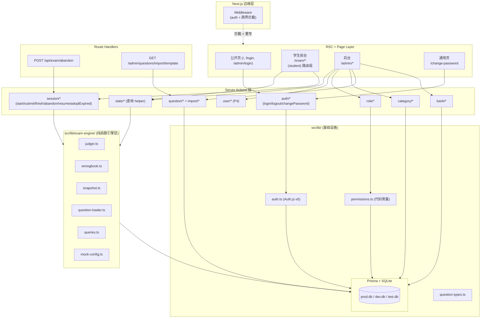

**分层原则**:

- **Middleware 层**:仅做"是否登录"与"跨界访问"两件事,不做业务权限点检查;业务权限点在 Server Action 与 RSC 入口判断。
- **Server Action 层**:zod 校验入参 → 鉴权 → 引擎调用 → 事务持久化 → `revalidatePath`。统一返回 `{ ok: true, data } | { ok: false, error }`。
- **引擎层**:除 `question-loader.ts` / `queries.ts` 需要 `prismaClient` 入参外,其它三个模块(`judger` / `wrongbook` / `snapshot`)是**纯函数零依赖**,直接被 PBT 测试。
- **持久层**:Prisma Client 单例从 `src/lib/db.ts` 读取,生产指向 `file:/data/prod.db`,测试指向 `file:./prisma/test.db`。

### 路由组与 Middleware 流

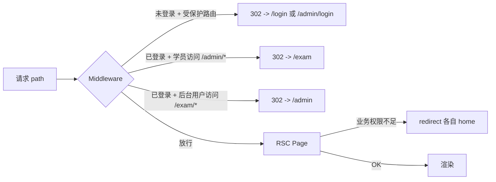

- **路由组分流**:
  - `app/(public)/` 或 `app/page.tsx` —— 公开 landing
  - `app/(auth)/login` + `app/admin/login` —— 两套登录页(共享 `LoginForm` 业务组件,选择不同 callback URL)
  - `app/(student)/exam/...` —— 学员前台,共享 `StudentShell` layout
  - `app/admin/(protected)/...` —— 后台,共享 `AdminShell` layout
  - `app/(common)/change-password` —— 跨角色通用页
- **Middleware 判断逻辑**(伪码):
  ```ts
  const role = token?.roleCode;
  if (!role && isProtectedPath(path)) return redirectByPathPrefix();
  if (role && isStudentRole(role) && path.startsWith('/admin')) return redirect('/exam');
  if (role && isStaffRole(role)  && path.startsWith('/exam'))  return redirect('/admin');
  ```
- 公开路由白名单:`/`, `/login`, `/admin/login`, `/api/exam/abandon`(Route Handler 内部自行做归属校验)。

### 答题会话生命周期

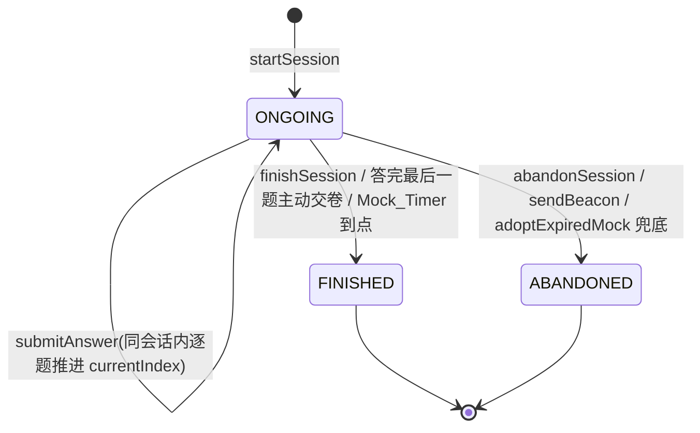

**离场兜底 5 路径**:

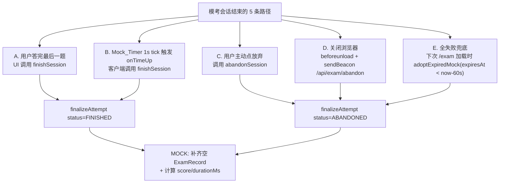

### 部署拓扑

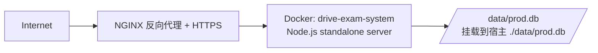

- 单容器、单进程、单文件数据库,符合 Requirement 31 的 2C2G 资源约束。
- NGINX 与 certbot **不打包到镜像**,由宿主机或同 compose 的另一服务提供。
- 数据库备份 = 复制 `./data/prod.db` 文件。

## Components and Interfaces

### 引擎层模块(`src/lib/exam-engine/`)

| 模块文件 | 导出 | 依赖 | 测试方式 |
|---|---|---|---|
| `judger.ts` | `normalizeAnswer` / `compareAnswer` / `isSubmittable` / `clampCostMs` | 零依赖 | PBT(CP-6 / CP-7 / CP-11) |
| `wrongbook.ts` | `applyExamResult(prev, isCorrect, now)` | 零依赖 | PBT(CP-8) |
| `snapshot.ts` | `serializeOrder` / `parseOrder` / `serializeCategoryIds` / `parseCategoryIds` | 零依赖 | PBT(往返性) |
| `mock-config.ts` | `MOCK_CONFIG` 常量、`getMockConfig(bankCode)` | 零依赖 | 单元测试 + PBT(CP-1) |
| `question-loader.ts` | `loadQuestionsForMode(prisma, input)` / `expandCategoryDescendants(prisma, ids)` | Prisma | PBT(CP-2 / CP-3 / CP-4 / CP-5,Prisma 走内存夹具) |
| `queries.ts` | `listWrongQuestions` / `listAttempts` / `listStudents` / `getStudentSummary` | Prisma | PBT(CP-12) + 集成测试 |

#### `judger.ts` 接口

```ts
export type QuestionType = 'SINGLE' | 'MULTI' | 'JUDGE';

/** 去空白、转大写;MULTI 还要拆字母升序去重再拼接。 */
export function normalizeAnswer(type: QuestionType, raw: string): string;

/** 两端都先 normalize 再比;SINGLE/JUDGE 字符串等,MULTI 集合等。 */
export function compareAnswer(
  type: QuestionType,
  userAnswer: string,
  correctAnswer: string
): boolean;

/** SINGLE/JUDGE: selectedCount===1; MULTI: 2<=selectedCount<=optionsCount。 */
export function isSubmittable(
  type: QuestionType,
  selectedCount: number,
  optionsCount: number
): boolean;

/** 永远返回 [0, 3_600_000] 范围内的整数。 */
export function clampCostMs(value: number): number;
```

#### `wrongbook.ts` 接口

```ts
export type WrongState = {
  wrongCount: number;
  rightCount: number;
  mastered: boolean;
  lastWrongAt: Date;
};

/**
 * 错题本状态机。返回 null 表示"不创建错题"。
 * 6 条转移规则见 Requirement 20。
 */
export function applyExamResult(
  prev: WrongState | null,
  isCorrect: boolean,
  now: Date
): WrongState | null;
```

#### `snapshot.ts` 接口

```ts
/** 序列化任意字符串数组为 JSON 字符串。 */
export function serializeOrder(ids: string[]): string;
/** 反序列化;非 JSON / 非数组 / 元素非 string 时返回 []。 */
export function parseOrder(json: string | null | undefined): string[];

export function serializeCategoryIds(ids: string[]): string;
export function parseCategoryIds(json: string | null | undefined): string[];
```

#### `mock-config.ts` 接口

```ts
export type MockConfig = {
  count: number;        // 题量
  durationMs: number;   // 时长(毫秒)
  passScore: number;    // 通过分数线(0-100)
};

export const MOCK_CONFIG: Readonly<Record<string, MockConfig>> = Object.freeze({
  subject_1: { count: 100, durationMs: 45 * 60 * 1000, passScore: 90 },
  subject_4: { count: 50,  durationMs: 30 * 60 * 1000, passScore: 90 },
  __default: { count: 50,  durationMs: 30 * 60 * 1000, passScore: 90 },
});

export function getMockConfig(bankCode: string): MockConfig;
```

#### `question-loader.ts` 接口

```ts
export type LoadInput =
  | { mode: 'SEQUENTIAL'; bankId: string }
  | { mode: 'RANDOM';     bankId: string }
  | { mode: 'CHAPTER';    bankId: string; categoryIds: string[] }
  | { mode: 'MOCK';       bankId: string; bankCode: string }
  | { mode: 'WRONG_REVIEW'; userId: string };

export type LoadResult =
  | { ok: true; questionIds: string[]; expiresAt?: Date }
  | { ok: false; error: 'BANK_EMPTY' | 'CHAPTER_EMPTY' | 'INSUFFICIENT_QUESTIONS' | 'NO_WRONG_QUESTIONS' };

export async function loadQuestionsForMode(
  prisma: PrismaClient,
  input: LoadInput
): Promise<LoadResult>;

/** 递归展开 categoryIds 得到包括全部后代的分类 ID 集合。 */
export async function expandCategoryDescendants(
  prisma: PrismaClient,
  rootIds: string[]
): Promise<string[]>;
```

**实现细节**(锚定 SYSTEM-FEATURES §6.6):

- `SEQUENTIAL` / `CHAPTER`:`Question` 按 `(createdAt asc, id asc)` 双键稳定排序(为 CP-3 提供稳定性保证)。
- `RANDOM`:取整库题目 ID,Fisher–Yates 洗牌(种子从 `crypto.randomBytes` 取,会话独立)。
- `MOCK`:整库随机抽 `MOCK_CONFIG[bankCode].count` 题;若题库题数 < count 则返回 `INSUFFICIENT_QUESTIONS`。
- `WRONG_REVIEW`:`prisma.wrongQuestion.findMany({ where: { userId, mastered: false }, orderBy: { lastWrongAt: 'desc' } })`,然后映射为 `questionId[]`。

**mode 分支决策**:

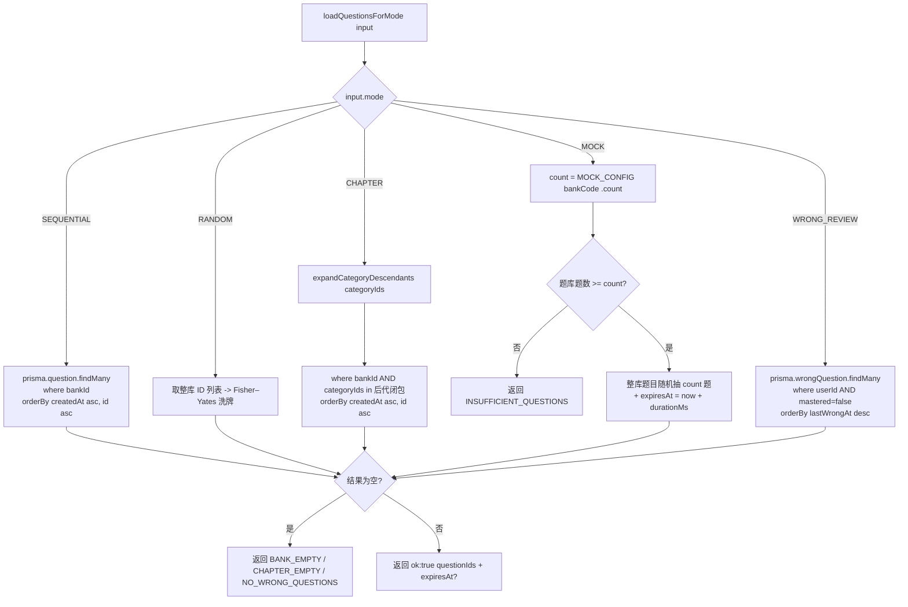

#### `queries.ts` 接口

```ts
export type Page<T> = { items: T[]; total: number; page: number; pageSize: number };

export async function listWrongQuestions(input: {
  userId: string; page: number; pageSize?: number;
  bankId?: string; masteredFilter?: 'all' | 'mastered' | 'unmastered';
}): Promise<Page<WrongQuestionView>>;

export async function listAttempts(input: {
  userId: string; page: number; pageSize?: number;
  bankId?: string; mode?: ExamMode;
}): Promise<Page<AttemptListItem>>;

export async function listStudents(input: {
  page: number; pageSize?: number;
}): Promise<Page<StudentListItem>>;

export async function getStudentSummary(userId: string): Promise<{
  totalAttempts: number; avgCorrectRate: number; lastPracticedAt: Date | null;
}>;
```

**分页不变量**(对应 CP-12,Requirement 26):

- 实现统一使用 `prisma.$transaction([findMany, count])` 保证 `total` 与当前页 `items` 在同一事务快照中读取。
- `pageSize` 默认 20,`page` 从 1 起;非法 `page <= 0` 视为 `page = 1`,`pageSize > 100` 截断为 100。
- 排序键必须是稳定的(主键 / 唯一索引),避免跨页重复(CP-12 第 3 项)。`listAttempts` 排序为 `(startedAt desc, id desc)`。

### Server Actions(`src/app/.../actions.ts`)

每个 Server Action 遵循模板:

```ts
'use server';
export async function actionName(input: unknown): Promise<ActionResult<T>> {
  const session = await requireSession();              // 抛 UnauthorizedError 由顶层 catch 转 302
  const parsed  = ZodSchema.safeParse(input);
  if (!parsed.success) return { ok: false, error: '参数不合法' };
  if (!hasPermission(session.user, 'xxx:yyy')) return { ok: false, error: '无权操作' };

  return prisma.$transaction(async (tx) => {
    // 调用 exam-engine 纯函数 + tx 写库
    revalidatePath('/...');
    return { ok: true, data: ... };
  });
}
```

#### 答题会话动作汇总

| Action | 路径 | 入参 zod | 主要副作用 | 关联 Requirement |
|---|---|---|---|---|
| `startSession` | `actions/session.ts` | `discriminatedUnion('mode', SequentialIn / RandomIn / ChapterIn / MockIn / WrongReviewIn)` | 查 ONGOING 复用或创建 `ExamAttempt`;写 `questionOrder` / `categoryIds` / `expiresAt`;`revalidatePath('/exam')` | 17 / 18 / CP-1 |
| `resumeSession` | 同上 | `{ attemptId }` | 校验归属与 status;返回 `{ attemptId, currentIndex, mode }` | 18 |
| `submitAnswer` | 同上 | `{ attemptId, questionId, userAnswer, costMs }` | 事务:校验归属/超时/幂等 → `normalizeAnswer` → `clampCostMs` → 写 `ExamRecord` → `applyExamResult` upsert `WrongQuestion` → 推进 `currentIndex` | 19 / 20 / 21 / 25 / CP-6 / CP-9 |
| `finishSession` | 同上 | `{ attemptId }` | `finalizeAttempt(_, _, 'FINISHED')` | 22 / CP-10 |
| `abandonSession` | 同上 | `{ attemptId }` | `finalizeAttempt(_, _, 'ABANDONED')` | 22 / CP-10 |
| `adoptExpiredMock` | 同上 | `{ userId? }` | 扫 `mode='MOCK' AND status='ONGOING' AND expiresAt < now - 60s` 逐个 ABANDONED | 23 |
| `toggleMastered` | `actions/wrong.ts` | `{ wrongId, mastered }` | 校验归属;`mastered: true→false` 时同步重置 `rightCount=0`;`revalidatePath('/exam/wrong')` | 24 |

#### `submitAnswer` 关键决策序列

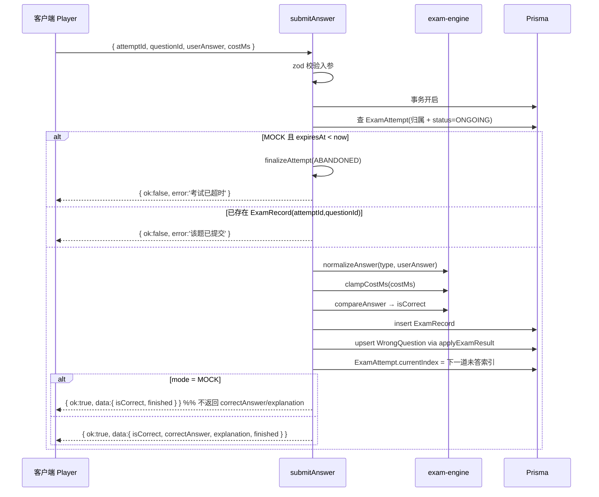

#### `finalizeAttempt` 内部流程

```mermaid
flowchart TB
  Start[finalizeAttempt tx attemptId finalStatus] --> Read[读 ExamAttempt + ExamRecord]
  Read --> CheckMode{mode == MOCK?}
  CheckMode -->|是| Fill[为 questionOrder 中缺失的题<br/>补齐 ExamRecord{ userAnswer:'', isCorrect:false, costMs:0 }]
  CheckMode -->|否| Stat
  Fill --> Stat[计算<br/>totalCount = questionOrder.length<br/>correctCount = COUNT(isCorrect)<br/>score = round(correct/total*100)<br/>durationMs = finishedAt-startedAt]
  Stat --> Write[更新 ExamAttempt status/finishedAt/统计 4 字段]
  Write --> Reval[revalidatePath /exam/history]
  Reval --> End[返回 { ok:true }]
```

### 鉴权与登录组件

#### 登录流程

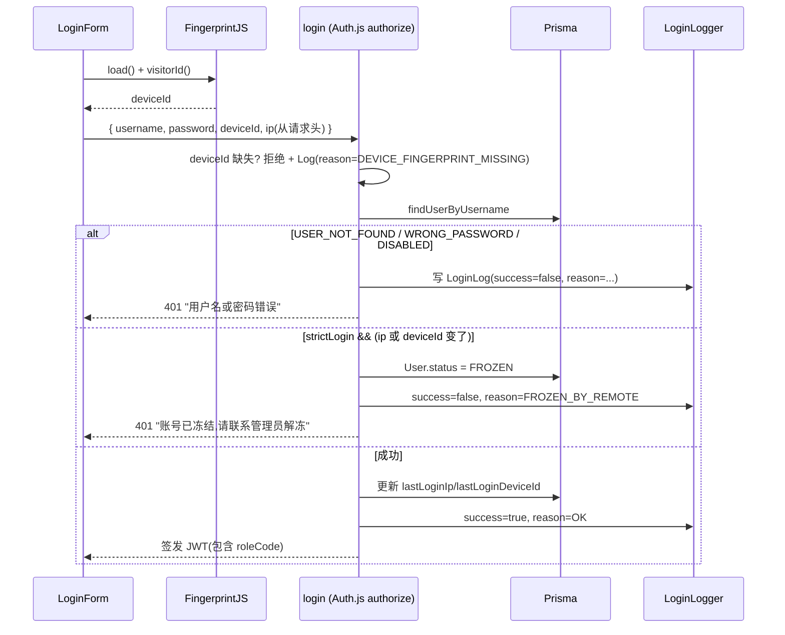

#### 权限判定函数

```ts
// src/lib/permissions.ts
export const SUPER_ADMIN_PERMISSIONS = '*' as const;  // 哨兵值

export function hasPermission(
  user: { roleCode: string; permissionCodes: string[] },
  code: string
): boolean {
  if (user.roleCode === 'super_admin') return true;   // 代码常量优先(Requirement 2.1)
  return user.permissionCodes.includes(code);
}
```

`permissionCodes` 在 JWT signed 时一次性写入 token,后续 API/RSC 无需查 DB(Requirement 3.3)。

### UI 业务组件清单

视觉 / 颜色 / 排版 / 间距 / 阴影一律由 `frontend-design` + `ui-ux-pro-max` skill 提供;以下仅记录与业务行为相关的接口与状态。

#### 学生答题界面

| 组件 | 职责 | 关键 prop / state |
|---|---|---|
| `ExamModePicker` | `/exam` 主选择卡片 | 题库列表 + 5 种模式按钮;ONGOING 时显示"继续上次"+"放弃后重开"次级动作 |
| `PracticePlayer` | SEQUENTIAL/CHAPTER/WRONG_REVIEW 共用 | 上一题/下一题可用;`AnswerFeedback` 可见 |
| `RandomPlayer` | RANDOM 专用 | 禁用"上一题";`AnswerFeedback` 可见 |
| `MockPlayer` | MOCK 专用 | 禁用"上一题";嵌 `MockTimer`;**不渲染 `AnswerFeedback`**;顶栏交卷过 `SubmitConfirmDialog`;绑定 `beforeunload` → `sendBeacon` |
| `QuestionView` | 渲染题干 + 图片 + 选项 | `imageUrl onError` 占位;SINGLE/JUDGE 用 RadioGroup,MULTI 用 Checkbox |
| `AnswerFeedback` | 提交后展示对错+高亮+解析 | MOCK 模式不挂载 |
| `ProgressBar` | 进度显示 | 顺序/章节/错题:`第 N/M`;随机:`已答 N/M`;模考:含倒计时插槽 |
| `MockTimer` | 1s tick 倒计时 | `remainingMs = max(0, expiresAt - Date.now())`;归零回调 `onTimeUp` |
| `SubmitConfirmDialog` | 二次确认 | 显示未答题数,确认才触发 `onConfirm` |
| `CategorySelectDialog` | CHAPTER 模式分类选择 | 多选树形,至少选 1 才能"开始" |

#### 后台管理界面

| 组件 | 职责 |
|---|---|
| `AdminShell` | 顶栏 + 侧栏 + 主内容;移动端折叠为抽屉(Requirement 28.3);侧栏依权限过滤菜单(28.9) |
| `BankList` / `BankForm` / `DeleteBankButton` | 题库 CRUD;内置或含题题库的删除按钮显示禁用态 |
| `QuestionList` / `QuestionsFilter` / `QuestionForm` | 题目 CRUD;表单按题型动态校验 |
| `ImportForm` | JSON / Excel 导入;两步流程"预览 → 确认" |
| `CategoriesClient` | 树形分类管理,增删改 |
| `RolesList` / `EditRoleForm` | 权限点按 group 分组渲染;super_admin 角色编辑按钮永远 disabled |
| `StudentStatsList` / `StudentDetail` | 教练查看学员成绩,带题库/模式筛选 |
| `LoginLogsList` | 登录日志,按状态/时间/关键字筛选 |

## Data Models

数据模型直接对应 `prisma/schema.prisma`,字段语义与 SYSTEM-FEATURES §3 严格一致。

### 实体关系图

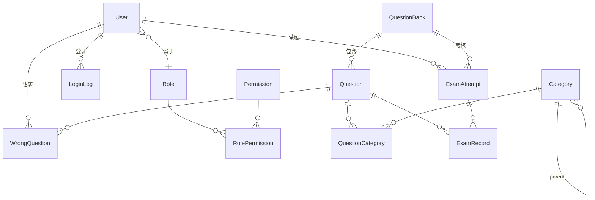

### Prisma Schema(规范化片段)

```prisma
// prisma/schema.prisma

datasource db { provider = "sqlite" url = env("DATABASE_URL") }
generator   client { provider = "prisma-client-js" }

// ==== RBAC ====
enum UserStatus { ACTIVE FROZEN DISABLED }

model User {
  id                String      @id @default(cuid())
  username          String      @unique
  passwordHash      String
  name              String?
  roleId            String
  role              Role        @relation(fields: [roleId], references: [id])
  status            UserStatus  @default(ACTIVE)
  lastLoginIp       String?
  lastLoginDeviceId String?
  createdAt         DateTime    @default(now())
  updatedAt         DateTime    @updatedAt
  attempts          ExamAttempt[]
  wrongQuestions    WrongQuestion[]
  loginLogs         LoginLog[]
}

model Role {
  id           String  @id @default(cuid())
  code         String  @unique          // super_admin / admin / teacher / student_strict / student_normal
  name         String
  strictLogin  Boolean @default(false)  // 仅 student_strict = true
  isSystem     Boolean @default(true)
  permissions  RolePermission[]
  users        User[]
}

model Permission {
  id     String @id @default(cuid())
  code   String @unique          // exam:practice / exam:mock / stats:self / ...
  group  String                  // 用户管理 / 角色权限 / 题库管理 / ...
  name   String
  roles  RolePermission[]
}

model RolePermission {
  roleId       String
  permissionId String
  role         Role       @relation(fields: [roleId],       references: [id], onDelete: Cascade)
  permission   Permission @relation(fields: [permissionId], references: [id], onDelete: Cascade)
  @@id([roleId, permissionId])
}

// ==== 登录日志 ====
enum LoginReason { OK WRONG_PASSWORD USER_NOT_FOUND FROZEN_BY_REMOTE DISABLED DEVICE_FINGERPRINT_MISSING }

model LoginLog {
  id        String      @id @default(cuid())
  userId    String?
  user      User?       @relation(fields: [userId], references: [id])
  username  String                            // 失败时记录尝试的用户名
  ip        String
  deviceId  String?
  userAgent String?
  success   Boolean
  reason    LoginReason
  createdAt DateTime    @default(now())
  @@index([userId, createdAt])
  @@index([createdAt])
}

// ==== 题库 / 题目 ====
model QuestionBank {
  id        String     @id @default(cuid())
  code      String     @unique             // subject_1 / subject_4 / ...
  name      String
  isBuiltin Boolean    @default(false)
  createdAt DateTime   @default(now())
  questions Question[]
  attempts  ExamAttempt[]
}

model Category {
  id        String              @id @default(cuid())
  name      String
  parentId  String?
  parent    Category?           @relation("CategoryParent", fields: [parentId], references: [id])
  children  Category[]          @relation("CategoryParent")
  questions QuestionCategory[]
  createdAt DateTime            @default(now())
  @@unique([parentId, name])    // 同 parent 下唯一(Requirement 11.2)
}

enum QuestionType { SINGLE MULTI JUDGE }

model Question {
  id          String              @id @default(cuid())
  bankId      String
  bank        QuestionBank        @relation(fields: [bankId], references: [id], onDelete: Cascade)
  type        QuestionType
  content     String
  imageUrl    String?
  options     String              // JSON: [{key, text}, ...]
  answer      String              // 'B' / 'AC' / 'T' / 'F'
  explanation String?
  tags        String              // JSON: string[]
  createdAt   DateTime            @default(now())
  categories  QuestionCategory[]
  records     ExamRecord[]
  wrongs      WrongQuestion[]
  @@index([bankId, createdAt])
}

model QuestionCategory {
  questionId String
  categoryId String
  question   Question @relation(fields: [questionId], references: [id], onDelete: Cascade)
  category   Category @relation(fields: [categoryId], references: [id], onDelete: Cascade)
  @@id([questionId, categoryId])
}

// ==== 答题会话 ====
enum ExamMode   { SEQUENTIAL RANDOM CHAPTER MOCK WRONG_REVIEW }
enum ExamStatus { ONGOING FINISHED ABANDONED }

model ExamAttempt {
  id            String      @id @default(cuid())
  userId        String
  user          User        @relation(fields: [userId], references: [id])
  bankId        String?     // WRONG_REVIEW 时为 null
  bank          QuestionBank? @relation(fields: [bankId], references: [id])
  mode          ExamMode
  status        ExamStatus  @default(ONGOING)
  questionOrder String      // JSON: string[](快照,会话生命周期不可变)
  currentIndex  Int         @default(0)
  categoryIds   String      // JSON: string[](CHAPTER 用;其它模式 "[]")
  expiresAt     DateTime?   // 仅 MOCK
  startedAt     DateTime    @default(now())
  finishedAt    DateTime?
  totalCount    Int?
  correctCount  Int?
  score         Int?
  durationMs    Int?
  records       ExamRecord[]
  @@index([userId, mode, status])
  @@index([userId, startedAt])
}

model ExamRecord {
  id          String      @id @default(cuid())
  attemptId   String
  attempt     ExamAttempt @relation(fields: [attemptId], references: [id], onDelete: Cascade)
  questionId  String
  question    Question    @relation(fields: [questionId], references: [id])
  userAnswer  String      // 已 normalize
  isCorrect   Boolean
  costMs      Int         // 已 clamp 到 [0, 3_600_000]
  createdAt   DateTime    @default(now())
  @@unique([attemptId, questionId])    // 同会话同题幂等(Requirement 25.1)
  @@index([attemptId, createdAt])
}

model WrongQuestion {
  id           String   @id @default(cuid())
  userId       String
  user         User     @relation(fields: [userId], references: [id])
  questionId   String
  question     Question @relation(fields: [questionId], references: [id])
  wrongCount   Int      @default(1)
  rightCount   Int      @default(0)
  mastered     Boolean  @default(false)
  lastWrongAt  DateTime
  @@unique([userId, questionId])
  @@index([userId, mastered, lastWrongAt])
}
```

### 字段约束与不变量

| 约束 | 实现位置 |
|---|---|
| `User.status ∈ {ACTIVE,FROZEN,DISABLED}` | Prisma enum + DB CHECK(SQLite 无 CHECK,enum 由 Prisma client 强制) |
| 同 `(parentId, name)` 分类唯一 | `Category` 复合 unique |
| 同 `(attemptId, questionId)` 答题记录唯一 | `ExamRecord` 复合 unique |
| 同 `(userId, questionId)` 错题唯一 | `WrongQuestion` 复合 unique |
| `costMs ∈ [0, 3_600_000]` | 应用层 `clampCostMs` 在写入前钳制 |
| `score ∈ [0, 100]` | 应用层 `Math.round(c/t*100)`,`t=0` 时取 0 |
| `questionOrder` 是 JSON `string[]` | `serializeOrder` / `parseOrder` |
| MOCK 会话 `expiresAt` 必填 | 应用层 `startSession` 写入 |
| 非 MOCK 会话 `expiresAt = null` | 应用层 `startSession` 不写入 |

### 索引策略(2C2G 优化)

针对 SQLite + 单进程的 2C2G 约束,索引刻意精简:

- `LoginLog (userId, createdAt)` + `LoginLog (createdAt)` —— 支持登录日志列表的按用户筛选与全量分页
- `Question (bankId, createdAt)` —— 支持 SEQUENTIAL/CHAPTER 的稳定排序
- `ExamAttempt (userId, mode, status)` —— 支持断点续答查询(Requirement 18.1)
- `ExamAttempt (userId, startedAt)` —— 支持答题历史分页
- `WrongQuestion (userId, mastered, lastWrongAt)` —— 支持 WRONG_REVIEW 加载与错题本筛选

不建以下索引(理由):

- `Question.bankId + answer + type` 复合索引 —— 题目数量级 < 5000,SQLite 顺序扫描更便宜,索引徒增写入成本
- 任何全文检索索引 —— 使用 SQLite 内置 LIKE 即可

### 种子数据规格

`pnpm db:seed` 脚本必须创建:

1. **5 个 Role**:`super_admin / admin / teacher / student_strict / student_normal`,`student_strict.strictLogin=true`,其余 `false`,全部 `isSystem=true`(Requirement 1.1 / 1.5)。
2. **30 个 Permission**:覆盖 7 个 group,至少包含 Requirement 1.3 列出的全部权限码。
3. **`RolePermission` 关联**:按 §9 速查表挂载;`super_admin` 不依赖此表(代码常量),但仍写入"全部权限"以便 UI 展示一致。
4. **2 个内置 QuestionBank**:`subject_1` / `subject_4`,`isBuiltin=true`(Requirement 10.2)。
5. **1 个初始 User**:`username = INITIAL_ADMIN_USERNAME`(默认 `admin`),`passwordHash = bcrypt(INITIAL_ADMIN_PASSWORD)`(默认 `Admin@123`),`roleCode = admin`(Requirement 5.3)。


## Auth & RBAC 详细设计

本节填充 Requirement 1–9、Requirement 27 的实现契约。

### Auth.js v5 配置

```ts
// src/lib/auth.ts
export const authConfig: NextAuthConfig = {
  session: { strategy: 'jwt' },
  providers: [
    Credentials({
      credentials: {
        username: {}, password: {}, deviceId: {},
      },
      async authorize(raw, req) {
        const ip = (req.headers.get('x-forwarded-for') ?? '').split(',')[0]?.trim() || '0.0.0.0';
        const userAgent = req.headers.get('user-agent') ?? null;
        return loginPipeline({ ...raw, ip, userAgent });
      },
    }),
  ],
  callbacks: {
    async jwt({ token, user }) {
      if (user) {
        token.userId          = user.id;
        token.roleCode        = user.roleCode;          // Requirement 3.2
        token.permissionCodes = user.permissionCodes;   // 一次性灌入,生效"下次登录刷新缓存"
      }
      return token;
    },
    async session({ session, token }) {
      session.user.id              = token.userId as string;
      session.user.roleCode        = token.roleCode as string;
      session.user.permissionCodes = token.permissionCodes as string[];
      return session;
    },
  },
  pages: { signIn: '/login' },
};
```

### 登录管道 `loginPipeline`

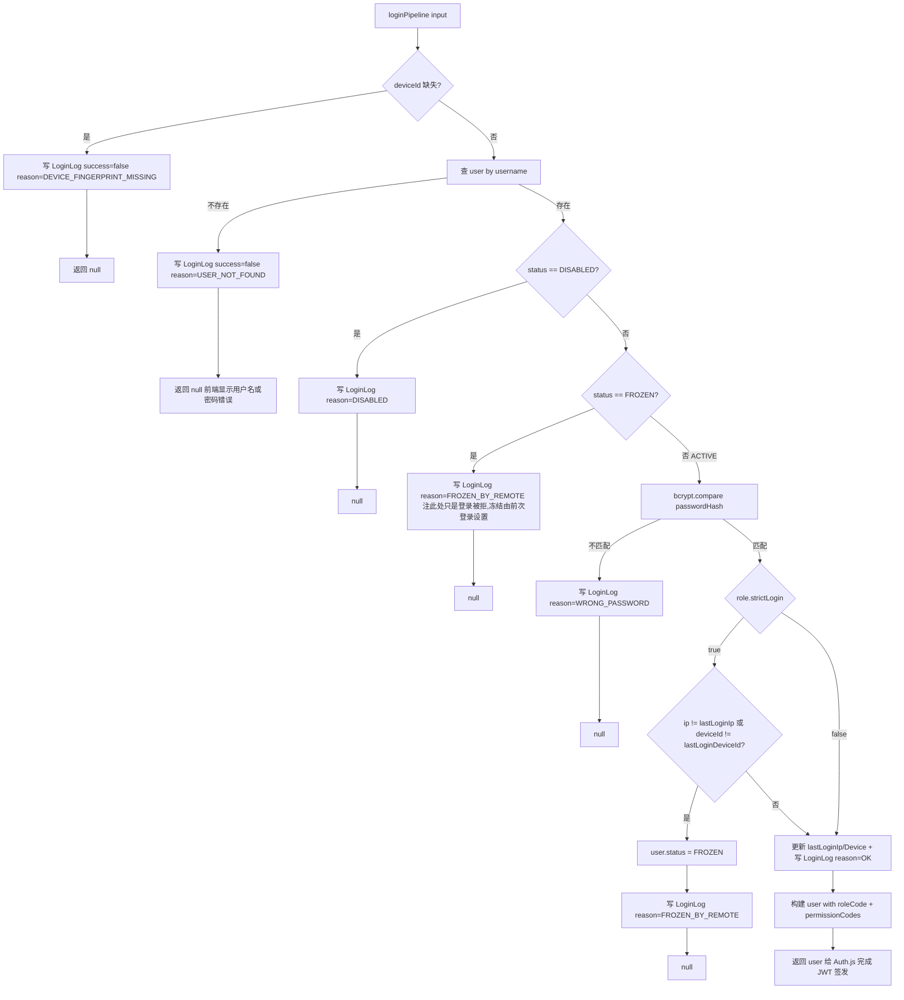

**关键约束**:

- `permissionCodes` 在 `loginPipeline` 内通过 `roleId` 一次性查 `RolePermission` 取出,塞进 token 后续不再查询(Requirement 3.3 "下次登录才刷新")。
- `super_admin` 角色 `permissionCodes` 字段可以塞 `['*']` 哨兵,但权限判定函数永远以 `roleCode === 'super_admin'` 短路为先(Requirement 2.1)。
- `user:unfreeze` 操作需在解冻 Server Action 中**同步清空** `lastLoginIp` / `lastLoginDeviceId`(Requirement 7.4),否则下次登录会因 IP/Device 仍不匹配再次触发冻结。
- `/change-password` 提交成功后调用 `signOut({ redirectTo: '/login' })` 强制清除当前 session(Requirement 9.3)。

### 权限判定与 UI 渲染

```ts
// src/lib/permissions.ts
import type { Session } from 'next-auth';

export const ALL_PERMISSION_CODES = [
  'exam:practice', 'exam:mock',
  'stats:self', 'stats:all',
  'bank:read', 'bank:write',
  'question:read', 'question:write', 'question:import',
  'category:write',
  'user:read', 'user:write', 'user:unfreeze', 'user:reset-password',
  'role:read', 'role:edit-permissions',
  'log:read',
  // ... 其余 13 个权限点(stats、user 二级、system) 由 seed 维护
] as const;

export type PermissionCode = typeof ALL_PERMISSION_CODES[number];

export function hasPermission(session: Session | null, code: PermissionCode): boolean {
  if (!session?.user) return false;
  if (session.user.roleCode === 'super_admin') return true;     // 代码常量优先
  return session.user.permissionCodes.includes(code);
}

/** 在 Server Action / RSC 入口调用,失败抛 UnauthorizedError */
export function requirePermission(session: Session | null, code: PermissionCode): void {
  if (!hasPermission(session, code)) throw new UnauthorizedError(code);
}
```

UI 侧 `<AdminShell>` 侧栏菜单项配置 `requires?: PermissionCode`,渲染时按 `hasPermission` 过滤(Requirement 28.9)。

### 登录后路由分发

```ts
// src/lib/auth-redirect.ts
export function homeForRole(roleCode: string): '/admin' | '/exam' {
  return ['super_admin', 'admin', 'teacher'].includes(roleCode) ? '/admin' : '/exam';
}
```

由 `signIn(...)` 的 `callbackUrl` 与 Middleware 共同使用(Requirement 27.7)。

## Middleware 与路由清单

### 路由分类(对应 Requirement 27)

| 类别 | 路径前缀 | Middleware 处理 |
|---|---|---|
| 公开 | `/`, `/login`, `/admin/login` | 永远放行 |
| 学生前台 | `/exam`, `/exam/session/[attemptId]`, `/exam/session/[attemptId]/result`, `/exam/wrong`, `/exam/history`, `/exam/history/[attemptId]` | 未登录 → `/login`;后台角色访问 → 302 `/admin` |
| 后台 | `/admin`(及全部 `/admin/*` 子路由) | 未登录 → `/admin/login`;学生角色访问 → 302 `/exam` |
| 通用 | `/change-password` | 未登录 → 按当前路径推断登录入口 |
| Route Handler | `POST /api/exam/abandon` | 内部用 `getServerSession` 校验,Middleware 放行 |
| 模板下载 | `GET /admin/questions/import/template` | 同 `/admin/*` 后台权限 |

### Middleware 实现

```ts
// src/middleware.ts
import { auth } from '@/lib/auth';

const STUDENT_ROLES = new Set(['student_strict', 'student_normal']);
const STAFF_ROLES   = new Set(['super_admin', 'admin', 'teacher']);

export default auth((req) => {
  const { pathname } = req.nextUrl;
  const role = req.auth?.user?.roleCode;

  // 公开路由放行
  if (pathname === '/' || pathname === '/login' || pathname === '/admin/login') return;

  // 未登录拦截
  if (!role) {
    const to = pathname.startsWith('/admin') ? '/admin/login' : '/login';
    return Response.redirect(new URL(to, req.nextUrl));
  }

  // 跨界访问拦截(Requirement 27.5 / 27.6)
  if (STUDENT_ROLES.has(role) && pathname.startsWith('/admin'))
    return Response.redirect(new URL('/exam', req.nextUrl));
  if (STAFF_ROLES.has(role) && pathname.startsWith('/exam'))
    return Response.redirect(new URL('/admin', req.nextUrl));

  // 角色权限编辑页特殊检查(Requirement 2.3)
  if (/^\/admin\/roles\/[^/]+\/edit$/.test(pathname) && role !== 'super_admin')
    return Response.redirect(new URL('/admin', req.nextUrl));
});

export const config = {
  matcher: ['/((?!_next|.*\\..*).*)'],
};
```

### RBAC 种子数据规格(Requirement 1)

| Role.code | name | strictLogin | isSystem | 默认权限点(节选) |
|---|---|---|---|---|
| `super_admin` | 超级管理员 | `false` | `true` | 全部 30 项(代码常量优先,DB 仅作 UI 展示一致) |
| `admin` | 管理员 | `false` | `true` | 除 `role:edit-permissions` 外全部 |
| `teacher` | 教练 | `false` | `true` | `stats:all`, `stats:self`, `bank:read`, `question:read`, `exam:practice`, `exam:mock`, `user:read` |
| `student_strict` | 严格学员 | `true` | `true` | `exam:practice`, `exam:mock`, `stats:self` |
| `student_normal` | 普通学员 | `false` | `true` | `exam:practice`, `exam:mock`, `stats:self` |

**30 个 Permission 按 7 group 分布**(Requirement 1.2):

| group | 权限码示例 | 数量 |
|---|---|---|
| 用户管理 | `user:read` / `user:write` / `user:unfreeze` / `user:reset-password` / `user:disable` | 5 |
| 角色权限 | `role:read` / `role:edit-permissions` / `role:create` / `role:delete` | 4 |
| 题库管理 | `bank:read` / `bank:write` / `bank:delete` | 3 |
| 题目管理 | `question:read` / `question:write` / `question:delete` / `question:import` / `category:write` / `category:delete` | 6 |
| 答题 | `exam:practice` / `exam:mock` / `exam:wrong-review` | 3 |
| 统计 | `stats:self` / `stats:all` / `stats:export` / `stats:class` | 4 |
| 系统 | `log:read` / `log:export` / `system:setting` / `system:audit` / `system:backup` | 5 |

种子脚本 `prisma/seed.ts` 在执行 `db:seed` 时按上表 upsert,`isSystem=true` 标记保护内置数据(Requirement 1.4)。

## Import Pipeline(批量导入)

`Importer` 子系统是 JSON 与 Excel 共用的两阶段流水线,严格分离"读 → 校验"与"提交"两步,UI 流程为"预览 → 确认"。

### 共享契约

```ts
// src/lib/import/types.ts
export type ImportRow = {
  type: 'SINGLE' | 'MULTI' | 'JUDGE';
  content: string;
  imageUrl: string | null;
  options: Array<{ key: string; text: string }>;
  answer: string;
  categories: string[];
  explanation: string | null;
  tags: string[];
};

export type PreviewResult = {
  valid:   ImportRow[];
  invalid: { row: number; errors: string[] }[];
};

export type CommitResult = { ok: true; insertedCount: number } | { ok: false; error: string };

export interface ImportSource {
  // 通用解析:把外部输入(JSON 文本 / Excel 工作簿)转成 ImportRow[] 的可疑形态。
  parse(payload: unknown): { rows: unknown[]; rowToError?: Map<number, string> };
}

export function previewImport(source: ImportSource, payload: unknown): PreviewResult;
export async function commitImport(
  source: ImportSource, payload: unknown, opts: { bankId: string; tx: Prisma.TransactionClient }
): Promise<CommitResult>;
```

### JSON 导入器

```ts
// src/lib/import/json-source.ts
export const jsonSource: ImportSource = {
  parse(payload) {
    const obj = typeof payload === 'string' ? JSON.parse(payload) : payload;
    if (Array.isArray(obj))                      return { rows: obj };
    if (Array.isArray((obj as any)?.questions))  return { rows: (obj as any).questions };
    return { rows: [] };
  },
};
```

满足 Requirement 13.1(顶层数组与 `{questions:[...]}` 两种形态)。

### Excel 导入器

```ts
// src/lib/import/excel-source.ts
const COLUMNS = [
  'type', 'content', 'imageUrl',
  'optionA', 'optionB', 'optionC', 'optionD', 'optionE', 'optionF',
  'answer', 'categories', 'explanation', 'tags',
] as const;

export function generateExcelTemplate(): Buffer {
  // 通过 xlsx 包写入仅含表头行的 .xlsx,提供给 GET /admin/questions/import/template
}

export const excelSource: ImportSource = {
  parse(payload) {
    const wb = XLSX.read(payload as Buffer, { type: 'buffer' });
    const sheet = wb.Sheets[wb.SheetNames[0]];
    const rows = XLSX.utils.sheet_to_json(sheet, { defval: null });
    return { rows: rows.map(rowToImportRow) };  // 见下
  },
};

function rowToImportRow(row: any): unknown {
  const options = (['A','B','C','D','E','F'] as const)
    .map((k) => row[`option${k}`] ? { key: k, text: String(row[`option${k}`]) } : null)
    .filter(Boolean);
  return {
    type:        row.type,
    content:     row.content,
    imageUrl:    row.imageUrl ?? null,
    options,
    answer:      row.answer,
    categories: (row.categories ?? '').split('|').map((s: string) => s.trim()).filter(Boolean),
    explanation: row.explanation ?? null,
    tags:       (row.tags ?? '').split('|').map((s: string) => s.trim()).filter(Boolean),
  };
}
```

**多值列分隔符为 `|`**(U+007C),不是中文逗号也不是英文逗号(Requirement 14.2),避免与中文文本歧义。

### 行级校验

```ts
// src/lib/import/validate.ts
export function validateRow(row: unknown, rowIndex: number): { ok: true; data: ImportRow } | { ok: false; errors: string[] } {
  const parsed = ImportRowSchema.safeParse(row);
  if (!parsed.success) return { ok: false, errors: zodIssuesToCodes(parsed.error) };

  const r = parsed.data;
  const errs: string[] = [];

  // 共通:answer 引用的字母对应选项必须存在且非空
  for (const ch of [...new Set(r.answer.split(''))]) {
    const found = r.options.find((o) => o.key === ch);
    if (!found || !found.text || !found.text.trim())
      errs.push('OPTION_MISSING_FOR_ANSWER');
  }

  // 题型相关
  if (r.type === 'SINGLE' && !/^[A-F]$/.test(r.answer))           errs.push('SINGLE_ANSWER_INVALID');
  if (r.type === 'MULTI'  && !/^[A-F]{2,6}$/.test(r.answer))      errs.push('MULTI_ANSWER_INVALID');
  if (r.type === 'MULTI'  && !isSortedDistinctAZ(r.answer))       errs.push('MULTI_ANSWER_NOT_SORTED');
  if (r.type === 'JUDGE'  && !/^[TF]$/.test(r.answer))            errs.push('JUDGE_ANSWER_INVALID');
  if (r.type === 'JUDGE'  && JSON.stringify(r.options) !== JUDGE_OPTIONS_JSON)
    errs.push('JUDGE_OPTIONS_INVALID');

  return errs.length ? { ok: false, errors: errs } : { ok: true, data: r };
}
```

`OPTION_MISSING_FOR_ANSWER` 是 Excel 导入特别强调的错误码(Requirement 14.3)——如 `answer='B'` 但 `optionB` 单元格为空,也视为非法。

### `commitImport` 提交流程

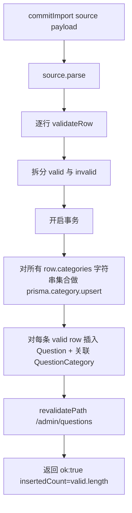

- 分类按名 upsert(Requirement 13.3):`prisma.category.upsert({ where: { parentId_name: { parentId: null, name } }, create: { name }, update: {} })`,**导入只在顶层 parentId=null 上 upsert**。
- 一行非法不影响其它行(Requirement 13.4)——非法行落入 `invalid` 列表,合法行照常提交。
- UI 在预览页同时显示"将导入 N 条"与"跳过 M 条非法记录"两个数字(Requirement 13.5)。

## UI 行为目录(非视觉)

视觉 token、配色、字体、阴影、卡片圆角、布局留白由 `frontend-design` 与 `ui-ux-pro-max` skill 提供;本节只列**业务行为相关**的 UI 约束。

| 行为 | 出处 | 实现要点 |
|---|---|---|
| 桌面与移动端核心功能等价 | Requirement 28.2 | 关键交互元素(按钮、单选/多选)最小触控尺寸 ≥ 44 × 44 CSS px |
| `viewport ≤ 768px` 时 AdminShell 折叠抽屉 | Requirement 28.3 | `useMediaQuery('(max-width: 768px)')` 控制抽屉显隐;顶栏菜单按钮触发 |
| 题图加载失败渲染占位 | Requirement 28.4 | `<Image onError>` 切换到占位组件(图标 + "图片加载失败"文案),不阻断答题 |
| SINGLE/JUDGE 用 RadioGroup,MULTI 用 Checkbox | Requirement 28.5 | 由 `Question.type` 分派 `<QuestionView>` 内部子组件 |
| 提交按钮可用性由 `isSubmittable` 决定 | Requirement 28.5 | `disabled={!isSubmittable(type, selected.length, options.length)}` |
| MOCK 模式不渲染 `AnswerFeedback` | Requirement 28.6 | `MockPlayer` 不挂载该子组件;`submitAnswer` 响应也不返回 `correctAnswer/explanation`,组件层无数据可渲染(双保险) |
| MOCK 交卷需 `SubmitConfirmDialog` 二次确认 | Requirement 28.6 | 顶栏"交卷"按钮先开 dialog,确认后才调 `finishSession` |
| `Mock_Timer` 1 秒 tick | Requirement 28.7 | `setInterval(1000)` 重新计算 `remainingMs = max(0, expiresAt - Date.now())`;归零调 `onTimeUp` |
| `beforeunload` + `sendBeacon` 兜底 | Requirement 28.8 | 仅在 `mode = MOCK` 且 `status = ONGOING` 时绑定;`sendBeacon('/api/exam/abandon', JSON.stringify({ attemptId }))` |
| 侧栏依权限过滤菜单 | Requirement 28.9 | `<AdminShell>` 通过 `hasPermission` 过滤 `nav` 数组,无权菜单不渲染 |
| `/exam` 页面进入时调 `adoptExpiredMock` | Requirement 23.1 | RSC 同步调用,失败不阻塞页面;主入口仍是 `Mock_Timer` 客户端 |
| 错题本乐观更新 + 失败回滚 | Requirement 24.4 | `useTransition` + `toast.error` 回滚 |
| RANDOM/MOCK 禁用"上一题" | Requirement 18.5 | `RandomPlayer` / `MockPlayer` 不渲染上一题按钮 |
| 改密成功强制重新登录 | Requirement 9.3 | Server Action 内部 `signOut`,客户端跳 `/login` |

**视觉规范**:本文档不约束。`frontend-design` 与 `ui-ux-pro-max` skill 是事实来源(Requirement 28.1)。

## Correctness Properties

*A property is a characteristic or behavior that should hold true across all valid executions of a system—essentially, a formal statement about what the system should do. Properties serve as the bridge between human-readable specifications and machine-verifiable correctness guarantees.*

下列 12 条性质是 `Exam_Engine` 与 `Pagination_Query` 的核心不变量,与 `requirements.md §Correctness Properties` 中的 CP-1 … CP-12 一一对应。每条性质必须在 `Test_Suite` 中以 fast-check 实现,`numRuns >= 100`(Requirement 29.2)。其它源自需求条款的 PBT 性质(异地登录、导入、跨界拦截等)归入 §Testing Strategy 的"补充 PBT 列表"。

### Property 1: startSession 字段一致性

*For any* 合法 `startSession` 入参 `input`,创建出的 `ExamAttempt` 满足:`mode = input.mode`、`status = ONGOING`、`currentIndex = 0`;`questionOrder.length` 与 `mode` 对应的 Requirement 15 题量规则一致;`categoryIds` 仅在 `mode = CHAPTER` 时非空;`expiresAt` 仅在 `mode = MOCK` 时非空,且 `expiresAt = startedAt + MOCK_CONFIG[bankCode].durationMs`。

**Validates: Requirements 15, 16, 17.1, 18**

### Property 2: questionOrder 快照不重复且来源正确

*For any* 五种模式产出的 `questionOrder`,以下三项同时成立:
- `questionOrder` 内题目 ID 不重复;
- `mode ∈ {SEQUENTIAL, RANDOM, CHAPTER, WRONG_REVIEW}` 时 `questionOrder.length` 等于"满足条件题目集合"的大小,`mode = MOCK` 时(题量充足条件下)`questionOrder.length = MOCK_CONFIG[bankCode].count`;
- `questionOrder` 是其来源题目集合的一个排列(子集 + 同元素)。

**Validates: Requirements 15.2, 15.3, 15.4, 15.5, 15.6**

### Property 3: SEQUENTIAL/CHAPTER 严格 createdAt 升序

*For any* `mode ∈ {SEQUENTIAL, CHAPTER}`,`questionOrder` 对应的 `Question[]` 序列严格满足 `Q[i].createdAt <= Q[i+1].createdAt`,且对相等 `createdAt` 时序的稳定性由 `Question.id` 字典序保障。

**Validates: Requirements 15.2, 15.4**

### Property 4: CHAPTER 后代分类闭包

*For any* `mode = CHAPTER` 与入参 `categoryIds`,`questionOrder` 中题目 ID 的集合等于 `expandCategoryDescendants(categoryIds)` 对应分类树下题目的并集;不在该并集中的题目不会出现在 `questionOrder`。

**Validates: Requirements 15.4**

### Property 5: WRONG_REVIEW 集合与排序

*For any* `mode = WRONG_REVIEW`,`questionOrder` 严格等于当前用户 `WrongQuestion.mastered = false` 的题目按 `lastWrongAt` 降序排列后的题目 ID 序列。

**Validates: Requirements 15.6**

### Property 6: submitAnswer 写入字段语义

*For any* 合法 `submitAnswer` 调用,写入的 `ExamRecord` 满足:`userAnswer = normalizeAnswer(type, raw)`、`costMs ∈ [0, 3_600_000]`(已 `clampCostMs`)、`isCorrect = compareAnswer(type, userAnswer, correctAnswer)`。

**Validates: Requirements 19.1, 19.4, 19.5, 19.6, 21.2**

### Property 7: compareAnswer 答案语义

*For any* `(type, userAnswer, correctAnswer)`,`compareAnswer` 满足:
- `type ∈ {SINGLE, JUDGE}` 时等价于 `normalizeAnswer` 后的字符串相等;
- `type = MULTI` 时,把 `correctAnswer` 任意排列输入都返回 `true`,把任何与正确答案集合不等的输入都返回 `false`(集合相等)。

**Validates: Requirements 19.2**

### Property 8: 错题本状态机 6 条转移 + 单调性

*For any* `(prev, isCorrect, now)`,`applyExamResult` 输出的 `next` 满足 Requirement 20 列出的 6 条转移规则,且:
- `next.wrongCount >= (prev?.wrongCount ?? 0)`;
- `next.lastWrongAt >= (prev?.lastWrongAt ?? Epoch)`;
- `mastered` 字段仅按两条路径转移:`rightCount + 1 >= 3 ⇒ true`;`mastered = true` 时答错 ⇒ `false`(同时 `rightCount = 0`)。

**Validates: Requirements 20.1, 20.2, 20.3, 20.4, 20.5, 20.6, 20.7**

### Property 9: 同会话同题幂等

*For any* `(attemptId, questionId)`,首次 `submitAnswer` 写入一条 `ExamRecord`;任意后续相同 `(attemptId, questionId)` 调用都返回 `{ ok: false, error: '该题已提交' }`,且数据库状态(`ExamRecord` 行数、相关 `WrongQuestion` 字段、`ExamAttempt.currentIndex`)与首次成功写入后保持完全一致。

**Validates: Requirements 21.4, 25.1, 25.2**

### Property 10: 会话结束统计字段公式(含 MOCK 补齐)

*For any* `finalizeAttempt` 调用,在 MOCK 模式下补齐空记录后,`ExamAttempt` 的统计字段满足:
- `totalCount = questionOrder.length`;
- `correctCount = COUNT(ExamRecord WHERE attemptId AND isCorrect = true)`;
- `score = totalCount === 0 ? 0 : Math.round(correctCount / totalCount * 100)`;
- `durationMs = finishedAt - startedAt`;
- `0 <= score <= 100`。

**Validates: Requirements 22.2, 22.3**

### Property 11: isSubmittable 真值表

*For any* `(type, selectedCount, optionsCount)`,`isSubmittable` 返回值满足:
- `type ∈ {SINGLE, JUDGE}` 时等价于 `selectedCount === 1`;
- `type = MULTI` 时等价于 `2 <= selectedCount <= optionsCount`;
- 其它(非法 type)输入一律返回 `false`。

**Validates: Requirements 19.3**

### Property 12: 分页查询不变量

*For any* 合法分页参数,`Pagination_Query` 的四个函数(`listWrongQuestions` / `listAttempts` / `listStudents` / `getStudentSummary` 中的列表型查询)满足:
- `items.length <= pageSize`;
- `(page - 1) * pageSize + items.length <= total`;
- 跨页遍历所有合法页码所得 `items` 间不存在重复主键;
- 跨页 `items` 的并集大小等于 `min(total, ceil(total / pageSize) * pageSize)` 与实际命中行数中的较小值;
- `listAttempts` 返回的每条 `status ∈ {FINISHED, ABANDONED}` 且按 `startedAt desc` 排列。

**Validates: Requirements 26.1, 26.2, 26.3, 26.4, 26.5**

## Error Handling

### 统一返回结构

所有 Server Action 返回 `ActionResult<T>`:

```ts
type ActionResult<T> = { ok: true; data: T } | { ok: false; error: string };
```

不抛异常给客户端;仅在引擎层抛错时由顶层 `try/catch` 转为 `{ ok: false, error }`,日志写 `console.error` + 不暴露内部细节。

### 错误码命名约定

| 类别 | 错误码 / 文案 | 触发场景 |
|---|---|---|
| 鉴权 | `'未登录'` / `'无权操作'` | Middleware 已拦截大部分;Action 兜底 |
| 入参 | `'参数不合法'` | zod `safeParse` 失败 |
| 题库管理 | `'内置题库不可删除'` / `'题库下尚有题目,无法删除'` | Requirement 10.3, 10.4 |
| 分类 | `'同级分类名重复'` | Requirement 11.2 |
| 答题 | `'考试已超时'` / `'该题已提交'` | Requirement 21.3, 21.4 |
| 登录 | `'用户名或密码错误'` | 统一文案,不泄露失败原因(Requirement 5.5) |
| 改密 | `'旧密码错误'` | Requirement 9.2 |
| 导入(行级) | `OPTION_MISSING_FOR_ANSWER` / `SINGLE_ANSWER_INVALID` / `MULTI_ANSWER_INVALID` / `MULTI_ANSWER_NOT_SORTED` / `JUDGE_ANSWER_INVALID` / `JUDGE_OPTIONS_INVALID` | 落入 `invalid` 列表的逐行错误码 |
| 题目加载 | `BANK_EMPTY` / `CHAPTER_EMPTY` / `INSUFFICIENT_QUESTIONS` / `NO_WRONG_QUESTIONS` | `loadQuestionsForMode` 返回 |

### 边界处理

| 场景 | 行为 |
|---|---|
| `parseOrder` 收到非 JSON 字符串 | 返回 `[]`,不抛(Requirement 17.5) |
| `parseOrder` 收到非数组 JSON | 返回 `[]`(Requirement 17.5) |
| `parseOrder` 元素含非 string | 返回 `[]`(Requirement 17.5) |
| `clampCostMs(NaN)` | 返回 `0`(`max(0, min(NaN, X))` 的 NaN 行为由实现保证 → 内部用 `Number.isFinite` 检查) |
| `clampCostMs(-1)` / `clampCostMs(99999999)` | 返回 `0` / `3_600_000` |
| MOCK `submitAnswer` 提交时已超时 | 当场 `finalizeAttempt(_, _, 'ABANDONED')`,返回 `'考试已超时'`(Requirement 21.3) |
| `adoptExpiredMock` 与客户端 timer 同时触发 | 后到者按 Requirement 21.4 幂等返回错误,数据不重复修改 |
| `revalidatePath` 抛错 | 包裹 `try/catch`,不影响主返回 |
| `sendBeacon` 失败(网络断) | 由 `adoptExpiredMock` 兜底,RSS 加载 `/exam` 时统一处理(Requirement 23) |

## Testing Strategy

### 测试基建

| 工具 | 用途 | 配置约束 |
|---|---|---|
| Vitest | 单元 + 集成 + 组件测试运行器 | `vitest --run` 单次执行,不依赖 watch(Requirement 29.3) |
| fast-check | 引擎层 PBT 库 | `numRuns >= 100`(Requirement 29.2) |
| jsdom | 客户端组件渲染环境 | `vitest.config.ts: environment: 'jsdom'` |
| `@testing-library/react` + `@testing-library/jest-dom` | 组件断言 | 在 `vitest.setup.ts` 中 `expect.extend(matchers)` |
| 集成测试数据库 | `DATABASE_URL=file:./prisma/test.db` | 每个用例前 `db:reset` + 夹具种子(Requirement 29.4) |

### 目录与文件布局

```
src/
  lib/exam-engine/
    judger.ts              wrongbook.ts
    snapshot.ts            mock-config.ts
    question-loader.ts     queries.ts
  test/
    judger.property.test.ts            # CP-6 / CP-7 / CP-11
    wrongbook.property.test.ts         # CP-8
    snapshot.property.test.ts          # CP-1 字段一致性的 expiresAt 部分 + 17.4/17.5 往返与 safe-fail
    question-loader.property.test.ts   # CP-2 / CP-3 / CP-4 / CP-5
    queries.property.test.ts           # CP-12
    session.integration.test.ts       # CP-1 / CP-9 / CP-10(整合 startSession/submitAnswer/finalizeAttempt)
tests/
  components/                         # @testing-library/react 组件测试
  e2e/                                # 端到端流程(可选)
prisma/
  test.db                             # 集成测试专用 SQLite
  seed.ts
```

### CP → 测试映射(Requirement 29.2)

| 性质 | 主测试文件 | 被测函数 / 路径 | 关键 fast-check arbitrary |
|---|---|---|---|
| **CP-1** startSession 字段一致性 | `src/test/session.integration.test.ts` | `startSession` + `loadQuestionsForMode` + `getMockConfig` | `fc.constantFrom('SEQUENTIAL','RANDOM','CHAPTER','MOCK','WRONG_REVIEW')` × 题库夹具 |
| **CP-2** questionOrder 快照不变量 | `src/test/question-loader.property.test.ts` | `loadQuestionsForMode` | 题库夹具(`fc.array(questionArb, {minLength: 1})`)+ 五种模式 |
| **CP-3** SEQUENTIAL/CHAPTER 严格 createdAt 升序 | `src/test/question-loader.property.test.ts` | `loadQuestionsForMode` | 题目 createdAt 用 `fc.date()` |
| **CP-4** CHAPTER 后代闭包 | `src/test/question-loader.property.test.ts` | `expandCategoryDescendants` + CHAPTER 分支 | 分类树用递归 `fc.letrec` 生成 |
| **CP-5** WRONG_REVIEW 集合与排序 | `src/test/question-loader.property.test.ts` | WRONG_REVIEW 分支 | `fc.array(wrongArb)` |
| **CP-6** submitAnswer 字段语义 | `src/test/session.integration.test.ts` | `submitAnswer` + `judger` | 题型 × 用户答案 |
| **CP-7** compareAnswer 答案语义 | `src/test/judger.property.test.ts` | `compareAnswer` | `fc.constantFrom('A','B','C','D','E','F')` 与排列洗牌 |
| **CP-8** 错题本状态机 + 单调性 | `src/test/wrongbook.property.test.ts` | `applyExamResult` | `prevArb`(含 null)× `boolean` × `fc.date()` |
| **CP-9** 同会话同题幂等 | `src/test/session.integration.test.ts` | `submitAnswer` | 重复 (attemptId, questionId) 提交 |
| **CP-10** 会话结束统计字段 | `src/test/session.integration.test.ts` | `finalizeAttempt` | 部分回答场景 + MOCK 补齐分支 |
| **CP-11** isSubmittable 真值表 | `src/test/judger.property.test.ts` | `isSubmittable` | type × selectedCount × optionsCount |
| **CP-12** 分页查询不变量 | `src/test/queries.property.test.ts` | `listWrongQuestions` / `listAttempts` / `listStudents` | 总行数 × pageSize × 跨页遍历 |

### 补充 PBT 与单元测试列表

下列性质来自需求条款,虽然不属于"引擎冠军不变量",但可用 fast-check 写补充测试以提升健壮性。各测试至少 50 次迭代:

| 来源 | 测试形式 | 文件 |
|---|---|---|
| Requirement 2.1 super_admin 全权限 | PBT,`hasPermission('super_admin', anyCode) === true` | `src/test/permissions.property.test.ts` |
| Requirement 6.3 缺失 deviceId 拒绝 | PBT,`loginPipeline({ deviceId: '' })` 永远失败 | `src/test/auth.integration.test.ts` |
| Requirement 7.1 异地登录 IP/Device 任一变化触发 FROZEN | PBT | 同上 |
| Requirement 7.3 strictLogin=false 不比对 | PBT | 同上 |
| Requirement 8.1 LoginLog 写入完整性 | PBT | 同上 |
| Requirement 11.2 同 parent 同名拒绝 | PBT,unique 约束 | `src/test/category.integration.test.ts` |
| Requirement 12.2/12.3/12.4 题型答案校验 | PBT | `src/test/question-validate.property.test.ts` |
| Requirement 13.1/13.2/13.3/13.4 JSON 导入两种形态 + 不写库 + 分类 upsert + 非法不影响合法 | PBT | `src/test/import.property.test.ts` |
| Requirement 14.2 `|` 分隔解析往返 | PBT | 同上 |
| Requirement 14.3 `OPTION_MISSING_FOR_ANSWER` | PBT | 同上 |
| Requirement 17.4 `parseOrder(serializeOrder(xs))===xs` | PBT(往返) | `src/test/snapshot.property.test.ts` |
| Requirement 17.5 `parseOrder` safe-fail | PBT | 同上 |
| Requirement 18.1 ONGOING 复用 | 集成测试 | `src/test/session.integration.test.ts` |
| Requirement 27.5/27.6 跨界拦截 | 集成测试 + middleware 单元 | `src/test/middleware.test.ts` |

### 单元测试 / 组件测试 / 集成测试 比例

- **单元测试 + PBT(引擎层)**:覆盖 `judger.ts` / `wrongbook.ts` / `snapshot.ts` / `mock-config.ts` 100% 行覆盖。
- **集成测试**:覆盖 Server Actions 主路径,使用 `prisma/test.db` 与 `db:reset` + 夹具种子。
- **组件测试**:仅覆盖业务行为(图片占位、`isSubmittable` 控制按钮、MOCK 不渲染 `AnswerFeedback`、AdminShell 抽屉、Mock_Timer 1s tick),不做视觉断言(由 skill 负责)。
- **PBT 强度**:CP-1..CP-12 每条 `numRuns >= 100`(Requirement 29.2);补充 PBT 每条 `numRuns >= 50`。

### 测试运行命令

```bash
pnpm test           # vitest --run(CI)
pnpm test:watch     # 仅本地开发使用
pnpm db:reset       # 测试夹具重置
```

`pnpm test` 与 `pnpm build` 与 `docker compose build` 三项门禁均通过后视作交付完成(Requirement 33.3)。

## Deployment & 2C2G 资源约束

### 部署拓扑

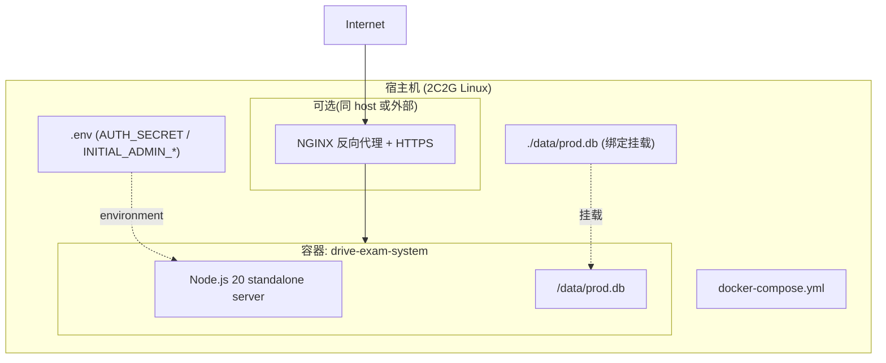

### Dockerfile(多阶段 + Next.js standalone)

```dockerfile
# ---- Stage 1: deps ----
FROM node:20-alpine AS deps
RUN corepack enable && corepack prepare pnpm@9.15.4 --activate
WORKDIR /app
COPY package.json pnpm-lock.yaml ./
COPY prisma ./prisma
RUN pnpm install --frozen-lockfile

# ---- Stage 2: build ----
FROM node:20-alpine AS builder
RUN corepack enable && corepack prepare pnpm@9.15.4 --activate
WORKDIR /app
COPY --from=deps /app/node_modules ./node_modules
COPY . .
ENV NEXT_TELEMETRY_DISABLED=1
RUN pnpm prisma generate && pnpm build

# ---- Stage 3: runner ----
FROM node:20-alpine AS runner
WORKDIR /app
ENV NODE_ENV=production NEXT_TELEMETRY_DISABLED=1
RUN addgroup -S app && adduser -S app -G app
COPY --from=builder /app/.next/standalone ./
COPY --from=builder /app/.next/static ./.next/static
COPY --from=builder /app/public ./public
COPY --from=builder /app/prisma ./prisma
COPY --from=builder /app/node_modules/.prisma ./node_modules/.prisma
COPY --from=builder /app/node_modules/@prisma ./node_modules/@prisma
COPY docker/entrypoint.sh /entrypoint.sh
RUN chmod +x /entrypoint.sh && chown -R app:app /app
USER app
EXPOSE 3000
ENTRYPOINT ["/entrypoint.sh"]
```

`docker/entrypoint.sh`:

```bash
#!/bin/sh
set -e
# 首次启动:迁移 + 种子
node node_modules/prisma/build/index.js migrate deploy
node prisma/seed.js
exec node server.js
```

### docker-compose.yml

```yaml
services:
  app:
    build: .
    image: drive-exam-system:latest
    container_name: drive-exam-system
    restart: unless-stopped
    environment:
      DATABASE_URL: file:/data/prod.db
      AUTH_SECRET: ${AUTH_SECRET}
      AUTH_URL:    ${AUTH_URL:-}
      INITIAL_ADMIN_USERNAME: ${INITIAL_ADMIN_USERNAME:-admin}
      INITIAL_ADMIN_PASSWORD: ${INITIAL_ADMIN_PASSWORD:-Admin@123}
    volumes:
      - ./data:/data
    ports:
      - '3000:3000'
    deploy:
      resources:
        limits:
          memory: 1.5G       # 给系统进程预留 ~500MB(Requirement 31.2)
```

### 启动序列

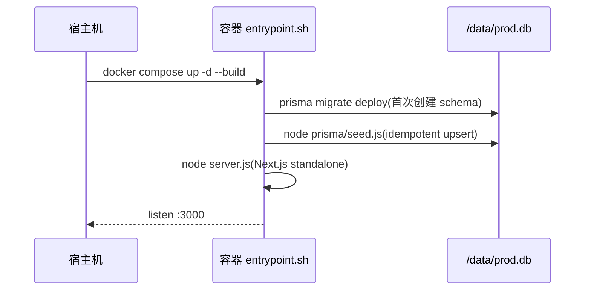

### 2C2G 资源控制措施

| 措施 | Requirement |
|---|---|
| Next.js `output: 'standalone'` 单进程构建产物,镜像未压缩 ≤ 800 MB | 31.4 |
| SQLite 单文件持久化,无独立 DB 进程 | 30.2 / 31.3 |
| 不引入 Redis / ES / Kafka 等常驻 ≥1GB 内存的组件 | 31.5 |
| Next.js `next.config.mjs` 关闭遥测 + 禁用 `experimental.instrumentationHook` 等带来 RSS 上涨的特性 | 31.1 |
| `docker compose` `deploy.resources.limits.memory: 1.5G` 显式限制容器上限 | 31.2 |
| pnpm 9.15.4 + corepack 锁定 lockfile,避免 `node_modules` 漂移 | 32.1 |
| `pnpm build` 前置 `prisma generate`,确保产物一致 | 32.3 |
| 数据库索引精简(详见 §Data Models 索引策略),减少写放大 | 31.1 |

### RSS 验证步骤(交付前)

1. **空载稳态**:`docker compose up -d` → 等待 5 分钟 → `docker stats drive-exam-system` 观察 `MEM USAGE` 应 ≤ 600 MB(Requirement 31.1)。
2. **负载验证**:用 `wrk -t2 -c50 -d30s http://localhost:3000/exam` 对 50 并发跑 30 秒 → `MEM USAGE` 应 ≤ 1.2 GB(Requirement 31.2)。
3. **镜像大小**:`docker images drive-exam-system:latest` 的 `SIZE` 列 ≤ 800 MB(Requirement 31.4)。
4. **数据备份**:停服 → 复制 `./data/prod.db` → 启服;复制即备份(Requirement 30.2)。
5. **冷启**:`docker compose down -v` 后重新 up,首次仍能通过 entrypoint 完成 `migrate + seed` 写入初始管理员(Requirement 30.4)。

### 环境变量清单

| 变量 | 必填 | 默认 | 用途 |
|---|---|---|---|
| `DATABASE_URL` | 是 | `file:/data/prod.db` | SQLite 路径 |
| `AUTH_SECRET` | 是 | — | NextAuth JWT 加密密钥,生产用 `openssl rand -base64 32`(Requirement 30.3) |
| `AUTH_URL` | 否 | — | 部署完整 URL(`https://example.com`) |
| `INITIAL_ADMIN_USERNAME` | 否 | `admin` | 首次 seed 写入(Requirement 5.3) |
| `INITIAL_ADMIN_PASSWORD` | 否 | `Admin@123` | 首次 seed 写入 |

### 常用脚本(Requirement 32.2)

| 命令 | 说明 |
|---|---|
| `pnpm dev` | 本地开发服务器(开发者本机执行,不打包) |
| `pnpm build` | 生产构建,前置 `prisma generate` |
| `pnpm start` | 启动生产服务器 |
| `pnpm db:push` | 同步 schema(开发) |
| `pnpm db:migrate` | 创建并应用迁移(生产) |
| `pnpm db:seed` | 种子数据 |
| `pnpm db:reset` | 重置 dev/test 数据库(危险) |
| `pnpm db:studio` | Prisma Studio |
| `pnpm lint` | ESLint |
| `pnpm typecheck` | tsc --noEmit |
| `pnpm test` | Vitest --run(CI 与默认本地一次执行) |
| `pnpm test:watch` | 仅本地开发辅助使用 |
