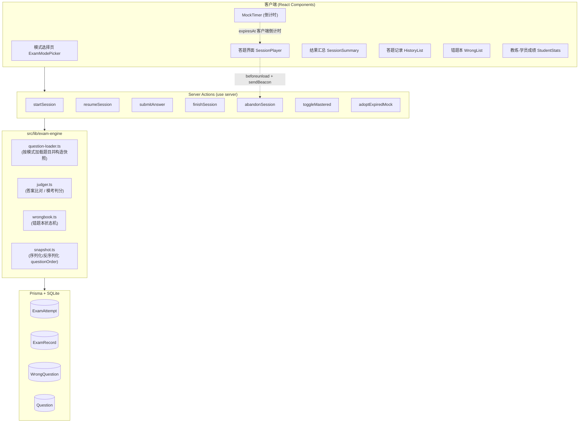
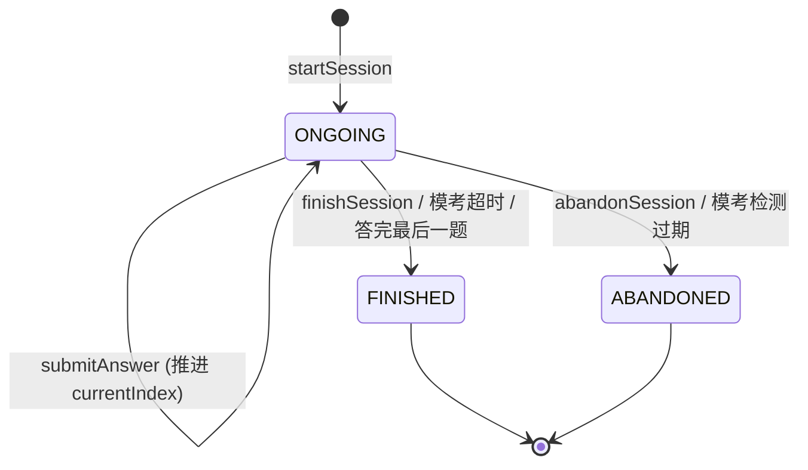
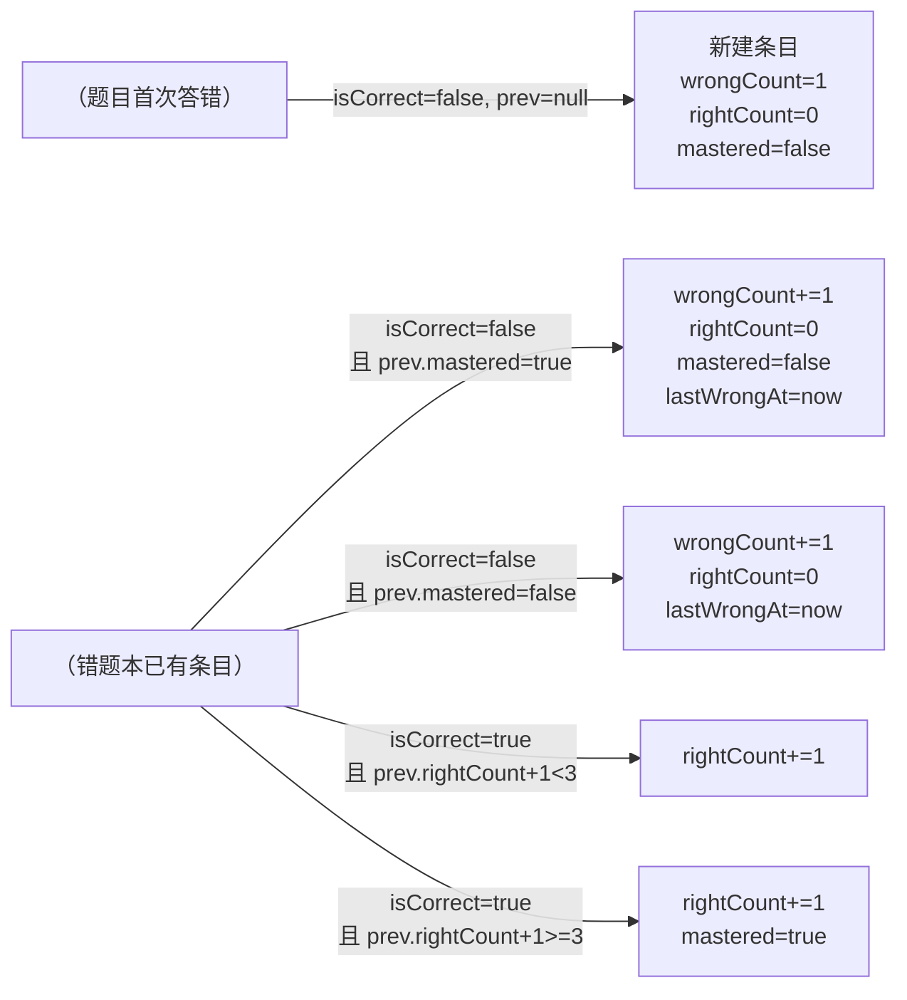

# Design Document

## Overview

本设计文档描述驾考答题系统 P3 阶段的"答题模式"功能实现方案。功能覆盖五种练习模式（顺序、随机、章节、模拟考试、错题重做），并附带答题记录查看、错题本管理、教练查看学员成绩三个辅助页面。

### 设计目标

- **断点续答**：所有非模考模式的会话允许中途离开后从原位置继续，模考模式遵循"考试不可中断"语义。
- **会话快照**：随机/模考/章节模式在创建会话时一次性冻结题目顺序与筛选范围，避免后续题库变化影响进行中的会话。
- **统一答题引擎**：把"加载题目 / 提交答案 / 推进进度 / 触发结束"的核心逻辑收敛在一组 Server Actions 与一个 `examEngine` 服务模块中，UI 层只关心渲染与交互。
- **错题本驱动学习闭环**：所有模式（含模考）的错题统一进入错题本，并通过"连续答对 3 次"的状态机自动标记掌握。
- **复用现有数据模型**：尽量不破坏 `ExamAttempt / ExamRecord / WrongQuestion` 现有结构，仅新增 4 个字段以承载模式快照与断点信息。

### 与现有系统的衔接

- 鉴权沿用 Auth.js v5 + JWT，权限检查通过 `hasPermission(user, code)` 完成。学员练习用 `exam:practice` / `exam:mock`，查看个人成绩用 `stats:self`，教练查看全员成绩用 `stats:all`。
- 路由分组沿用 `(student)` 前台与 `admin/(protected)` 后台两套 shell。
- 数据访问统一通过 `src/lib/db.ts` 的 Prisma Client，写操作以 Server Actions 暴露给客户端组件。
- 题目选项渲染复用 `src/lib/question-types.ts` 的 `parseOptions` / `QUESTION_TYPE_DISPLAY`。

## Architecture

### 整体分层



设计要点：

- **Server Actions 层**：每个动作返回统一的 `ActionResult<T>`（沿用 `src/app/admin/(protected)/banks/actions.ts` 的写法），出错时 UI 用 `sonner` 弹 toast。
- **examEngine 层**：纯函数为主，便于单元测试和属性测试。`question-loader` 是少数会读 DB 的模块，但只做查询；`judger` / `wrongbook` / `snapshot` 完全是纯函数。
- **数据库层**：在现有 schema 基础上新增 4 个字段，详见"Data Models"章节。

### 路由设计

| 路由 | 角色 | 权限 | 说明 |
| --- | --- | --- | --- |
| `/exam` | 学员 | `exam:practice` | 题库列表 + 模式入口（已有占位页，本期重写） |
| `/exam/start` | 学员 | `exam:practice` | 选择题库 + 模式 + 章节 + 开始（也可整合进 `/exam` 卡片，见组件设计） |
| `/exam/session/[attemptId]` | 学员（仅本人） | `exam:practice`（模考还需 `exam:mock`） | 答题主界面，按 `attempt.mode` 渲染 |
| `/exam/session/[attemptId]/result` | 学员（仅本人） | `stats:self` | 结束后的成绩汇总；ABANDONED 也可访问 |
| `/exam/history` | 学员 | `stats:self` | 个人答题记录列表（已有占位页） |
| `/exam/history/[attemptId]` | 学员（仅本人） | `stats:self` | 单次答题逐题详情 |
| `/exam/wrong` | 学员 | `exam:practice` | 错题本列表 + 标记掌握（已有占位页） |
| `/admin/student-stats` | 教练/管理员 | `stats:all` | 学员列表（每页 20，含总次数/平均正确率/最近时间） |
| `/admin/student-stats/[userId]` | 教练/管理员 | `stats:all` | 单个学员答题历史 |

> 路由权限同时由 `auth.config.ts` 的 `authorized` 回调（角色级）和页面级 `hasPermission` 双重把关。`/admin/student-stats` 缺少 `stats:all` 时由页面 `redirect('/admin')` 兜底，对应需求 11.4。

### 状态管理与数据流

#### 会话生命周期状态机



- `ONGOING → FINISHED`：用户主动结束、模考交卷、模考倒计时归零、随机模式答完全部题目。
- `ONGOING → ABANDONED`：用户点击"放弃"、模考被判离场（参见 5.9 / Error Handling）。

#### 客户端 / 服务端职责划分

- **倒计时**：模考的剩余时间在客户端基于 `expiresAt` 推算（`Math.max(0, expiresAt - Date.now())`），不依赖客户端时钟绝对值，避免本地时间被改导致作弊。提交时由服务端再次比对 `expiresAt`，若已过期则按超时处理（即使客户端还显示剩余时间）。
- **题目顺序**：随机/模考/章节模式在 `startSession` 时把顺序写入 `ExamAttempt.questionOrder`，客户端只读不改。顺序模式不需要 `questionOrder`（按 `Question.createdAt asc` 即可），但仍记录 `currentIndex`。
- **断点续答**：客户端进入 `/exam/session/[attemptId]` 时 Server Component 读取 `attempt.currentIndex`，从对应题目开始渲染。
- **离场处理**：模考界面绑定 `beforeunload` 事件，调用 `navigator.sendBeacon('/api/exam/abandon', { attemptId })`（尽力而为）；同时模考会话有 `expiresAt`，下次任何会话请求遇到 `ONGOING` 且 `now > expiresAt + 60s` 的模考，由 `adoptExpiredMock` 自动结算（按超时算分，状态置 `ABANDONED`，未答题计错）。

## Components and Interfaces

### 客户端组件

#### `ExamModePicker`（`src/app/(student)/exam/page.tsx`）

服务器组件，加载所有可用题库与该用户的进行中会话列表，再传给客户端子组件渲染。

- 输出：题库卡片 → 卡片内含 5 个模式按钮（顺序/随机/章节/模考/错题重做）。
- 当用户选择"章节练习"时弹出抽屉/对话框 `CategorySelectDialog`，选择一个或多个分类后再开始。
- 当存在 `mode + bankId` 组合的 `ONGOING` 会话时，按钮文案变为"继续上次"，并显示二次操作"放弃后重开"——对应需求 1.8。

#### `SessionPlayer`（`src/app/(student)/exam/session/[attemptId]/page.tsx` 及子组件）

客户端组件容器，按 `attempt.mode` 切换不同的子组件：

- `PracticePlayer`（顺序/章节/错题重做共用）：支持上一题/下一题导航，提交后立即显示反馈。
- `RandomPlayer`：禁用"上一题"按钮，仅"下一题"。
- `MockPlayer`：嵌入 `MockTimer`，禁用"上一题"，提交后不显示反馈，全部结束后跳到结果页。

共用子组件：

- `QuestionView`：根据 `Question.type` 渲染单选 / 多选 / 判断（`<RadioGroup>` / `<Checkbox>`，复用 `@radix-ui` 已有的封装）。
- `AnswerFeedback`：提交后显示对错、正确答案、解析（模考模式下隐藏）。
- `ProgressBar`：根据模式显示"第 N/M 题"或"已答 N/M 题"。
- `MockTimer`：客户端基于 `expiresAt` 实时倒计时，归零后调用 `finishSession`。
- `SubmitConfirmDialog`：模考交卷确认框，显示未答题数。

#### `SessionSummary`（`/exam/session/[attemptId]/result`）

结束后的统计卡片：总题数、正确数、正确率（一位小数）、用时（mm:ss）、模考额外显示"通过/未通过"标识（90% 阈值）。

#### `HistoryList` / `HistoryDetail`

列表使用服务端组件 + URL 分页参数（`?page=1`），单条记录可点入查看 `ExamRecord` 详情。ABANDONED 记录加 `Badge` 标注"未完成"。

#### `WrongList`

错题列表 + 筛选条（题库 / 掌握状态），每条带"标记/取消掌握"按钮（调用 `toggleMastered` Server Action，使用 React `useTransition` + `sonner` 反馈）。

#### `StudentStats`（教练）

两级页面：第一级学员列表，第二级单学员的 `ExamAttempt` 历史表格（与个人 `HistoryList` 列相同 + 状态列），支持按题库 / 模式筛选。

### Server Actions

所有 Action 文件统一返回 `ActionResult<T>`，并在头部用一个轻量 `requireUser(perm)` helper 校验权限和 `userId`。

```ts
// src/app/(student)/exam/actions.ts
'use server';

export type StartSessionInput =
  | { mode: 'SEQUENTIAL'; bankId: string }
  | { mode: 'RANDOM'; bankId: string }
  | { mode: 'CHAPTER'; bankId: string; categoryIds: string[] }
  | { mode: 'MOCK'; bankId: string }
  | { mode: 'WRONG_REVIEW' };

export async function startSession(input: StartSessionInput): Promise<ActionResult<{ attemptId: string; resumed: boolean }>>;

export async function resumeSession(attemptId: string): Promise<ActionResult<void>>;

export async function submitAnswer(input: {
  attemptId: string;
  questionId: string;
  userAnswer: string;
  costMs: number;
}): Promise<ActionResult<{
  isCorrect: boolean;
  correctAnswer?: string;   // 模考时不返回
  explanation?: string|null;// 模考时不返回
  finished: boolean;        // 答完最后一题时为 true
}>>;

export async function finishSession(attemptId: string): Promise<ActionResult<void>>;
export async function abandonSession(attemptId: string): Promise<ActionResult<void>>;
export async function toggleMastered(wrongId: string, mastered: boolean): Promise<ActionResult<void>>;
```

补充一个 Route Handler 用于 `navigator.sendBeacon`（Server Actions 不支持 beacon 的 keep-alive 语义）：

```ts
// src/app/api/exam/abandon/route.ts
export async function POST(req: Request) { /* parse JSON, call abandonSession */ }
```

### examEngine 模块

```
src/lib/exam-engine/
  ├─ question-loader.ts   // 五种模式的题目加载器
  ├─ judger.ts            // 答案比对 / 模考评分
  ├─ wrongbook.ts         // 错题本状态机
  └─ snapshot.ts          // questionOrder 序列化
```

- `loadQuestionsForMode(mode, opts) → Question[]`：按模式构造题目数组，模考模式同时返回 `expiresAt`。
- `compareAnswer(type, userAnswer, correctAnswer) → boolean`：把"BA" 与 "AB" 视为相等（多选无序），单选/判断逐字符比较，全部统一大写。
- `applyExamResult(prev, isCorrect) → next`：错题本状态机，输入旧条目（可能为 null）+ 是否答对，返回新的 wrongCount/rightCount/mastered/lastWrongAt。
- `serializeOrder(ids) / parseOrder(json)`：复用 `JSON.stringify` / `JSON.parse`，附边界校验。

### 错题本状态机详细规则



- 答对题目但题目不在错题本中：**不创建条目**（错题本只记录至少错过一次的题）。
- "答对 3 次自动掌握"在所有模式下都生效，包括模考结束后批量结算。

## Data Models

### Schema 变更

需要在 `prisma/schema.prisma` 的 `ExamAttempt` 模型新增 4 个字段（其它模型保持不变）：

```prisma
model ExamAttempt {
  id           String    @id @default(cuid())
  userId       String
  user         User      @relation(fields: [userId], references: [id], onDelete: Cascade)
  bankId       String?
  /// SEQUENTIAL | RANDOM | CHAPTER | MOCK | WRONG_REVIEW
  mode         String
  /// ONGOING | FINISHED | ABANDONED
  status       String    @default("ONGOING")
  totalCount   Int       @default(0)
  correctCount Int       @default(0)
  score        Int?
  durationMs   Int?
  startedAt    DateTime  @default(now())
  finishedAt   DateTime?

  /// ✨ 新增:JSON 数组,会话创建时冻结的题目顺序(question.id[])。
  /// SEQUENTIAL 与 CHAPTER 模式存"按 createdAt 升序的快照",
  /// RANDOM 与 MOCK 模式存打乱后的快照,
  /// WRONG_REVIEW 存按 lastWrongAt 降序的快照。
  questionOrder  String   @default("[]")

  /// ✨ 新增:0-based 当前题号,用于断点续答与进度展示。
  currentIndex   Int      @default(0)

  /// ✨ 新增:章节模式的所选分类 ID 数组,JSON 字符串,其它模式留空。
  categoryIds    String   @default("[]")

  /// ✨ 新增:仅 MOCK 模式使用,倒计时截止时间;其它模式为 null。
  expiresAt      DateTime?

  records ExamRecord[]

  @@index([userId])
  @@index([startedAt])
  @@index([userId, mode, status])  // ✨ 新增,加速 1.8 中"是否存在 ONGOING 会话"查询
}
```

> **迁移策略**：用 `pnpm db:push`（开发期）或 `pnpm db:migrate`（生产）追加字段。所有新字段都有默认值，老数据无需回填。`questionOrder` 默认为 `"[]"`，老的 `ONGOING` 会话不会被本次改动恢复（用户重进时若 questionOrder 为空且模式不是 SEQUENTIAL/WRONG_REVIEW，则提示放弃后重开）——这种"灰度"在迁移文档中标注即可。

### `ExamRecord` 不变

字段已经够用：`questionId / userAnswer / isCorrect / costMs`。本期只新增使用约定：

- `userAnswer` 多选题以选项字母按字母升序拼接存储（如 "AC"、"BCD"）。`compareAnswer` 在比对前两边都排序，存储则规范化以便回看。
- 模考超时未答的题目同样写一条 `ExamRecord`，`userAnswer = ""`，`isCorrect = false`，`costMs = 0`。这样 `correctCount` / `totalCount` 计算可以始终基于 `ExamRecord` 数量得到，不需要引入新字段（参见需求 5.4 / 8.3）。

### `WrongQuestion` 不变

字段已经够用：`wrongCount / rightCount / mastered / lastWrongAt`。本期补充使用约定：

- `(userId, questionId)` 唯一索引保证 `applyExamResult` 的写入路径是 `upsert`。
- `mastered = true` 的条目在错题重做模式中被排除（需求 1.4）。
- `mastered` 切换由用户手动操作（需求 10.3 / 10.4）或系统自动（需求 6.4 / 7.7）。

### TypeScript 模型映射

```ts
// src/lib/exam-engine/types.ts
export const EXAM_MODES = ['SEQUENTIAL', 'RANDOM', 'CHAPTER', 'MOCK', 'WRONG_REVIEW'] as const;
export type ExamMode = (typeof EXAM_MODES)[number];

export const ATTEMPT_STATUS = ['ONGOING', 'FINISHED', 'ABANDONED'] as const;
export type AttemptStatus = (typeof ATTEMPT_STATUS)[number];

export const EXAM_MODE_DISPLAY: Record<ExamMode, string> = {
  SEQUENTIAL: '顺序练习',
  RANDOM: '随机练习',
  CHAPTER: '章节练习',
  MOCK: '模拟考试',
  WRONG_REVIEW: '错题重做',
};

/** 模考配置,集中维护以便后期 admin 化 */
export const MOCK_CONFIG: Record<string, { count: number; durationMs: number; passScore: number }> = {
  subject_1: { count: 100, durationMs: 45 * 60 * 1000, passScore: 90 },
  subject_4: { count: 50,  durationMs: 30 * 60 * 1000, passScore: 90 },
  // 其它题库默认值
  __default: { count: 50, durationMs: 30 * 60 * 1000, passScore: 90 },
};
```


## Correctness Properties

*属性（Property）是一段在系统所有合法执行下都应成立的特征或行为——它是一个关于"系统应该做什么"的形式化陈述。属性是把人类可读的需求与机器可验证的正确性保证连接起来的桥梁。*

下面给出经过 prework 分析与去重合并后的 12 条核心属性。每条属性都附带"For all" 或 "For any" 的全称量化语句，以及它所验证的需求条款。属性测试将基于 [`fast-check`](https://fast-check.dev/) 实施（见 Testing Strategy）。

### Property 1: startSession 创建的 ExamAttempt 字段一致

*For any* 合法的 `(userId, mode, bankId, categoryIds?)` 输入，`startSession` 成功返回时所创建的 `ExamAttempt` 都必须满足：`status = 'ONGOING'`、`mode` 与输入一致、`bankId` 与输入一致（`WRONG_REVIEW` 模式 `bankId = null`）、`questionOrder` 解析为 `string[]` 且 `totalCount` 域不被使用（`totalCount` 在结束时才计算）、`currentIndex = 0`、`startedAt <= now`。

**Validates: Requirements 1.1**

### Property 2: 各模式 questionOrder 快照的不变量

*For any* 模式 `M ∈ {SEQUENTIAL, CHAPTER, RANDOM, MOCK, WRONG_REVIEW}` 与对应合法输入，`startSession` 后的 `questionOrder` 数组都必须满足：

- **无重复**：`new Set(questionOrder).size === questionOrder.length`
- **长度规则**：
  - `SEQUENTIAL` / `CHAPTER`：等于按筛选规则得到的题目集合大小
  - `RANDOM`：等于题库题目总数
  - `MOCK`：等于 `MOCK_CONFIG[bankCode].count`（不足时由 5.2 阻止创建）
  - `WRONG_REVIEW`：等于错题本中 `mastered = false` 条目数
- **元素均来自合法来源集**：每个 ID 都属于上面定义的来源集合

**Validates: Requirements 1.7, 3.1, 3.2, 5.1**

### Property 3: SEQUENTIAL / CHAPTER 模式按 createdAt 升序排列

*For any* `SEQUENTIAL` 或 `CHAPTER` 模式的 `startSession` 调用，返回的 `questionOrder` 都应等于"题目集合按 `Question.createdAt` 升序排列"得到的 ID 序列。

**Validates: Requirements 2.1, 4.2**

### Property 4: CHAPTER 模式按分类树过滤

*For any* 分类树和题目-分类关联组合、任意非空 `categoryIds` 输入，`CHAPTER` 模式 `questionOrder` 中出现的题目集合都应等于：

```
{ q | q.bankId == bankId AND ∃ c ∈ q.categories: c.id ∈ descendantsOf(categoryIds) }
```

其中 `descendantsOf(ids)` 包含 `ids` 自身及其在分类树中所有递归子分类。

**Validates: Requirements 4.1**

### Property 5: WRONG_REVIEW 题目加载与排序

*For any* 用户错题本状态，`WRONG_REVIEW` 模式 `startSession` 后的 `questionOrder` 都应等于：

```
[w.questionId for w in 用户错题 if w.mastered == false]
按 w.lastWrongAt 降序排列
```

且 `mastered = true` 的错题不出现在 `questionOrder` 中。

**Validates: Requirements 1.4, 6.1**

### Property 6: 提交答案的 ExamRecord 字段不变量

*For any* 进行中的会话和合法的答题输入 `(questionId, userAnswer, costMs)`，`submitAnswer` 成功后创建的 `ExamRecord` 都必须满足：

- `attemptId` 等于当前会话 ID
- `questionId` 与输入一致
- `userAnswer` 已规范化（多选按字母升序拼接、全部大写）
- `isCorrect == compareAnswer(question.type, userAnswer, question.answer)`
- `costMs` 等于输入（钳制在 `[0, 3_600_000]` 区间内）
- `answeredAt <= now`

**Validates: Requirements 7.1**

### Property 7: 答案比对函数语义

*For any* 题目类型 `T` 与规范化后的两个答案串 `a, b`：

- `T = SINGLE` 或 `T = JUDGE`：`compareAnswer(T, a, b)` 当且仅当 `a == b`（大小写归一后）
- `T = MULTI`：`compareAnswer(T, a, b)` 当且仅当 `sorted(a) == sorted(b)`（即视作集合相等，大小写归一）

特别地，对任意正确答案 `c` 与其字符的任意排列 `c'`，`compareAnswer(T, c, c') == true`。

**Validates: Requirements 7.1**

### Property 8: 错题本状态机转移规则

*For any* 旧错题本条目 `prev`（可能为 `null` 表示首次答错）和答题结果 `isCorrect`，函数 `applyExamResult(prev, isCorrect, now)` 返回的新条目 `next` 都必须满足下列状态机：

| prev | isCorrect | next 字段 |
| --- | --- | --- |
| `null` | `false` | `wrongCount=1, rightCount=0, mastered=false, lastWrongAt=now` |
| `null` | `true` | `next == null`（不创建条目） |
| 已存在，`mastered=false` | `false` | `wrongCount = prev.wrongCount + 1, rightCount=0, mastered=false, lastWrongAt=now` |
| 已存在，`mastered=true` | `false` | `wrongCount = prev.wrongCount + 1, rightCount=0, mastered=false, lastWrongAt=now` |
| 已存在 | `true` 且 `prev.rightCount + 1 < 3` | `rightCount = prev.rightCount + 1, 其余字段不变` |
| 已存在 | `true` 且 `prev.rightCount + 1 >= 3` | `rightCount = prev.rightCount + 1, mastered=true, 其余字段不变` |

并且对任意输入 `next.wrongCount >= prev?.wrongCount ?? 0`、`next.lastWrongAt >= prev?.lastWrongAt ?? Epoch`（单调性）。

**Validates: Requirements 6.2, 6.3, 6.4, 7.5, 7.6, 7.7**

### Property 9: 同会话同题目的提交幂等

*For any* 已存在 `ExamRecord(attemptId, questionId)` 的会话，再次调用 `submitAnswer({ attemptId, questionId, ...任意 })` 都必须：

- 返回 `{ ok: false }` 或抛出已定义的"重复提交"错误
- 数据库中关于 `(attemptId, questionId)` 的 `ExamRecord` 数量保持为 1
- 第一次写入的 `userAnswer / isCorrect / costMs / answeredAt` 字段不被改变

**Validates: Requirements 7.8**

### Property 10: 会话结束的统计字段公式

*For any* 会话结束动作（用户点结束、用户放弃、模考超时、随机模式答完最后一题），`finalize(attempt)` 之后的字段都应满足：

- `status ∈ {FINISHED, ABANDONED}`（与触发源对应）
- `finishedAt` 已被设置且 `>= startedAt`
- `totalCount = ExamRecord.count({attemptId})`
- `correctCount = ExamRecord.count({attemptId, isCorrect:true})`
- `score = totalCount === 0 ? 0 : Math.round(correctCount / totalCount * 100)`
- `durationMs = finishedAt - startedAt`
- 对于 `MOCK` 模式：会话结束时为 `questionOrder` 中尚无 `ExamRecord` 的每道题创建一条 `userAnswer="", isCorrect=false, costMs=0` 的 `ExamRecord`，使得 `totalCount = questionOrder.length`

**Validates: Requirements 5.4, 5.6, 5.7, 5.9, 8.1, 8.2, 8.3, 8.6**

### Property 11: 提交按钮的可用性谓词

*For any* 题目类型 `T` 与已选选项集合 `selected`：

- `T = SINGLE` 或 `T = JUDGE`：`isSubmittable(T, selected) == (selected.length === 1)`
- `T = MULTI`：`isSubmittable(T, selected) == (selected.length >= 2 && selected.length <= optionsCount)`

并且单选/判断模式下选择第二个选项时，第一个选项被自动取消（`selected` 永远长度 ≤ 1）。

**Validates: Requirements 12.2, 12.3, 12.4, 12.5**

### Property 12: 分页查询的不变量

*For any* 数据源（个人答题记录、错题本、教练学员列表、教练单学员历史）和合法的 `(page, pageSize=20, filters)` 输入，分页查询返回的 `items` 都应满足：

- `items.length <= 20`
- 排序顺序与各页面规约一致：
  - 答题记录 / 教练单学员历史：按 `startedAt` 降序
  - 错题本：按 `lastWrongAt` 降序
- 当 `filters` 非空时，`items` 中每一项都满足该筛选谓词
- 答题记录 / 教练历史：仅包含 `status ∈ {FINISHED, ABANDONED}` 的会话

**Validates: Requirements 9.1, 9.2, 9.5, 10.1, 10.2, 11.1, 11.2, 11.3**

## Error Handling

### 通用错误返回结构

所有 Server Action 沿用现有 `ActionResult<T>` 约定（参见 `src/app/admin/(protected)/banks/actions.ts`）：

```ts
type ActionResult<T = void> =
  | { ok: true } | { ok: true; data: T }
  | { ok: false; error: string };
```

UI 调用后用 `sonner.toast.error(result.error)` 反馈，避免抛出未处理异常打断 React 渲染。

### 输入校验

- 所有 Server Action 入参用 `zod` 显式校验（与现有 `BankFormSchema` / `QuestionFormSchema` 风格一致），失败时返回 `error: '提交不合法'` 并附第一条 issue 信息。
- `userAnswer` 在校验阶段就规范化（去空白 / 大写 / 字母升序），避免后续判分逻辑发散。

### 会话存在性与归属

- `submitAnswer / finishSession / abandonSession / resumeSession` 都按 `(attemptId, userId)` 双条件查询，若查不到则返回 `{ ok: false, error: '会话不存在或无权访问' }`。
- 状态非 `ONGOING` 的会话再次提交答案时返回 `{ ok: false, error: '会话已结束，无法继续提交' }`（覆盖需求 7.8 与一般边界）。

### 模考特定错误

| 场景 | 处理 |
| --- | --- |
| 题库题数 < `MOCK_CONFIG.count` | `startSession` 返回错误"题库题目不足，无法开始模拟考试"（需求 5.2） |
| 客户端 `expiresAt` 已过但仍在提交答案 | 服务端比对 `now > expiresAt` 时拒绝当前提交，并立即触发自动结束（按超时算分） |
| 客户端浏览器关闭 | `beforeunload` 触发 `sendBeacon` 调用 `/api/exam/abandon`；同时由"过期模考兜底任务"`adoptExpiredMock` 在用户下次登录或访问 `/exam` 时扫描 `mode='MOCK' AND status='ONGOING' AND expiresAt < now - 60s` 的会话，统一标记为 `ABANDONED` 并补齐统计字段 |
| 模考期间会话被 `ABANDONED` | 学员后续点击"开始模考"会被允许（不视作 1.8 中"已有 ONGOING 会话"），但历史记录会展示这次未完成的模考 |

### 章节模式空筛选

- 1.2/1.3/4.4：`categoryIds` 为空 → 返回"请至少选择一个章节"；筛选后 `questionOrder` 为空 → 返回"所选章节下暂无题目"。**这两个错误必须在 `startSession` 创建 ExamAttempt 之前发生**，避免数据库出现"零题"会话。

### 错题本错误

- 10.7：`toggleMastered` 失败时 UI 用 React `useTransition` 的 pending 状态实现乐观更新，回滚原状态并 toast。
- `WRONG_REVIEW` 启动时若没有未掌握错题，`startSession` 返回"暂无需要重做的错题"（需求 1.6）。

### 图片加载

- 12.7：题目图片用 `` 的 `onError` 显示占位 SVG 与替代文字，不抛错也不阻塞答题逻辑。

### 越权访问

- `/exam/session/[attemptId]` Server Component 校验 `attempt.userId === session.user.id`，否则 `notFound()`。
- `/exam/history/[attemptId]` 同上。
- `/admin/student-stats` 通过 `hasPermission(user, 'stats:all')` 检查，否则 `redirect('/admin')`（需求 11.4）。

## Testing Strategy

### 测试分层

| 层级 | 工具 | 目标 |
| --- | --- | --- |
| 单元测试 | Vitest | 纯函数：`compareAnswer / applyExamResult / serializeOrder / computeScore / isSubmittable` |
| 属性测试 | Vitest + fast-check | 上述纯函数及关键 Server Action 在其领域上的全称属性 |
| 集成测试 | Vitest + Prisma 测试数据库（`prisma/test.db` 或内存 SQLite） | Server Action 与 DB 交互、断点续答、错题本流转 |
| E2E（可选） | Playwright | 关键路径：模考从开始到交卷、错题重做闭环 |
| 渲染快照 | React Testing Library | UI 单列布局 / 题型渲染 / 进度文案 |

### 属性测试库选择

选用 [`fast-check`](https://fast-check.dev/) 作为属性测试框架。理由：

- 与 Vitest / Jest 集成成熟，社区活跃
- 支持 TypeScript 一等公民 API
- 内置 `Arbitrary` 工具足以构造题目、用户、会话等领域对象
- 满足 100 次以上迭代（`fc.assert(prop, { numRuns: 100 })` 默认即如此）

> 不重新发明轮子：禁止从零实现属性框架。

### 属性测试约束

- 每个属性测试 `numRuns >= 100`（fast-check 默认 100）
- 失败用例必须打印 fast-check 的 `counterexample`（fast-check 内置）
- 每个属性测试在文件头注释加上规格映射，格式为：
  ```ts
  // Feature: exam-modes, Property 8: 错题本状态机转移规则
  ```
- 性能敏感的纯函数测试 `numRuns >= 200` 以增强覆盖率（`compareAnswer / applyExamResult`）

### 测试夹具与生成器

预计在 `src/lib/exam-engine/__tests__/arbitraries.ts` 集中维护以下生成器：

```ts
const arbQuestion: fc.Arbitrary<Question>;       // 含 SINGLE / MULTI / JUDGE 与合法 answer
const arbBankWithQuestions: fc.Arbitrary<{ bank: QuestionBank; questions: Question[] }>;
const arbCategoryTree: fc.Arbitrary<Category[]>;          // 父子层级
const arbWrongQuestionState: fc.Arbitrary<WrongQuestion>; // 各种 mastered/rightCount 组合
const arbAnswerInput: fc.Arbitrary<{ type: QuestionType; userAnswer: string }>;
```

### 测试数据库策略

- 集成测试使用专用 `DATABASE_URL=file:./prisma/test.db`，由 `vitest.setup.ts` 在每个 `describe` 前用 `prisma.$transaction` 包裹并回滚（或直接 `db:reset` 后注入夹具）。
- 纯函数测试不接 DB。

### 单元测试 vs 属性测试 平衡

- **属性测试覆盖**：判分逻辑、状态机、快照、会话结束统计、提交按钮规则、分页排序、查询过滤
- **单元/示例测试覆盖**：
  - 具体 UI 文案（如空状态文字、模式标签）
  - 权限拒绝重定向（11.4）
  - 路由级别行为（点击 FINISHED 记录跳详情）
  - 模拟图片加载失败（12.7）
- **集成测试覆盖**：
  - 五种模式 `startSession` 完整链路
  - 模考超时兜底（`adoptExpiredMock`）
  - 错题本与提交联动（提交错答 → 错题本出现 → 重做答对 3 次 → mastered）
- **不做 PBT 的部分**：
  - 倒计时每秒更新（UI 动画）
  - 1 秒内显示反馈（性能 SLA）
  - 100 毫秒内更新视觉状态（性能 SLA）
  - 单列布局 / 响应式（视觉，建议手测或快照）

### 持续验证

- `pnpm test` 命令本身在 P3 之前没有引入，本期会同时增加：
  - 安装 `vitest` / `@vitejs/plugin-react` / `fast-check` / `@testing-library/react`
  - 在 `package.json` 增加 `"test": "vitest run"` 与 `"test:watch": "vitest"`
- 在 `tsconfig.json` 的 `include` 中加入 `src/**/__tests__` 以避免类型遗漏
- CI 阶段（如启用）执行 `pnpm test` + `pnpm typecheck` + `pnpm lint`

