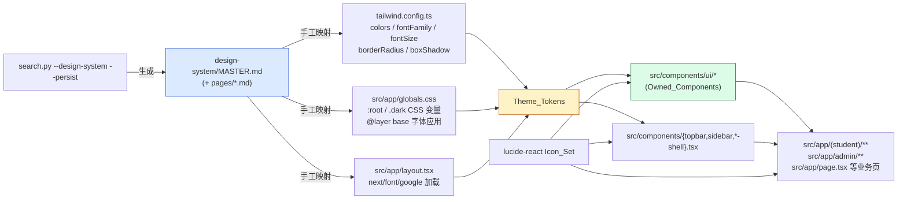
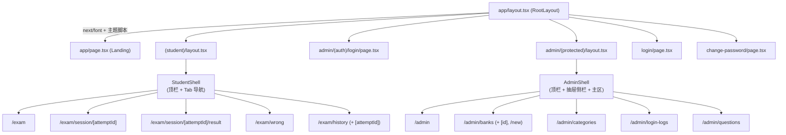
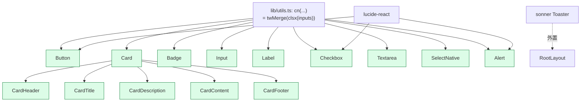
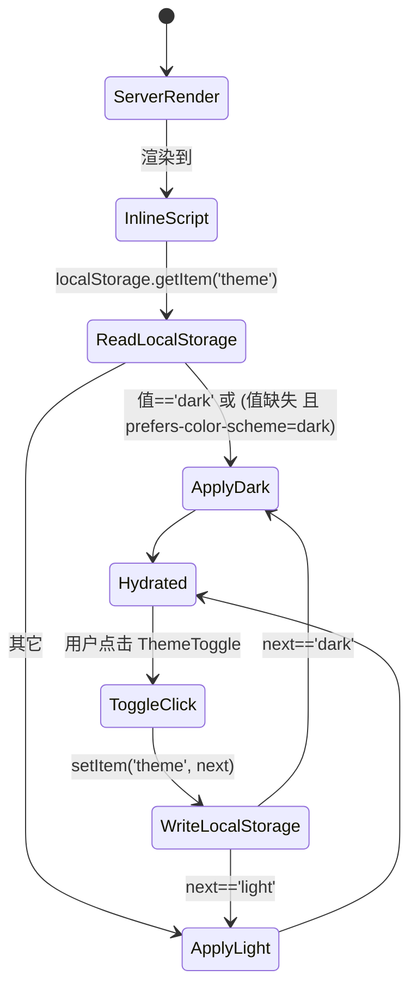
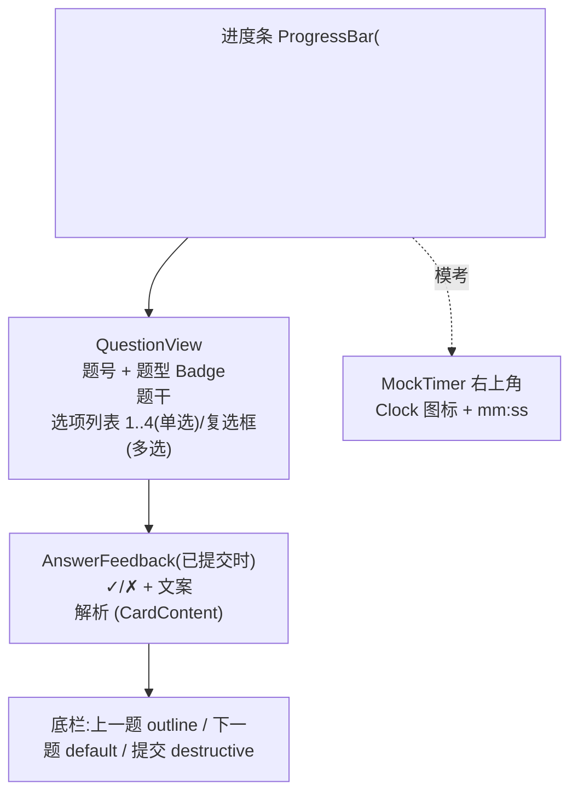

# Design Document

## Overview

本设计文档对应 `requirements.md`,目标是把驾考答题系统(System)的视觉/交互层做一次推倒重写,并落地为符合 Pre_Delivery_Checklist 的产品级 UI。设计的核心思路是建立一条"**Design_System_Master → Theme_Tokens → Owned_Components → 页面**"单向依赖链,让任何一处样式变更只能从 Master 文件流向下游,从而消除目前界面里"灰底灰字"、"emoji 当图标"、"hover 抖动"等不一致问题(对应 R1、R2)。

业务契约不变是另一条不可妥协的边界:Server Actions、Prisma schema、URL 路由、`pnpm test` 现有用例必须在重构后全部保持原样(R13)。因此本次重构在工程上是一次**纯前端层 codemod**——可以重写 `src/components/**/*.tsx`、`src/app/**/*.tsx` 中的 JSX/className/受控值适配代码,但禁止修改 `actions.ts`、`prisma/`、`auth.ts`、`middleware.ts` 等业务文件的对外签名。

设计选择的几条主线:

- **零 Radix 化** —— 把 `@radix-ui/*`、`class-variance-authority`、`tailwindcss-animate` 全量移出 `dependencies`(Banned_Packages,R2.5、R15.2),改为基于 Tailwind + `lucide-react` + `clsx` + `tailwind-merge` 的 Owned_Components(R15)。
- **Theme_Tokens 唯一来源** —— 所有色值/字号必须通过 `bg-primary`、`text-foreground` 这种 Tailwind token 引用,组件内禁止出现十六进制字面量或像素字号(R2.2、R15.8)。
- **明暗双模等价覆盖** —— 通过 `<html>` 上的 `.dark` 类切换,SSR 阶段同步注入 anti-FOUC 脚本(R5、R16)。
- **图标语义统一** —— 只从 `lucide-react` 导入图标,统一三档尺寸 `h-4/5/6 w-4/5/6`,JSX 中不出现 emoji-as-icon(R3)。
- **可验证性** —— 关键不变量(Banned_Packages 缺席、emoji 不作图标、hex 字面量缺席、Server Action 签名稳定、路由稳定等)以 PBT/扫描属性形式落到 `vitest + fast-check`,纳入 `pnpm test`(R13.3、第 8 节 Correctness Properties)。


## Architecture

### 2.1 单向依赖链



依赖方向必须是单向的:任何下游(组件、页面)只能向上读 Theme_Tokens / Owned_Components,**绝不允许下游硬编码色值或私自引入新图标库**(R2.2、R3.2、R15.2、R15.8)。

### 2.2 路由组与 Shell 拓扑



四类壳:
- **Auth_Surface 壳**:Landing、`/login`、`/admin/login`、`/change-password` 不进入任何 App_Shell,各自渲染居中卡片布局(R10)。
- **StudentShell**:`max-w-3xl` 主内容(R6.3),顶栏 + 标签导航,Theme_Toggle 在顶栏右(R8.1、R16.1)。
- **AdminShell**:`max-w-7xl` 主内容(R6.3),顶栏 + 1024px 以下折叠的抽屉侧栏(R12.3),Theme_Toggle 在顶栏右(R9.1、R16.1)。
- **`RootLayout`**:负责 `next/font/google` 字体注入(R2.3)、SSR 主题 anti-FOUC 脚本(R16.5)、`<Toaster />` 来自 sonner(R15.9)。

### 2.3 重构 vs 不动的代码边界

| 区域 | 允许 | 禁止 |
|------|------|------|
| `src/components/**/*.tsx` | 重写 props、JSX、className | — |
| `src/app/**/*.tsx`(页面 / `_components`) | 重写 JSX、className、`onSubmit`/受控值适配 | 改 URL 段名、改路由组结构(R13.4) |
| `src/app/**/actions.ts` | — | 改入参 / 返回值类型(R13.1) |
| `prisma/`、`src/lib/auth.ts`、`middleware.ts` | — | 任何改动(R13.1) |
| `tailwind.config.ts`、`globals.css`、`layout.tsx`(根) | 重写以承接 Master | 引入 Banned_Packages(R2.5) |
| `package.json` | 仅做依赖移除 / 字体 / fast-check 增加 | 引入新图标库(R3.2) |


## 设计体系生成与应用流程

### 3.1 生成 Design_System_Master(R1)

**步骤 1 —— 前置环境检查(R1.7)**:执行 `python3 --version || python --version`,如不可用则中止重构并提示用户安装 Python(参考 SKILL.md Prerequisites)。

**步骤 2 —— 调用脚本生成 Master**:在仓库根执行

```bash
python3 .kiro/steering/ui-ux-pro-max/scripts/search.py \
  "professional dashboard education driver license elegant minimal" \
  --design-system --persist -p "Drive Exam System"
```

- 查询词来自 R1.2 的默认值,用户可在执行前覆盖。
- `--persist` 会创建 `design-system/MASTER.md`(R1.3)与 `design-system/pages/` 目录(R1.5)。
- Master 中至少包含主色/辅色/背景调色板、字体组合、字号阶梯、圆角/阴影规范、推荐风格关键词、反模式列表(R1.4)。

**步骤 3 —— 入版本控制(R1.6)**:确认 `.gitignore` 不忽略 `design-system/`,提交首版 Master 后再开始下游改造。

### 3.2 Master → tailwind.config.ts 映射

`tailwind.config.ts` 在重构后承接 Master 的色板、字体、字号、圆角、阴影:

| Master 字段(示意) | tailwind.config.ts 映射点 | 引用方式 |
|---|---|---|
| `palette.primary` / `secondary` / `accent` / `muted` / `destructive` / `background` / `foreground` / `card` / `popover` / `border` / `input` / `ring` | `theme.extend.colors.<name>: 'hsl(var(--<name>))'` | `bg-primary` / `text-foreground` / ... |
| `typography.sans` / `typography.serif` / `typography.mono` (Google Fonts 名) | `theme.extend.fontFamily.{sans,serif,mono}: ['var(--font-sans)', ...]` | `font-sans` / `font-serif` |
| `typography.scale`(xs..3xl) | `theme.extend.fontSize.{xs,sm,base,lg,xl,2xl,3xl,4xl}` | `text-base` / `text-2xl` |
| `radius.base` | `theme.extend.borderRadius.{sm,md,lg,xl}` 全部基于 `var(--radius)` | `rounded-md` / `rounded-lg` |
| `shadow.{sm,md,lg}` | `theme.extend.boxShadow.{sm,md,lg,card,popover}` | `shadow-card` |

同时 `darkMode: ['class']` 必须保留,确保 `.dark` 类驱动暗色 token(R5、R16.2)。`tailwindcss-animate` 插件移除后(R2.5),需要的过渡通过原生 `transition-colors duration-200` 实现(R4.3、R4.4)。

### 3.3 Master → globals.css 映射

`src/app/globals.css` 用 `:root` 与 `.dark` 两套 CSS 变量承接 Master:

```css
@layer base {
  :root {
    /* —— 颜色:Master.palette.light —— */
    --background: <H S% L%>;
    --foreground: <H S% L%>;
    --card: <H S% L%>;
    --card-foreground: <H S% L%>;
    --primary: <H S% L%>;
    --primary-foreground: <H S% L%>;
    --secondary: ...;
    --muted: ...;
    --muted-foreground: ...;       /* R5.2:不浅于 slate-600 */
    --accent: ...;
    --destructive: ...;
    --border: ...;                 /* R5.4:浅色下需可见 */
    --input: ...;
    --ring: ...;
    /* —— 圆角 —— */
    --radius: <Master.radius.base>;
    /* —— 字体(由 next/font 在 layout.tsx 注入) —— */
    --font-sans: var(--font-app-sans), system-ui, -apple-system, "PingFang SC", "Microsoft YaHei", sans-serif;
  }
  .dark {
    --background: <H S% L%>;
    --foreground: <H S% L%>;
    /* …深色版的全部 token… */
  }
  * { @apply border-border; }
  body { @apply bg-background text-foreground font-sans; }

  @media (prefers-reduced-motion: reduce) {
    *, *::before, *::after {
      animation-duration: 0.01ms !important;
      transition-duration: 0.01ms !important;
    }
  }
}
```

要点:
- 所有色值用 HSL 三元组保存,Tailwind 端用 `hsl(var(--x))` 包裹,以便明暗共用同一个 token name(R2.2、R5)。
- `prefers-reduced-motion` 全局降级到 ≤0.01ms,满足 R11.4。
- 字体通过 `next/font/google` 在 `layout.tsx` 注入 `--font-app-sans` 变量,再由 `--font-sans` 在 base layer 上 apply,避免 FOUT(R2.3)。

### 3.4 Master → layout.tsx 字体注入(R2.3)

```tsx
// src/app/layout.tsx 伪代码
import { Inter, Noto_Sans_SC } from 'next/font/google'; // 名字来自 Master
const sans = Inter({ subsets: ['latin'], variable: '--font-app-sans', display: 'swap' });
const cn   = Noto_Sans_SC({ weight: ['400','500','700'], variable: '--font-app-sans-cn', display: 'swap' });

export default function RootLayout({ children }) {
  return (
    <html lang="zh-CN" suppressHydrationWarning className={`${sans.variable} ${cn.variable}`}>
      <head>
        <Script id="theme-init" strategy="beforeInteractive">{themeInitScript}</Script>
      </head>
      <body className="font-sans bg-background text-foreground antialiased">{children}<Toaster /></body>
    </html>
  );
}
```

具体字体名以 Master 输出为准;若 Master 推荐字体未覆盖中文,补一个 Google Fonts 中文 fallback(本项目用户群以中文为主)。

### 3.5 页级覆盖文件(R2.1、R1.5)

`design-system/pages/<page>.md` 仅在该页与 Master 有冲突时建立,文件内只写**与 Master 不同的部分**和 R14 要求的 "Checklist Verification" 章节。命名约定:

| 页面 | 覆盖文件名 |
|---|---|
| `/`(Landing) | `landing.md` |
| `/exam`(模式选择) | `exam-home.md` |
| `/exam/session/[attemptId]` | `exam-session.md` |
| `/exam/session/[attemptId]/result` | `exam-result.md` |
| `/exam/wrong` | `exam-wrong.md` |
| `/exam/history` 与 `[attemptId]` | `exam-history.md` |
| `/admin` | `admin-home.md` |
| `/admin/banks` 与 `[id]` | `admin-banks.md` |
| `/admin/categories` | `admin-categories.md` |
| `/admin/login-logs` | `admin-login-logs.md` |
| `/login`、`/admin/login`、`/change-password` | `auth.md`(三页共用) |


## Components and Interfaces

### 4.1 Owned_Components 总览(R15)



所有 Owned_Components 共享一个 `cn` helper:

```ts
// src/lib/utils.ts
import { clsx, type ClassValue } from 'clsx';
import { twMerge } from 'tailwind-merge';
export function cn(...inputs: ClassValue[]) { return twMerge(clsx(inputs)); }
```

公共约束(适用于全部 Owned_Components,R15.5/.6/.8):
- 禁止 import `@radix-ui/*`、`class-variance-authority`、`tailwindcss-animate`(R15.2)。
- 颜色与字号必须通过 Theme_Tokens(`bg-primary`、`text-foreground`、`text-sm`...),禁止 `#xxxxxx` 字面量与 `text-[14px]` 任意值类(R15.8)。
- 所有支持 disabled 的组件统一应用 `disabled:opacity-50 disabled:cursor-not-allowed disabled:pointer-events-none`(R15.5)。
- 焦点环统一:`focus-visible:outline-none focus-visible:ring-2 focus-visible:ring-ring focus-visible:ring-offset-2 focus-visible:ring-offset-background`(R4.5、R15.6)。

下列各小节给出每个组件的 props TypeScript 接口、variant/size 映射表,以及内部 Tailwind 类组合伪代码。

### 4.2 Button(`src/components/ui/button.tsx`)

```ts
type ButtonVariant = 'default' | 'outline' | 'ghost' | 'destructive';
type ButtonSize    = 'sm' | 'md' | 'lg';

export interface ButtonProps extends React.ButtonHTMLAttributes<HTMLButtonElement> {
  variant?: ButtonVariant;   // default 'default'
  size?: ButtonSize;         // default 'md'
  asChild?: false;           // 不实现,旧调用处统一改 <Link><Button>...
}
export const Button: React.ForwardRefExoticComponent<
  ButtonProps & React.RefAttributes<HTMLButtonElement>
>;
```

variant 映射:

| variant | 静态类 | hover | active |
|---|---|---|---|
| default | `bg-primary text-primary-foreground` | `hover:bg-primary/90` | `active:bg-primary/95` |
| outline | `border border-input bg-background text-foreground` | `hover:bg-accent hover:text-accent-foreground` | `active:bg-accent/80` |
| ghost | `bg-transparent text-foreground` | `hover:bg-accent hover:text-accent-foreground` | `active:bg-accent/80` |
| destructive | `bg-destructive text-destructive-foreground` | `hover:bg-destructive/90` | `active:bg-destructive/95` |

size 映射(R15.4,移动端 ≥44×44 R11.5):

| size | 类 |
|---|---|
| sm | `h-9 min-h-9 px-3 text-sm rounded-md` |
| md | `h-11 min-h-11 px-4 text-sm rounded-md`(默认,移动端达 44px) |
| lg | `h-12 min-h-12 px-6 text-base rounded-lg` |

基础类(对所有 variant/size 公共):
```
inline-flex items-center justify-center gap-2 font-medium select-none
transition-colors duration-200
focus-visible:outline-none focus-visible:ring-2 focus-visible:ring-ring focus-visible:ring-offset-2 focus-visible:ring-offset-background
disabled:opacity-50 disabled:cursor-not-allowed disabled:pointer-events-none
[&>svg]:h-5 [&>svg]:w-5 [&>svg]:shrink-0
```

最末的 `[&>svg]:h-5 [&>svg]:w-5` 约束按钮内 lucide 图标固定为 5×5(R3.3)。

### 4.3 Card 家族(`src/components/ui/card.tsx`)

```ts
export interface CardProps extends React.HTMLAttributes<HTMLDivElement> {
  interactive?: boolean;     // true 时附加 hover/cursor-pointer 类(R4.1/.2/.4)
  padded?: boolean;          // 默认 true,false 时去掉默认 p-6
}
export const Card: React.FC<CardProps>;
export const CardHeader: React.FC<React.HTMLAttributes<HTMLDivElement>>;
export const CardTitle: React.FC<React.HTMLAttributes<HTMLHeadingElement>>;        // 渲染 <h3>
export const CardDescription: React.FC<React.HTMLAttributes<HTMLParagraphElement>>;
export const CardContent: React.FC<React.HTMLAttributes<HTMLDivElement>>;
export const CardFooter: React.FC<React.HTMLAttributes<HTMLDivElement>>;
```

| 子组件 | 类 |
|---|---|
| Card(基础) | `rounded-lg border border-border bg-card text-card-foreground shadow-sm` |
| Card(`padded`) | 追加 `p-6` |
| Card(`interactive`) | 追加 `cursor-pointer transition-colors duration-200 hover:bg-accent/40 hover:border-ring/40`(R4.2/.3/.4) |
| CardHeader | `flex flex-col gap-1.5 pb-4` |
| CardTitle | `text-lg font-semibold leading-none tracking-tight text-foreground` |
| CardDescription | `text-sm text-muted-foreground` |
| CardContent | `pt-0` |
| CardFooter | `flex items-center pt-4` |

interactive 模式禁用 `hover:scale-*` 形变(R4.4),只用颜色/边框/阴影变化。

### 4.4 Badge(`src/components/ui/badge.tsx`)

```ts
type BadgeVariant = 'default' | 'outline' | 'destructive' | 'success' | 'warning';
export interface BadgeProps extends React.HTMLAttributes<HTMLSpanElement> {
  variant?: BadgeVariant;   // default 'default'
}
export const Badge: React.FC<BadgeProps>;
```

| variant | 类 |
|---|---|
| default | `bg-primary/10 text-primary border border-primary/20` |
| outline | `bg-transparent text-foreground border border-border` |
| destructive | `bg-destructive/10 text-destructive border border-destructive/30` |
| success | `bg-emerald-500/10 text-emerald-700 dark:text-emerald-400 border border-emerald-500/30` |
| warning | `bg-amber-500/10 text-amber-700 dark:text-amber-400 border border-amber-500/30` |

> success / warning 引入 emerald/amber 调色板,用于"通过/未通过/冻结"等语义状态(R8.6、R9.5)。这些颜色仍位于 Tailwind 默认调色板中,不属于硬编码 hex,符合 R2.2;但仍需 Master 在反模式中没有禁用 emerald/amber。如 Master 明确反模式包含,改为 `bg-primary/...` + 图标双重指示。

基础类:
```
inline-flex items-center gap-1 px-2.5 py-0.5 rounded-md text-xs font-medium
[&>svg]:h-3.5 [&>svg]:w-3.5
```

### 4.5 Input(`src/components/ui/input.tsx`)

```ts
type InputSize = 'sm' | 'md' | 'lg';
export interface InputProps extends Omit<React.InputHTMLAttributes<HTMLInputElement>, 'size'> {
  inputSize?: InputSize;     // default 'md'
  invalid?: boolean;         // 渲染 aria-invalid + 红色边框(R10.2、R11.2)
}
export const Input: React.ForwardRefExoticComponent<InputProps & React.RefAttributes<HTMLInputElement>>;
```

> 注意:HTML `size` 属性与 Tailwind size 形参冲突,这里改名 `inputSize`(R15.10:调用处需同步)。

| size | 类 |
|---|---|
| sm | `h-9 min-h-9 px-3 text-sm rounded-md` |
| md | `h-11 min-h-11 px-3 text-sm rounded-md`(默认) |
| lg | `h-12 min-h-12 px-4 text-base rounded-lg` |

基础类:
```
flex w-full bg-background text-foreground placeholder:text-muted-foreground
border border-input
transition-colors duration-200
focus-visible:outline-none focus-visible:ring-2 focus-visible:ring-ring focus-visible:ring-offset-2
disabled:opacity-50 disabled:cursor-not-allowed
aria-[invalid=true]:border-destructive aria-[invalid=true]:focus-visible:ring-destructive
file:border-0 file:bg-transparent file:text-sm file:font-medium
```

### 4.6 Label(`src/components/ui/label.tsx`)

```ts
export interface LabelProps extends React.LabelHTMLAttributes<HTMLLabelElement> {
  required?: boolean;    // 渲染右侧 * 红点(R11.2)
}
export const Label: React.FC<LabelProps>;
```

类:`text-sm font-medium text-foreground leading-none peer-disabled:opacity-50 peer-disabled:cursor-not-allowed`。
`required` 时在子元素后追加 `<span aria-hidden="true" className="ml-0.5 text-destructive">*</span>`,真正语义靠原生 `<input required>`。

### 4.7 Checkbox(`src/components/ui/checkbox.tsx`,R15.7)

```ts
export interface CheckboxProps extends Omit<React.InputHTMLAttributes<HTMLInputElement>, 'type' | 'size'> {
  // 受控值沿用原生 input checked / onChange,旧 onCheckedChange 调用处统一改写(R15.10)
}
export const Checkbox: React.ForwardRefExoticComponent<CheckboxProps & React.RefAttributes<HTMLInputElement>>;
```

实现方式(无 Radix):
- 渲染一个 `relative inline-flex` 容器:
  - 真实 `<input type="checkbox" className="peer absolute inset-0 opacity-0 cursor-pointer">`(可点击区铺满)。
  - 视觉方块 `<span className="h-4 w-4 rounded-sm border border-input bg-background peer-checked:bg-primary peer-checked:border-primary peer-focus-visible:ring-2 peer-focus-visible:ring-ring peer-disabled:opacity-50 transition-colors duration-200">`。
  - 视觉方块内部 `<Check className="h-3.5 w-3.5 text-primary-foreground hidden peer-checked:block" aria-hidden />`(R15.7 用 lucide 的 Check)。

容器外 wrap 必要时套 `min-h-11 min-w-11` 以达到 44×44 触控目标(R11.5)。

### 4.8 Textarea(`src/components/ui/textarea.tsx`)

```ts
type TextareaSize = 'sm' | 'md' | 'lg';
export interface TextareaProps extends React.TextareaHTMLAttributes<HTMLTextAreaElement> {
  textareaSize?: TextareaSize;    // default 'md'
  invalid?: boolean;
}
export const Textarea: React.ForwardRefExoticComponent<TextareaProps & React.RefAttributes<HTMLTextAreaElement>>;
```

类(基础):
```
flex w-full min-h-[6rem] bg-background text-foreground placeholder:text-muted-foreground
border border-input rounded-md transition-colors duration-200
focus-visible:outline-none focus-visible:ring-2 focus-visible:ring-ring focus-visible:ring-offset-2
disabled:opacity-50 disabled:cursor-not-allowed
aria-[invalid=true]:border-destructive
```

size 仅影响 `text-*` 与 `px-*`/`py-*`,不影响 `min-h-[6rem]`。

### 4.9 SelectNative(`src/components/ui/select-native.tsx`)

```ts
type SelectSize = 'sm' | 'md' | 'lg';
export interface SelectNativeProps extends Omit<React.SelectHTMLAttributes<HTMLSelectElement>, 'size'> {
  selectSize?: SelectSize;
  invalid?: boolean;
}
export const SelectNative: React.ForwardRefExoticComponent<SelectNativeProps & React.RefAttributes<HTMLSelectElement>>;
```

实现:`<select>` + 右侧绝对定位 `<ChevronDown />` 图标 + `appearance-none`。size 与 Input 共用同一组类。基础类:
```
relative flex w-full appearance-none bg-background text-foreground
border border-input rounded-md pr-9
transition-colors duration-200
focus-visible:outline-none focus-visible:ring-2 focus-visible:ring-ring focus-visible:ring-offset-2
disabled:opacity-50 disabled:cursor-not-allowed
```

### 4.10 Alert(`src/components/ui/alert.tsx`)

```ts
type AlertVariant = 'default' | 'outline' | 'destructive' | 'success' | 'warning';
export interface AlertProps extends React.HTMLAttributes<HTMLDivElement> {
  variant?: AlertVariant;
  icon?: React.ReactNode;     // 默认按 variant 自动选 lucide 图标
}
export const Alert: React.FC<AlertProps>;
export const AlertDescription: React.FC<React.HTMLAttributes<HTMLDivElement>>;
```

variant 与图标默认值:

| variant | 容器类 | 默认图标(lucide) |
|---|---|---|
| default | `bg-card text-card-foreground border border-border` | `Info` |
| outline | `bg-transparent text-foreground border border-border` | `Info` |
| destructive | `bg-destructive/10 text-destructive border border-destructive/30` | `AlertCircle` |
| success | `bg-emerald-500/10 text-emerald-700 dark:text-emerald-400 border border-emerald-500/30` | `CheckCircle2` |
| warning | `bg-amber-500/10 text-amber-700 dark:text-amber-400 border border-amber-500/30` | `AlertTriangle` |

基础容器:`relative w-full rounded-lg p-4 [&>svg]:h-5 [&>svg]:w-5 [&>svg]:absolute [&>svg]:left-4 [&>svg]:top-4 [&_p]:pl-7`。

### 4.11 Toast(继续使用 sonner,R15.9)

不重写。`RootLayout` 中渲染:

```tsx
import { Toaster } from 'sonner';
<Toaster
  position="top-center"
  richColors
  closeButton
  toastOptions={{
    classNames: {
      toast: 'bg-card text-card-foreground border border-border',
      title: 'text-sm font-medium',
      description: 'text-sm text-muted-foreground',
    },
  }}
/>
```

通过 `classNames` 接入 Theme_Tokens,使 Toast 在 `.dark` 下自动跟随(R15.8)。

### 4.12 NavIcon、Topbar、Sidebar、StudentShell、AdminShell 接口

```ts
// src/components/nav-icon.tsx —— 已存在,改造为强制 lucide 图标
type NavIconProps = { icon: LucideIcon; className?: string; label?: string };
export function NavIcon({ icon: Icon, className, label }: NavIconProps): JSX.Element;

// src/components/theme-toggle.tsx —— 新增
export function ThemeToggle(): JSX.Element;

// src/components/topbar.tsx —— 重写
type TopbarProps = {
  variant: 'student' | 'admin';
  user?: { name: string; role: string };
  onMenuClick?: () => void;          // admin 抽屉触发(R12.3)
};
export function Topbar(props: TopbarProps): JSX.Element;

// src/components/sidebar.tsx —— 重写,仅 admin 使用
type SidebarProps = {
  open: boolean;
  onClose: () => void;
  items: { href: string; label: string; icon: LucideIcon }[];
};
export function Sidebar(props: SidebarProps): JSX.Element;

// src/components/student-shell.tsx —— 重写
type StudentShellProps = { children: React.ReactNode; user?: { name: string } };
export function StudentShell(props: StudentShellProps): JSX.Element;

// src/components/admin-shell.tsx —— 重写
type AdminShellProps = { children: React.ReactNode; user: { name: string; role: string } };
export function AdminShell(props: AdminShellProps): JSX.Element;
```


## Data Models

本次重构的"数据模型"主要是前端层 props/state 形状(业务层 Prisma 模型不动,R13.1)。

### 5.1 Theme_Tokens 形状(由 Master 推导)

```ts
// 概念性类型,实际值来自 globals.css 的 CSS 变量
type ThemeColorToken =
  | 'background' | 'foreground'
  | 'card' | 'card-foreground'
  | 'popover' | 'popover-foreground'
  | 'primary' | 'primary-foreground'
  | 'secondary' | 'secondary-foreground'
  | 'muted' | 'muted-foreground'
  | 'accent' | 'accent-foreground'
  | 'destructive' | 'destructive-foreground'
  | 'border' | 'input' | 'ring';

type ThemeFontSizeToken = 'xs' | 'sm' | 'base' | 'lg' | 'xl' | '2xl' | '3xl' | '4xl';
type ThemeRadiusToken   = 'sm' | 'md' | 'lg' | 'xl';
type ThemeShadowToken   = 'sm' | 'md' | 'lg' | 'card' | 'popover';
```

### 5.2 Theme 切换状态(R16)

```ts
type Theme = 'light' | 'dark';
type ThemeSource = 'localStorage' | 'prefers-color-scheme' | 'default-light';

interface ThemeState {
  theme: Theme;
  source: ThemeSource;
}

// localStorage 键
const THEME_KEY = 'theme';
```

切换状态机(由 SSR 内联脚本和客户端 hook 共同维护):



### 5.3 答题播放器状态(沿用现有形状,R13.1/.2)

`practice-player` / `mock-player` / `random-player` 内部状态契约保持不变,仅适配组件 API:

```ts
interface PlayerState {
  currentIndex: number;
  answers: Record<string, number[] | null>;   // questionId → 选中选项下标数组
  startedAt: Date;
  remainingSeconds?: number;                  // 仅模考
  status: 'ONGOING' | 'SUBMITTED' | 'EXPIRED';
}
type AnswerFeedback = 'correct' | 'wrong' | 'unanswered';
```

UI 选项命中态:

```ts
type OptionVisual =
  | { state: 'idle' }                                // 未交互
  | { state: 'selected' }                            // 已选未提交
  | { state: 'correct'; icon: 'CheckCircle2' }       // 已提交且正确(色 + 图,R11.3)
  | { state: 'wrong'; icon: 'XCircle' }              // 已提交且错误
  | { state: 'correct-answer'; icon: 'Check' };      // 显示正确答案(用户错选时)
```

### 5.4 Admin 列表筛选模型

```ts
interface BankListFilter { keyword?: string; categoryId?: string; page: number; pageSize: number }
interface LoginLogFilter {
  keyword?: string;
  status?: 'SUCCESS' | 'FAIL' | 'FROZEN';
  from?: Date; to?: Date;
  page: number; pageSize: number;
}
```

筛选器组件不增加 Server Action 入参,只改 UI 控件(R13.1)。


## Correctness Properties

*A property is a characteristic or behavior that should hold true across all valid executions of a system—essentially, a formal statement about what the system should do. Properties serve as the bridge between human-readable specifications and machine-verifiable correctness guarantees.*

> 适用性评估:本特性以 UI 重构为主,但存在大量"不变量"型可形式化属性(依赖缺席、源码反模式缺席、组件渲染骨架、Server Action 签名稳定、路由稳定),这些属性的输入空间(可被随机抽取的源码文件、变体组合、路由记录)较大、运行成本低(纯文本扫描 + jsdom 渲染),非常适合 PBT(R13.3)。下列属性以 `vitest + fast-check` 实现,每条至少 100 次迭代。

每条属性的验证目标如 prework 中的去重整合所列(共 9 条),以下给出形式化叙述与对应 Requirement 编号映射。

### Property 1: Banned_Packages 不出现于 dependencies

*For all* package name `p ∈ Banned_Packages`(即 `class-variance-authority`、`tailwindcss-animate`、以及任何以 `@radix-ui/` 为前缀的包),`package.json.dependencies[p]` 应为 `undefined`,且 `package.json.dependencies` 中不存在以 `@radix-ui/` 为前缀的任意键。

**Validates: Requirements 2.5, 15.2**

### Property 2: 源码反模式扫描全称缺席

*For any* 源码文件 `f`(命中 glob `src/**/*.{ts,tsx}`)与任意反模式正则 `r ∈ AntiPatternRegexSet`,`f` 的内容应不匹配 `r`。`AntiPatternRegexSet` 至少包含:
- 十六进制色值字面量:`/#[0-9a-fA-F]{3}\b/`、`/#[0-9a-fA-F]{6}\b/`、`/#[0-9a-fA-F]{8}\b/`(R2.2、R15.8)
- 任意像素值类:`/text-\[\d+px\]/`、`/h-\[\d+px\]/`、`/w-\[\d+px\]/`(R2.2、R3.3、R15.8)
- 禁用图标库 import:`/from\s+['"](?:react-icons[\/'"]|@heroicons\/react|phosphor-react|@phosphor-icons\/)/`(R3.2)
- 禁用包 import:`/from\s+['"](?:@radix-ui\/|class-variance-authority|tailwindcss-animate)/`(R2.5、R15.2)
- emoji-as-icon(JSX 文本中的常见装饰性 emoji,排除题干等业务字段;通过白名单文件路径或 ARIA-hidden 容器豁免):至少包含 `🚗`、`📒`、`🎉`、`✅`、`❌` 等 Master 反模式列出的字符(R3.1)
- 形变 hover:`/hover:scale-(?:[2-9]\d|1[1-9]\d|[2-9]\d{2})/`(允许 `hover:scale-95/100/105` 微动效,R4.4)
- 浅色下不可见的玻璃/边框透明度:`/bg-white\/(?:[0-7]?\d)\b/`(<80)、`/border-white\/(?:[0-9])\b/`(<10)(R5.3、R5.4)

**Validates: Requirements 2.2, 3.1, 3.2, 3.3, 4.4, 5.3, 5.4, 15.2, 15.8**

### Property 3: Owned_Components 在任意 variant/size 下满足焦点与禁用基线

*For all* `(C, props) ∈ OwnedComponentMatrix`,其中 `C ∈ {Button, Input, Textarea, SelectNative, Checkbox, Card(interactive=true), Badge, Alert}`、`props.variant ∈ C.variants`、`props.size ∈ {sm,md,lg}`(若 C 支持 size)、`props.disabled ∈ {true, false}`,渲染结果 `el = render(<C {...props} />)`:

- `props.disabled === false` 时,`el.className` 含 `focus-visible:ring-2` 与 `focus-visible:ring-ring`;
- `props.disabled === true` 时,`el.className` 含 `opacity-50` 与 `cursor-not-allowed`(或 `pointer-events-none`)。

**Validates: Requirements 4.5, 15.5, 15.6**

### Property 4: 触控目标 ≥ 44×44

*For any* `size ∈ {md, lg}` 与任意 `variant ∈ Button.variants`,`render(<Button size={size} variant={variant}>x</Button>)` 的根 `<button>` 的 `className` 同时含 `min-h-11` 与高度类(`h-11`/`h-12`);对于 `Checkbox` 的可点击包裹层,渲染结果存在祖先节点 `className` 含 `min-h-11 min-w-11`。

**Validates: Requirements 11.5, 15.4**

### Property 5: 状态语义不依赖单一颜色

*For any* 带语义状态的组件实例 `(C, state)`,其中:
- `C = Checkbox` 与 `state ∈ {checked: true, checked: false}`;
- `C = OptionView`(答题播放器内部组件)与 `state ∈ {idle, selected, correct, wrong, correct-answer}`;

当 `state` 表示"正确/错误/选中"时,渲染结果同时包含一个 lucide 图标 `<svg>` 节点(`Check` / `CheckCircle2` / `XCircle`)与对应色调类(`text-primary` / `text-emerald-700` / `text-destructive` 之一),不允许只用颜色指示。

**Validates: Requirements 8.4, 11.3, 15.7**

### Property 6: ThemeToggle 状态机正确

*For all* 起始状态组合 `(stored, system) ∈ {null, 'light', 'dark'} × {'light', 'dark'}`,其中 `stored = localStorage.getItem('theme')`、`system = matchMedia('(prefers-color-scheme: dark)').matches ? 'dark' : 'light'`,以及任意点击次数 `k ∈ [0, 5]`:

- SSR 初态:`<html>` 是否含 `.dark` 类等价于 `(stored ?? system) === 'dark'`(R16.3、R16.5);
- 第 `k` 次点击 `<ThemeToggle />` 后:`<html>.classList.contains('dark')` 与 `localStorage.getItem('theme') === 'dark'` 等价,且二者随每次点击同步翻转(R16.2、R16.4)。

**Validates: Requirements 16.2, 16.3, 16.4**

### Property 7: Server Action 签名稳定

*For any* 文件 `f` 命中 `src/app/**/actions.ts` 中由 `export async function` 导出的函数 `fn`,`signature(fn)` 应等于 `__snapshots__/server-actions.snap` 中以 `relativePath(f) + '#' + fn.name` 为键记录的 baseline 字符串。`signature(fn)` 由 `ts-morph` 提取 `fn.getStructure()` 的参数类型 + 返回值类型 + zod schema 文本组成。

**Validates: Requirements 13.1**

### Property 8: URL 路由稳定

*For any* 路由 `r ∈ BaselineRoutes`,其中 `BaselineRoutes` 是重构前 `git stash` 状态下 `src/app/**/page.tsx` 经 Next.js 路由组规则解析得到的 URL 集合(包含 `/`、`/login`、`/admin/login`、`/admin`、`/admin/banks`、`/admin/banks/new`、`/admin/banks/[id]`、`/admin/categories`、`/admin/login-logs`、`/admin/questions` 及子路由、`/exam`、`/exam/wrong`、`/exam/history`、`/exam/history/[attemptId]`、`/exam/session/[attemptId]`、`/exam/session/[attemptId]/result`、`/change-password`),重构后的源码树中应存在与 `r` 对应的 `page.tsx` 文件。

**Validates: Requirements 13.4**

### Property 9: Shell 最大宽度单一性

*For any* 文件 `f` 命中 glob `src/app/(student)/**/page.tsx`,`f` 内容中出现的 `max-w-*` 类(若有)只属于集合 `{'max-w-3xl'}`;*for any* 文件 `f` 命中 glob `src/app/admin/(protected)/**/page.tsx`,`f` 内容中出现的 `max-w-*` 类只属于集合 `{'max-w-7xl'}`。

**Validates: Requirements 6.3**

> 说明:R5.1(对比度 4.5:1)、R12.x(视口断点)、R14(Pre_Delivery_Checklist)等需要真实浏览器或人工核对的项,不在本节 PBT 覆盖范围,放入第 7 节 Testing Strategy 的"人工 / 视觉回归"子项。


## Theme_Toggle 实现细节(R16)

### 7.1 SSR 内联脚本(anti-FOUC,R16.5)

在 `src/app/layout.tsx` 的 `<head>` 中通过 `next/script` 的 `strategy="beforeInteractive"` 注入下列脚本(伪代码,转义字符串实际由模板字符串提供):

```ts
// src/app/_theme-init-script.ts
export const themeInitScript = `(() => {
  try {
    var ls = localStorage.getItem('theme');                   // 'light' | 'dark' | null
    var prefersDark = window.matchMedia('(prefers-color-scheme: dark)').matches;
    var theme = ls === 'light' || ls === 'dark' ? ls : (prefersDark ? 'dark' : 'light');
    var root = document.documentElement;
    if (theme === 'dark') root.classList.add('dark');
    else root.classList.remove('dark');
    root.style.colorScheme = theme;
  } catch (_) {
    // localStorage 受限(隐私模式 / iframe)时按 light 兜底
  }
})();`;
```

要点:
- 必须在 React hydrate 之前同步执行 → 选 `beforeInteractive` 或裸 `<script dangerouslySetInnerHTML={{ __html: themeInitScript }} />` 放在 `<head>` 顶部。
- 同步访问 `localStorage`/`matchMedia`,任何异常 fallthrough 到 light(R16.5)。
- `<html lang="zh-CN" suppressHydrationWarning>` 必须设置 `suppressHydrationWarning`,因为 `.dark` 类是脚本动态加的,服务端 markup 不带它,React 不会报 mismatch。

### 7.2 客户端 useTheme hook

```ts
// src/lib/use-theme.ts(伪代码)
'use client';
import { useEffect, useState, useCallback } from 'react';
type Theme = 'light' | 'dark';

export function useTheme() {
  const [theme, setTheme] = useState<Theme>('light');

  // 初次挂载时同步真实状态(脚本已设好 .dark 类)
  useEffect(() => {
    const isDark = document.documentElement.classList.contains('dark');
    setTheme(isDark ? 'dark' : 'light');
  }, []);

  // 监听其它标签页 storage 事件,跨标签同步
  useEffect(() => {
    const onStorage = (e: StorageEvent) => {
      if (e.key === 'theme' && (e.newValue === 'light' || e.newValue === 'dark')) {
        applyTheme(e.newValue);
        setTheme(e.newValue);
      }
    };
    window.addEventListener('storage', onStorage);
    return () => window.removeEventListener('storage', onStorage);
  }, []);

  const toggle = useCallback(() => {
    setTheme(prev => {
      const next: Theme = prev === 'dark' ? 'light' : 'dark';
      applyTheme(next);
      try { localStorage.setItem('theme', next); } catch {}
      return next;
    });
  }, []);

  return { theme, toggle };
}

function applyTheme(t: Theme) {
  const root = document.documentElement;
  if (t === 'dark') root.classList.add('dark'); else root.classList.remove('dark');
  root.style.colorScheme = t;
}
```

### 7.3 ThemeToggle 按钮组件接入位置

```tsx
// src/components/theme-toggle.tsx(伪代码)
'use client';
import { Sun, Moon } from 'lucide-react';
import { Button } from '@/components/ui/button';
import { useTheme } from '@/lib/use-theme';

export function ThemeToggle() {
  const { theme, toggle } = useTheme();
  const Icon = theme === 'dark' ? Sun : Moon;
  return (
    <Button
      variant="ghost"
      size="md"           // size=md 自带 min-h-11,满足 R11.5 / R16.6
      aria-label="切换主题"
      onClick={toggle}
      className="h-11 w-11 p-0"
    >
      <Icon aria-hidden className="h-5 w-5" />
    </Button>
  );
}
```

接入位置:
- `src/components/topbar.tsx` 内,无论 `variant === 'student'` 还是 `'admin'`,Topbar 右侧固定渲染 `<ThemeToggle />`(R16.1)。
- `Auth_Surface`(`/login`、`/admin/login`、`/change-password`、`/`)默认不进入 Shell,这些页面**不强制**渲染 ThemeToggle;但页面背景必须随 `<html>` 的 `.dark` 类自动跟随(R16.7)。


## App Shell 重设计

### 8.1 StudentShell

```mermaid
flowchart TB
    subgraph StudentShell
        TB["Topbar(student)"]:::topbar
        TB --> L["Logo + 系统名(Lucide Car 图标)"]
        TB --> N["Tabs: 答题 / 错题本 / 答题记录"]
        TB --> R["右侧: ThemeToggle + 用户菜单"]
        Main["<main class=\"max-w-3xl mx-auto px-4 pt-20 pb-12\">{children}</main>"]
    end
    StudentShell --> Main
    classDef topbar fill:#dbeafe,stroke:#1d4ed8
```

布局结构(伪代码):

```tsx
// src/components/student-shell.tsx
<div className="min-h-screen bg-background text-foreground">
  <header
    className="fixed top-4 left-4 right-4 z-50 mx-auto max-w-3xl
               flex h-14 items-center justify-between
               rounded-xl border border-border bg-card/95 backdrop-blur
               shadow-sm px-4">
    <Link href="/exam" className="flex items-center gap-2">
      <Car aria-hidden className="h-6 w-6 text-primary" />
      <span className="text-base font-semibold">驾考答题系统</span>
    </Link>
    <nav className="hidden md:flex items-center gap-1">
      <NavLink href="/exam"   label="答题"     icon={GraduationCap} />
      <NavLink href="/exam/wrong"   label="错题本"   icon={BookMarked} />
      <NavLink href="/exam/history" label="答题记录" icon={History} />
    </nav>
    <div className="flex items-center gap-2">
      <ThemeToggle />
      <UserMenu user={user} />
    </div>
  </header>
  <main className="mx-auto w-full max-w-3xl px-4 pt-24 pb-12">
    {children}
  </main>
</div>
```

要点:
- `top-4 left-4 right-4` + `rounded-xl` 满足浮动导航空隙(R6.1)。
- `pt-24`(头部 56px + 上方 16px + 余量)防内容被遮挡(R6.2、R12.4)。
- 唯一最大宽度 `max-w-3xl`(R6.3)。
- 移动端(<768px)Tabs 折叠为底部 NavBar(`md:hidden fixed bottom-4 ...` 卡片化 tabs),触控目标统一 ≥44(R11.5、R12.2)。

状态:Shell 是 RSC,只接收 `user` props 与 `children`;`ThemeToggle`、`UserMenu` 是 'use client' 子组件,内部各自 hook 管理状态。

### 8.2 AdminShell

```mermaid
flowchart LR
    subgraph AdminShell
        SB["Sidebar(lg+ 常驻 / <lg 抽屉)"]
        subgraph RightCol["right column"]
            TB["Topbar(admin)\n含汉堡按钮 + ThemeToggle + 用户菜单"]
            Main["<main class=\"max-w-7xl mx-auto px-6 pt-20 pb-12\">{children}</main>"]
        end
    end
    SB --> RightCol
    classDef topbar fill:#fef3c7,stroke:#b45309
    class TB topbar
```

布局结构(伪代码):

```tsx
// src/components/admin-shell.tsx
'use client';
const [open, setOpen] = useState(false);
return (
  <div className="min-h-screen bg-background text-foreground">
    {/* Sidebar:lg 以上常驻;以下作为抽屉 */}
    <Sidebar open={open} onClose={() => setOpen(false)} items={ADMIN_NAV_ITEMS} />

    <div className="lg:pl-64">
      <header
        className="sticky top-4 z-40 mx-4 lg:mx-6 mt-4 flex h-14 items-center justify-between
                   rounded-xl border border-border bg-card/95 backdrop-blur shadow-sm px-4">
        <button
          className="lg:hidden inline-flex h-11 w-11 items-center justify-center rounded-md
                     hover:bg-accent transition-colors duration-200"
          aria-label="打开导航"
          onClick={() => setOpen(true)}>
          <Menu aria-hidden className="h-5 w-5" />
        </button>
        <Breadcrumb className="ml-2 text-sm text-muted-foreground" />
        <div className="ml-auto flex items-center gap-2">
          <ThemeToggle />
          <UserMenu user={user} />
        </div>
      </header>
      <main className="mx-auto w-full max-w-7xl px-4 lg:px-6 pt-6 pb-12">
        {children}
      </main>
    </div>
  </div>
);
```

`Sidebar` 内部:
```tsx
<aside className={cn(
  'fixed inset-y-0 left-0 z-50 w-64 border-r border-border bg-card',
  'transition-transform duration-200',
  open ? 'translate-x-0' : '-translate-x-full',
  'lg:translate-x-0 lg:transition-none',
)}>
  <nav className="flex flex-col p-3 gap-1">
    {items.map(item => (
      <Link key={item.href} href={item.href}
        className="flex items-center gap-2 rounded-md px-3 py-2 text-sm
                   text-foreground hover:bg-accent transition-colors duration-200
                   focus-visible:outline-none focus-visible:ring-2 focus-visible:ring-ring">
        <item.icon aria-hidden className="h-5 w-5" />
        {item.label}
      </Link>
    ))}
  </nav>
</aside>
{/* 移动端遮罩 */}
{open && <div className="fixed inset-0 z-40 bg-foreground/40 lg:hidden" onClick={onClose} />}
```

要点:
- `lg:` 断点 1024px,与 R12.3 完全对齐。
- 唯一最大宽度 `max-w-7xl`(R6.3)。
- 抽屉切换不依赖 Radix Dialog,纯 Tailwind transform + 遮罩(R15.2)。
- `Topbar`/`Sidebar` 客户端化以维护 `open` 状态;`{children}`(具体页面)仍可保持 RSC。


## 页面级设计(R7–R10)

### 9.1 公开首页 `/`(R7)

```
┌──────────────────────────────────────────────────────────────┐
│  [Car icon] 驾考答题系统               [登录] [前往后台]      │  ← Topbar(浮动卡片)
├──────────────────────────────────────────────────────────────┤
│                                                              │
│   驾考练习,从容应考                                          │  ← H1 text-4xl(md+)/2xl(<md)
│   覆盖科目一/科目四,顺序练习 · 模考冲刺 · 错题本             │  ← 副标题 text-base muted-foreground
│   [开始答题 →]   [我是后台管理员]                            │  ← 主 CTA Button default md / 辅 CTA Button outline md
│                                                              │
├──────────────────────────────────────────────────────────────┤
│   ┌─Card─────┐  ┌─Card─────┐  ┌─Card─────┐                  │
│   │ Layers    │  │ BarChart3 │  │ ShieldCheck│                │  ← 三张特性卡(同 Card 样式)
│   │ 多种练习  │  │ 自动统计  │  │ 账号安全  │                │
│   │ 模式      │  │ 成绩      │  │            │                │
│   └───────────┘  └───────────┘  └───────────┘                │
└──────────────────────────────────────────────────────────────┘
```

关键组合:
- Hero 区右上 logo 用 lucide `Car`(R7.2、R3.2)。
- 主/辅 CTA 都是 Owned Button,样式分别为 `default` / `outline`(R15.3)。
- 特性卡使用 `<Card interactive={false}>` 保持视觉统一;每张卡顶部 lucide 图标 `h-6 w-6 text-primary`,标题 `CardTitle`,描述 `CardDescription`(R7.4)。
- ≥768px:三列 grid;<768px:单列堆叠,卡间距 `gap-4`(R7.3、R12.2)。
- 不嵌入 Shell(Auth_Surface 之一),自己渲染浮动顶栏。

### 9.2 学生模式选择 `/exam`(R8.2、R8.3)

```
StudentShell
└── <main>
    ├── <h1>选择题库</h1>
    ├── <Card>(题库 A)──────────────────────────────────┐
    │   ├── CardHeader: 题库名 + 题量 Badge default
    │   └── CardContent: 4 列(md+)/ 2 列(<md) 模式按钮 grid
    │       │   [GraduationCap] 顺序  Button outline md
    │       │   [Shuffle]       随机  Button outline md
    │       │   [ListTree]      章节  Button outline md
    │       │   [Timer]         模考  Button default md
    │       │   ※ 若有 ONGOING:替换为
    │       │     Button default + lucide PlayCircle:"继续上次"
    │       │     下方一行小字 + Button ghost sm:"放弃后重开"
    └── <Card>(错题重做)
        └── 单个 Button default md,Lucide BookMarked
```

关键点:
- 每个题库一张 Card,卡内并排放 4 个模式按钮(R8.2)。
- ONGOING 状态用 `default` variant + `PlayCircle` 图标与"开始"形成可视区分;次级"放弃后重开"用 `ghost size=sm`(R8.3)。
- 错题重做独立 Card,Lucide 图标统一 `h-6 w-6 text-primary`(R3.3)。

### 9.3 答题播放器 `/exam/session/[attemptId]`(R8.4)



选项视觉规则(对应 Property 5、R8.4、R11.3):

| state | 容器类 | 图标 |
|---|---|---|
| idle | `border border-input bg-background` | `Circle`(单选)/`Square`(多选)空心 |
| selected | `border-primary bg-primary/10 text-primary` | `CheckCircle2` 实心(单选时) |
| correct(已提交且正确) | `border-emerald-500 bg-emerald-500/10 text-emerald-700 dark:text-emerald-400` | `CheckCircle2 className="h-5 w-5"` |
| wrong(已提交且错选) | `border-destructive bg-destructive/10 text-destructive` | `XCircle className="h-5 w-5"` |
| correct-answer(用户错时高亮的正解) | `border-emerald-500 bg-emerald-500/5 text-emerald-700` | `Check className="h-5 w-5"` |

不允许只用色相区分。

### 9.4 成绩页 `/exam/session/[attemptId]/result`(R8.6)

```
StudentShell
└── <main>
    └── <Card padded interactive={false}>
        ├── 顶部居中视觉:
        │   pass=true:lucide Trophy h-16 w-16 text-emerald-600 + 大字 "通过"
        │   pass=false:lucide Frown  h-16 w-16 text-destructive + 大字 "未通过"
        ├── 数据网格(2 行 × 3 列,<sm 时单列)
        │   得分(text-3xl) | 用时 | 正确率
        │   ─────────────  | ──── | ─────
        │   答对 Badge success | 答错 Badge destructive | 未答 Badge outline
        └── CardFooter:
            [继续学习] Button default
            [查看错题] Button outline
            [返回首页] Button ghost
```

emoji "🎉" 替换为 `Trophy`,emoji "❌" 替换为 `Frown`(R3.4、R7.5)。

### 9.5 错题本 `/exam/wrong`(R8.5)

```
<main>
├── 顶部筛选条:
│   [SelectNative size=md "题库"] [SelectNative "章节"] [Input size=md placeholder="搜索关键字" + Search 图标]
├── <ul role="list">
│   └── <Card interactive>
│       ├── 题号 + 题库名 + 章节 Badge outline
│       ├── 题干截断到 2 行
│       ├── 我的错答 Badge destructive · 正确答案 Badge success
│       └── CardFooter: [重做] Button outline sm  [移除错题] Button ghost sm
└── 底部分页器(自有 Pagination 组件,基于 Owned Button)
```

### 9.6 答题记录 `/exam/history` 与 `/exam/history/[attemptId]`

列表页:
- 表头:`日期 | 模式 Badge | 题库 | 得分 | 用时 | 操作`(<md 折叠为卡片列表)。
- 行 hover:`hover:bg-accent/40`(R4.2)。
- 详情页 `[attemptId]`:复用 `result` 页样式,但顶部加面包屑 `← 返回记录`,内容含全部题目逐题回放(用 `QuestionView state=correct/wrong`)。

### 9.7 后台首页 `/admin`(R9.2)

```
AdminShell
└── <main>
    ├── 顶部 stat 卡片网格(4 列 lg / 2 列 md / 1 列 <md)
    │   <Card padded> 每张:
    │     [Users 图标 + Badge variant=success "+12% 7d"]
    │     <h3>123</h3>(text-3xl font-semibold)
    │     <p class="text-sm text-muted-foreground">注册用户</p>
    ├── 中部两列(lg+)/ 单列(<lg)
    │   ├── 最近活动 (左):
    │   │   <Card> CardHeader title=最近活动
    │   │     <ul> 时间线列表(Lucide 时钟图标 + 操作描述)
    │   └── 快捷入口 (右):
    │       <Card> grid 2x2 of Button outline md
    │         [Plus 新建题库] [Tags 管理分类]
    │         [Upload 导入题目] [Shield 登录日志]
    └── 底部 alert 提示(若有系统通知,Alert variant=warning)
```

### 9.8 题库管理 `/admin/banks`、`/admin/banks/[id]`、`/admin/banks/new`(R9.3)

列表页:
```
[筛选 Input size=md "搜索题库"]   [Plus 新建题库] Button default md
<table> 表格视图(lg+):
  题库名 | 章节数 | 题目数 | 创建时间 | 操作
  hover 行高亮 hover:bg-accent/40
<Card> 卡片视图(<lg):同字段堆叠
空状态:居中 Inbox lucide 图标 h-16 w-16 text-muted-foreground + 文案 + 主 CTA
```

详情页 `[id]`:左列 `BankForm`(Input/Textarea/SelectNative/Button),右列 `CategorySection` 列表 + 增删按钮。

新建页 `/banks/new`:同 `BankForm` 单列。

### 9.9 分类管理 `/admin/categories`(R9.4)

```
[搜索 Input]                              [Plus 新建分类]
<Card padded>
  <ul role="tree">
    └── <li>分类 A
        ├── [ChevronDown] [Pencil] [Trash2 destructive]
        └── <ul>
            └── <li>子分类 a-1 ...
  </ul>
  空状态:居中 ListTree lucide 图标 + 文案
确认对话框:自有 Dialog 组件(若需要)使用 <dialog> + showModal()
  或同步 confirm()(项目当前未引入对话框,沿用既有 toast.confirm 模式)
```

> 注:项目当前依赖 `@radix-ui/react-dialog` 用于这类对话框;移除后用原生 `<dialog>`(支持 `showModal()`)+ Owned 样式实现,**不属于 Owned_Components 列表**(R15.1 没有列出 Dialog),允许在 `src/components/ui/dialog.tsx` 新增一个轻量自有组件,但接口由实现阶段决定。

### 9.10 登录日志 `/admin/login-logs`(R9.5)

```
[Input 搜索] [SelectNative status: 全部/成功/失败/冻结] [Date Range]
<table>
  时间 | 用户 | IP | UA | 状态 Badge | 操作
  状态 = 成功 → Badge success "成功"
  状态 = 失败 → Badge destructive "失败"
  状态 = 冻结 → Badge warning "冻结"
分页器同 9.5
```

状态徽章不只用色相,还附带文字 + lucide 图标(`CheckCircle2`/`XCircle`/`Lock`),满足 R11.3。

### 9.11 登录与改密 `/login` / `/admin/login` / `/change-password`(R10)

共享布局:
```
┌──────────────────────────────────────────────────────────────┐
│                                                              │
│              ┌───── 居中 max-w-md Card padded ─────┐         │
│              │  顶部品牌区(md+ 时左右双栏可选):     │         │
│              │   [Car/ShieldCheck 24px] 系统名      │         │
│              │   小副标题(角色徽章 Badge):          │         │
│              │     /login → "学员登录"              │         │
│              │     /admin/login → "管理员登录"      │         │
│              │     /change-password → "修改密码"   │         │
│              │  ─────────────────────────────       │         │
│              │  <form>:                            │         │
│              │    Label + Input("用户名/手机号")     │         │
│              │    Label + Input("密码", type=pw)    │         │
│              │    若 invalid: <p class="text-destructive text-sm"/>
│              │    Button default lg w-full "登录"    │         │
│              │  Footer: 链接 (text-sm)             │         │
│              └────────────────────────────────────┘         │
│                                                              │
└──────────────────────────────────────────────────────────────┘
```

要点:
- 三页布局共享(R10.1),仅顶部品牌徽章颜色/文案不同。
- 每个 `<Input>` 必有 `<Label htmlFor>`(R10.2、R11.2)。
- 错误用与字段相邻的红色 `<p>` 文本 + `Input invalid={true}`(R10.2)。
- `/change-password` 提交按钮在校验未通过时 `disabled={!isValid}`(R10.3)。
- 不进入 Shell,但页面顶部加 `ThemeToggle` 浮在右上(可选),保持品牌一致。


## 可访问性与响应式策略

### 10.1 焦点环(focus-visible)

- 全局基础类(由 Owned_Components 各自携带):
  ```
  focus-visible:outline-none
  focus-visible:ring-2 focus-visible:ring-ring focus-visible:ring-offset-2
  focus-visible:ring-offset-background
  ```
- 不使用 `:focus`(避免点击鼠标后保留焦点环);只在键盘聚焦时显示(R4.5)。
- `Card interactive` 也加上同款焦点环,确保 Tab 顺序内可见(R4.5)。

### 10.2 prefers-reduced-motion

- `globals.css` 顶层注入 `@media (prefers-reduced-motion: reduce) { *, *::before, *::after { transition-duration: 0.01ms !important; animation-duration: 0.01ms !important; } }`(R11.4)。
- 自定义动画(如抽屉滑入)在 `motion-reduce:transition-none` 上额外保险,组件内部 className 末尾追加 `motion-reduce:transition-none motion-reduce:transform-none`。

### 10.3 断点策略(R12)

| 断点 | Tailwind 前缀 | 行为 |
|---|---|---|
| <640px | (默认) | 全单列;Topbar Tabs 折叠为底部 NavBar;表格转卡片列表 |
| ≥640px | `sm:` | 表单两列布局开始;首页特性卡 2 列 |
| ≥768px | `md:` | 首页 hero 双栏可见;StudentShell Tabs 显示在 Topbar 中部 |
| ≥1024px | `lg:` | AdminShell Sidebar 常驻;管理表格全列展开 |
| ≥1280px | `xl:` | 后台 stat 卡 4 列;主内容仍受 `max-w-7xl` 约束 |
| ≥1440px | `2xl:` | 仅做内边距增大,不再扩宽 |

抽屉触发(R12.3):AdminShell Sidebar 在 `lg:translate-x-0`,以下用 `state.open` 控制 `translate-x-{0,-full}`。

### 10.4 触控目标 ≥ 44×44(R11.5)

- 所有 Owned Button(`size=md`/`lg`)默认 `min-h-11 min-w-11`(P-4)。
- Checkbox 包裹层(常用于 `<Label>` 旁)套 `min-h-11 min-w-11 inline-flex items-center`,但视觉方块仍是 16×16,不变形。
- 顶栏图标按钮(ThemeToggle、UserMenu、Sidebar 抽屉触发器)统一 `h-11 w-11 p-0`。

### 10.5 颜色不是唯一指示(R11.3)

由 Property 5 强约束:Checkbox 选中 → 颜色 + Check 图标;答题选项命中 → 颜色 + CheckCircle2/XCircle;状态徽章 → 颜色 + 文字 + 图标。

### 10.6 alt 文本与表单关联(R11.1、R11.2)

- 项目几乎不使用 `` / `next/image`(题库图片若有,在导入字段中存在;UI 层用 lucide 图标),少量装饰性图(如登录页 logo)使用 `<Car aria-hidden />`。
- 每个表单输入 `<Input id="x" />` 配套 `<Label htmlFor="x">`,通过 testing-library 的 `getByLabelText` 可达(P-Property 3 副集 + 单元测试)。


## 依赖移除与迁移路径

### 11.1 移除清单(R2.5、R15.2)

`pnpm remove` 命令执行(在重构 PR 的最后一步,避开中间态阻塞):

```
pnpm remove \
  @radix-ui/react-checkbox \
  @radix-ui/react-dialog \
  @radix-ui/react-dropdown-menu \
  @radix-ui/react-label \
  @radix-ui/react-radio-group \
  @radix-ui/react-select \
  @radix-ui/react-slot \
  @radix-ui/react-tabs \
  @radix-ui/react-toast \
  class-variance-authority \
  tailwindcss-animate
```

附:`tailwind.config.ts` 中 `plugins: [require('tailwindcss-animate')]` 须改为 `plugins: []`,并把仅 `tailwindcss-animate` 提供的 `accordion-down`/`accordion-up` keyframes 一并删除(本项目当前未使用 Accordion)。

`pnpm-lock.yaml` 改动审查摘要 PR 描述需附(R13.5):
- 移除 `@radix-ui/*`(9 个直接依赖)及其传递依赖(`@radix-ui/primitive`、`react-remove-scroll`、`aria-hidden` 等)。
- 移除 `class-variance-authority`(无传递依赖)。
- 移除 `tailwindcss-animate`(无传递依赖)。
- 保留 `clsx`、`tailwind-merge`、`lucide-react`、`sonner`、`@hookform/resolvers`、`react-hook-form`、`zod`。

### 11.2 文件级替换路径

| 现有文件 | 现有依赖 | 替换方案 |
|---|---|---|
| `src/components/ui/button.tsx` | `class-variance-authority`、`@radix-ui/react-slot` | 重写,本设计 §4.2 接口;移除 `asChild`,调用处用 `<Link><Button>...</Button></Link>` 包裹 |
| `src/components/ui/card.tsx` | (轻量) | 重写,§4.3,新增 `interactive` prop |
| `src/components/ui/badge.tsx` | `class-variance-authority` | 重写,§4.4,新增 `success`/`warning` variant |
| `src/components/ui/input.tsx` | (轻量) | 重写,§4.5,`size` 形参改名 `inputSize`;调用处同步 |
| `src/components/ui/label.tsx` | `@radix-ui/react-label` | 重写为原生 `<label>`,§4.6;调用处只需保留 `htmlFor`(R15.7、R11.2) |
| `src/components/ui/checkbox.tsx` | `@radix-ui/react-checkbox` | 重写为原生 `<input type="checkbox">` + `peer-checked` 视觉,§4.7;`onCheckedChange` 调用处同步改为 `onChange` |
| `src/components/ui/textarea.tsx` | (轻量) | 重写,§4.8 |
| `src/components/ui/select-native.tsx` | (轻量) | 重写,§4.9;`size` 形参改名 `selectSize` |
| `src/components/ui/alert.tsx` | `class-variance-authority` | 重写,§4.10,新增 `success`/`warning` variant |
| `src/components/topbar.tsx` | (待重写) | §4.12 + §8 |
| `src/components/sidebar.tsx` | `@radix-ui/react-dialog`(若用) | §8.2,改为纯 transform 抽屉 |
| `src/components/student-shell.tsx` | (待重写) | §8.1 |
| `src/components/admin-shell.tsx` | (待重写) | §8.2 |
| `src/components/nav-icon.tsx` | (lucide 包装) | 微调,确保仅传 `LucideIcon` 类型 |
| `src/app/admin/(protected)/categories/categories-client.tsx` | 可能用 Radix Dialog/Select | 改为原生 `<dialog>` + Owned SelectNative |
| `src/app/admin/(protected)/banks/[id]/category-section.tsx` | 可能用 Radix | 同上 |
| `src/app/(student)/exam/_components/category-select-dialog.tsx` | `@radix-ui/react-dialog` | 改为原生 `<dialog>` 自有 wrapper(本设计未明确列入 Owned_Components,允许新增 `src/components/ui/dialog.tsx`) |
| `src/app/(student)/exam/_components/submit-confirm-dialog.tsx` | `@radix-ui/react-dialog` | 同上 |
| 任意页面/组件中的 `cva(...)` 调用 | `class-variance-authority` | 替换为 `cn(base, variant === 'x' && 'classes-for-x')` 模式或转入 Owned_Components 内部映射表 |
| `tailwind.config.ts` | `tailwindcss-animate` plugin | 删除 plugin,删除 accordion keyframes/animations |
| `globals.css` | (无插件依赖) | 仅做 token 重写,见 §3.3 |

### 11.3 调用方 codemod 步骤

1. 依次重写 `src/components/ui/*.tsx` 为 Owned_Components(本节 §4)。
2. 用 `pnpm typecheck` 找出所有调用处对旧 API(`asChild`、`onCheckedChange`、`size` 字符串)的引用并人工修正。
3. 重写 `src/components/{topbar,sidebar,student-shell,admin-shell}.tsx`。
4. 重写 `src/app/page.tsx`(Landing)。
5. 重写 `src/app/(student)/**/page.tsx` 与 `_components/*.tsx`。
6. 重写 `src/app/admin/**/page.tsx` 与 `_components/*.tsx`。
7. 重写 `src/app/login/page.tsx`、`src/app/admin/(auth)/login/page.tsx`、`src/app/change-password/page.tsx`。
8. 执行 `pnpm remove` 命令(§11.1),`pnpm install`,`pnpm lint && pnpm typecheck && pnpm test` 全绿(R13.3)。
9. 把 `package.json` diff 与 `pnpm-lock.yaml` 摘要写入 PR 描述(R13.5)。
10. 对每个页面在 `design-system/pages/<page>.md` 中填写 Pre-Delivery Checklist Verification(R14.1)。


## Error Handling

### 12.1 表单层

- 所有受控表单(登录、改密、`BankForm`、`CategorySection`)继续使用 `react-hook-form` + `zod`(R13.1,Server Action 入参 schema 不变)。
- 错误显示统一:字段下方 `<p className="text-sm text-destructive mt-1">` + `Input invalid={true}`(由 `aria-invalid="true"` 触发红色边框)。
- 顶部全局错误用 `<Alert variant="destructive">` + `AlertCircle` 图标(§4.10)。

### 12.2 网络/Server Action 失败

- 调用 Server Action 返回 `{ ok: false, error }` 时,前端统一调用 `toast.error(error)`(sonner,R15.9)。
- 5xx 失败:在 catch 中 `toast.error('系统繁忙,请稍后再试')`,不暴露内部信息。

### 12.3 主题相关失败

- `localStorage` 不可用(隐私模式)→ §7.1 兜底 light,无 toast 打扰。
- `matchMedia` 不可用(老浏览器)→ 兜底 light。

### 12.4 路由与 RBAC

- 业务边界由 `middleware.ts` 与 Server Action 内 `requireAdmin()` 维护(R13.1 不动)。前端 UI 不重复检查权限,只渲染服务端 props 提供的菜单项。

### 12.5 异常场景的视觉表现

| 场景 | UI 元素 | 文案与图标 |
|---|---|---|
| 列表空 | `<Card padded>` 居中 | `Inbox`/`Trophy`/`BookMarked` lucide + 主文案 + 次级 CTA |
| 网络断开 | `<Alert variant="warning">` | `WifiOff` 图标 + "网络异常,请检查连接" |
| 请求中 | Button `disabled` + 内嵌 `Loader2` 旋转 | 不阻塞页面 |
| 表单字段错误 | `<p text-destructive>` 邻接字段 | 颜色 + 文字 + `Input invalid` 边框 |


## Testing Strategy

### 13.1 测试金字塔

| 层 | 工具 | 覆盖范围 | 数量级 |
|---|---|---|---|
| 单元 / 组件 | `vitest` + `@testing-library/react` + `jsdom` | Owned_Components 渲染、变体、disabled、focus-visible | ~20 测试 |
| 属性(PBT) | `vitest` + `fast-check` | §6 共 9 条 properties,每条 ≥100 iterations | 9 个 property test |
| 集成 | `vitest` | Shell 渲染、ThemeToggle 状态机、表单可达性 | ~10 测试 |
| 视觉/手工 | 浏览器 + Pre-Delivery Checklist | 对比度、视口、明暗双核对(R5、R12、R14) | 14 页面 × 16 项 |

### 13.2 PBT 实现细节

- 库:`fast-check`(`devDependencies` 已含)。
- 配置:`fc.assert(prop, { numRuns: 100 })`(R property test 最少 100 次,本约束)。
- 标签:每个 property test 顶部加注释
  ```
  // Feature: ui-redesign, Property {N}: {property text}
  ```
- 文件位置:`src/__tests__/properties/*.property.test.ts`,与组件单元测试分离。
- baseline snapshot:
  - `src/__tests__/snapshots/server-actions.snap.ts`(Property 7,§13.5):由 `pnpm tsx scripts/snapshot-actions.ts` 在重构开始前生成,提交入库。
  - `src/__tests__/snapshots/routes.snap.ts`(Property 8):同上,记录 `BaselineRoutes`。

### 13.3 单元测试要点

- Owned_Components 每个组件至少:
  - 默认渲染快照(基础类断言);
  - 每个 variant 的额外类断言;
  - `disabled=true` 渲染断言;
  - 键盘 Tab 焦点环存在断言。
- ThemeToggle 单测覆盖:
  - 初始 light 时点击切换为 dark,localStorage 写入 'dark';
  - 初始 dark 时点击切换为 light;
  - 模拟其它标签页 storage 事件,组件状态同步。
- Auth 表单单测覆盖:
  - 每个 `<Input>` 通过 `getByLabelText` 可达(R10.2、R11.2)。

### 13.4 集成测试要点

- StudentShell / AdminShell 渲染:
  - 顶栏含 ThemeToggle(R16.1);
  - AdminShell 在 `<lg` 视口(jsdom 不模拟 viewport,改为 className 静态断言)含 `lg:hidden` 抽屉触发器;
  - 主内容容器 `max-w-3xl` / `max-w-7xl`(R6.3,与 Property 9 互补,Property 9 是 glob 扫描,这里是渲染断言)。
- 答题播放器:
  - 提交后选项渲染 correct/wrong 视觉双重(同 Property 5 的 OptionView 子集)。

### 13.5 ts-morph 提取 Server Action 签名

```ts
// scripts/snapshot-actions.ts(伪代码)
import { Project } from 'ts-morph';
const p = new Project({ tsConfigFilePath: 'tsconfig.json' });
const out: Record<string, string> = {};
p.getSourceFiles('src/app/**/actions.ts').forEach(sf => {
  sf.getFunctions().filter(f => f.isExported() && f.isAsync()).forEach(fn => {
    const key = `${sf.getFilePath().replace(process.cwd(), '')}#${fn.getName()}`;
    const sig = `${fn.getParameters().map(p => p.getType().getText()).join(',')} -> ${fn.getReturnType().getText()}`;
    out[key] = sig;
  });
});
fs.writeFileSync('src/__tests__/snapshots/server-actions.snap.json', JSON.stringify(out, null, 2));
```

后续 Property 7 测试只读快照,不再写。

### 13.6 不在 PBT 范围内的人工/视觉项

| 项 | 验证方式 |
|---|---|
| R5.1 浅色对比度 4.5:1 | 浏览器 DevTools 颜色拾取 + 手工 |
| R5.5 双主题渲染人眼核对 | 手工双核对(R5.5 显式要求) |
| R12.1 4 视口无水平滚动 | 浏览器 responsive 模式 |
| R14 Pre-Delivery Checklist | 在 `design-system/pages/<page>.md` 填表 |
| R7.1 Hero 字体/字号 Master 一致 | 视觉对比 |

### 13.7 CI 命令

```
pnpm lint && pnpm typecheck && pnpm test
```

`pnpm test` 通过 `vitest run`(已在 `package.json`)执行,包含单元 + 属性测试。


## Traceability(Requirements ↔ Design)

下表把 R1–R16 的每条 Acceptance Criteria 关联到本设计中的具体章节与/或 Correctness Properties。粒度到 X.Y 子条。

| Requirement | 关联章节 | 关联 Property |
|---|---|---|
| R1.1 search.py 命令 | §3.1 | — |
| R1.2 默认查询词 | §3.1 | — |
| R1.3 design-system/MASTER.md 落盘 | §3.1 | — |
| R1.4 Master 必要字段 | §3.1、§3.2、§3.3 | — |
| R1.5 page 覆盖文件 | §3.5 | — |
| R1.6 design-system/ 入版本控制 | §3.1 | — |
| R1.7 Python 不可用中止 | §3.1 | — |
| R2.1 优先读 page 文件 | §3.5 | — |
| R2.2 色板/字号通过 Theme_Tokens | §3.2、§3.3、§4.1 | Property 2 |
| R2.3 next/font/google 加载 | §3.4 | — |
| R2.4 移除反模式 | §3.1、§4.* | Property 2 |
| R2.5 Banned_Packages 不出现 | §11.1 | Property 1 |
| R3.1 不用 emoji-as-icon | §4.*、§9.1、§9.4 | Property 2 |
| R3.2 Icon_Set = lucide-react | §4.* | Property 2 |
| R3.3 图标统一尺寸 | §4.2、§4.10 | Property 2 |
| R3.4 emoji 替换为 SVG/lucide | §9.1、§9.4 | — |
| R3.5 业务文本 emoji 原样 | (业务字段豁免) | Property 2 (白名单) |
| R4.1 cursor-pointer | §4.3 | Property 5 子条(Card interactive) / 单元测试 |
| R4.2 200ms hover 反馈 | §4.3 | 单元测试 + Property 2 (反禁) |
| R4.3 transition 150-300ms | §4.* 基础类 | 单元测试 |
| R4.4 不用 hover:scale | §4.3 | Property 2 |
| R4.5 focus-visible 焦点环 | §4.1 公共约束、§10.1 | Property 3 |
| R5.1 浅色对比度 4.5:1 | §3.3 | 人工(§13.6) |
| R5.2 muted ≥ slate-600 | §3.3 | 单元(globals.css 值) |
| R5.3 玻璃不透明度 ≥ /80 | §10.* | Property 2 |
| R5.4 浅色边框可见 | §3.3 | Property 2 |
| R5.5 双主题人工核对 | §13.1 | 人工 |
| R6.1 浮动导航 ≥ top-4 left-4 right-4 | §8.1、§8.2 | 集成测试 |
| R6.2 主内容上 padding | §8.1、§8.2 | 集成测试 |
| R6.3 Student max-w-3xl / Admin max-w-7xl | §8.1、§8.2 | Property 9 |
| R7.1 Hero 重绘 | §9.1 | — |
| R7.2 标题图标替换为 lucide | §9.1 | Property 2 |
| R7.3 ≥768/<768 布局 | §9.1 | — |
| R7.4 三特性卡统一 | §9.1 | 单元测试 |
| R7.5 双主题 | §9.1 + §10.* | 人工 |
| R8.1 StudentShell 重绘 | §8.1 | 集成测试 |
| R8.2 ExamModePicker | §9.2 | — |
| R8.3 ONGOING 区分 + 放弃后重开 | §9.2 | 单元测试 |
| R8.4 选项色 + 图标双重 | §9.3 | Property 5 |
| R8.5 错题本 + 答题记录 | §9.5、§9.6 | — |
| R8.6 成绩页 | §9.4 | — |
| R8.7 R4/R5/R6 满足 | §10.* | Properties 2/3/9 |
| R9.1 AdminShell 重绘 | §8.2 | 集成测试 |
| R9.2 工作台首页 | §9.7 | — |
| R9.3 题库列表/详情 | §9.8 | — |
| R9.4 分类管理 | §9.9 | — |
| R9.5 登录日志 | §9.10 | — |
| R9.6 R4/R5/R6 满足 | §10.* | Properties 2/3/9 |
| R10.1 共享布局 | §9.11 | — |
| R10.2 input/label/红色错误文本 | §9.11、§12.1 | 集成测试(getByLabelText) |
| R10.3 改密 disabled | §9.11 | 单元测试 |
| R11.1 img/Image alt | §10.6 | 单元测试(扫描) |
| R11.2 表单 label/aria-label | §4.6、§9.11、§10.6 | 集成测试 |
| R11.3 颜色不是唯一指示 | §10.5 | Property 5 |
| R11.4 prefers-reduced-motion | §3.3、§10.2 | 单元测试(globals.css) |
| R11.5 ≥44×44 触控 | §10.4、§4.2 | Property 4 |
| R12.1 4 视口无横向滚动 | §10.3 | 人工 |
| R12.2 <640px 单列 | §10.3、§9.* | — |
| R12.3 <1024px Admin 抽屉 | §8.2、§10.3 | 集成测试 |
| R12.4 Topbar 不重叠 | §8.1、§8.2 | 集成测试 |
| R13.1 Server Actions / Prisma 不变 | §2.3 | Property 7 |
| R13.2 改动范围 | §2.3 | (代码 review) |
| R13.3 lint/typecheck/test 通过 | §13.7 | CI |
| R13.4 路由不变 | §2.2、§2.3 | Property 8 |
| R13.5 PR 描述 lockfile diff | §11.1 | — |
| R13.6 偏差标注 | §3.5 | — |
| R14.1-14.3 Pre-Delivery Checklist | §3.5、§13.6 | — |
| R15.1 9 个 Owned_Components | §4.2–§4.10 | 单元测试 |
| R15.2 仅基于 Tailwind/clsx/tw-merge/lucide | §4.1 公共约束、§11.1 | Properties 1, 2 |
| R15.3 Button/Badge/Alert variant 完整 | §4.2、§4.4、§4.10 | Property 3 |
| R15.4 size = sm/md/lg | §4.2、§4.5、§4.8、§4.9 | Properties 3, 4 |
| R15.5 disabled 统一态 | §4.1 | Property 3 |
| R15.6 焦点环 | §4.1、§10.1 | Property 3 |
| R15.7 Checkbox 原生 + Check 图标 / Label htmlFor | §4.6、§4.7 | Property 5 |
| R15.8 引用 Theme_Tokens | §4.1 | Property 2 |
| R15.9 sonner 继续使用 | §4.11 | — |
| R15.10 调用方同步更新 | §11.3 | typecheck 兜底 |
| R16.1 Topbar 右侧 ThemeToggle + aria-label | §7.3、§8.1、§8.2 | 集成测试 |
| R16.2 切换 .dark 类 | §7.2 | Property 6 |
| R16.3 prefers-color-scheme 初值 | §7.1 | Property 6 |
| R16.4 localStorage 持久化 | §7.1、§7.2 | Property 6 |
| R16.5 SSR 内联脚本 anti-FOUC | §3.4、§7.1 | 单元测试(layout.tsx 含 script id) |
| R16.6 R4 + R11.5 满足 | §7.3、§10.4 | Properties 3, 4 |
| R16.7 切换后对比度保持 | §3.3、§10.* | 人工 |

---

至此设计文档涵盖 Overview、Architecture、Components and Interfaces、Data Models、Correctness Properties、Error Handling、Testing Strategy 七大 Required 章节,以及设计体系生成与应用流程、Theme_Toggle 实现细节、App Shell、页面级设计、可访问性与响应式、依赖移除迁移、Mermaid 图、Traceability 表 等本次特性所需的扩展章节。下一步将进入 tasks.md 的任务拆分阶段。
