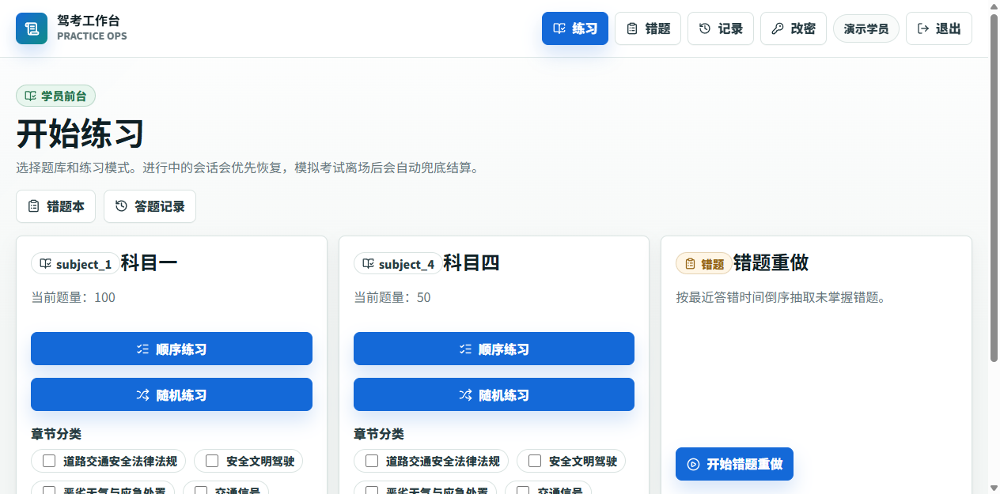
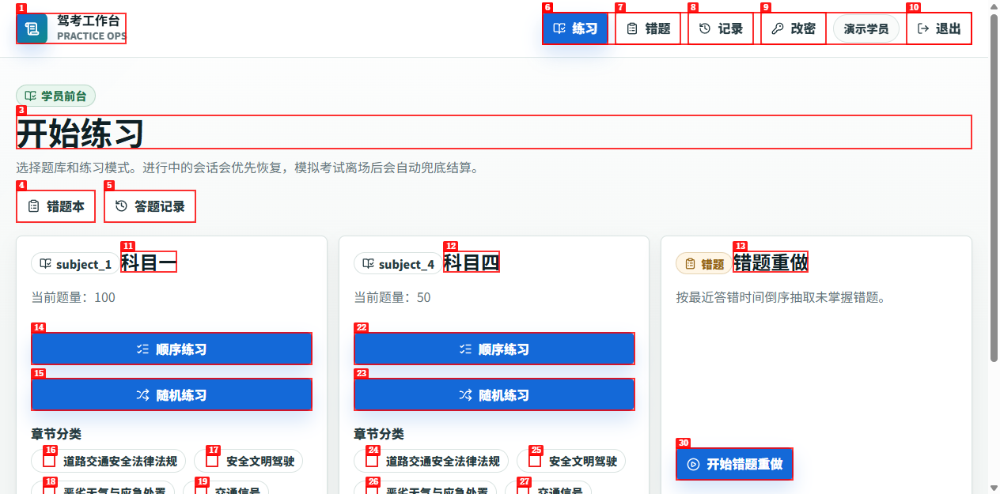
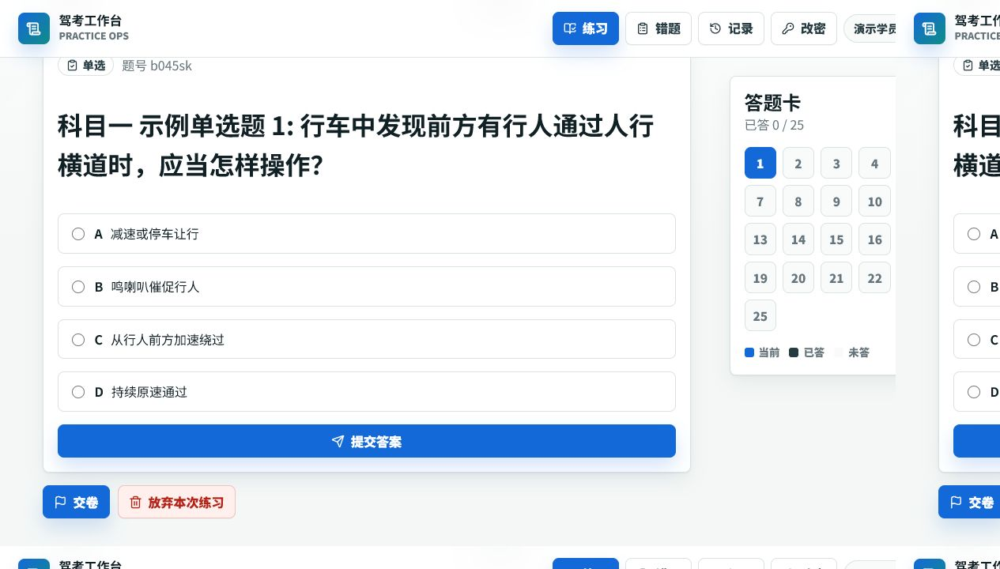
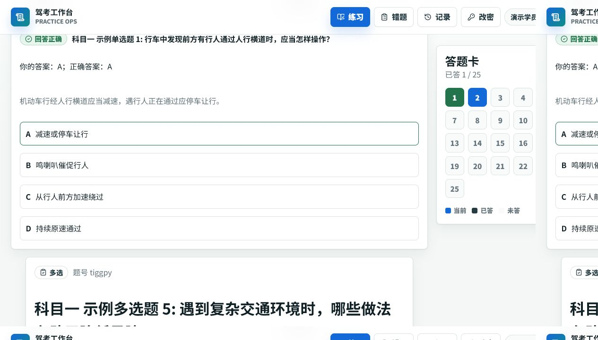
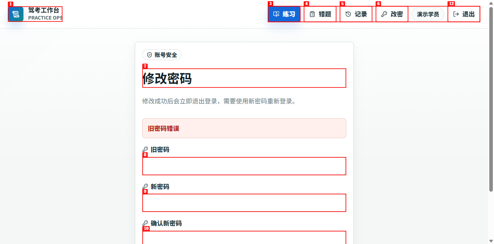

# Dogfood Report: Drive Exam System

| Field | Value |
|-------|-------|
| **Date** | 2026-06-04 |
| **App URL** | http://localhost:3001 |
| **Session** | drive-exam-qa |
| **Scope** | Full app exploratory click-through: public pages, student flows, admin flows, forms, navigation, console errors |

## Summary

| Severity | Count |
|----------|-------|
| Critical | 0 |
| High | 1 |
| Medium | 1 |
| Low | 1 |
| **Total** | **3** |

All 3 findings have been fixed or verified as addressed in browser retests.

## Issues

### ISSUE-001: Chapter practice gives no visible feedback when no chapter is selected

| Field | Value |
|-------|-------|
| **Severity** | low |
| **Category** | ux / functional |
| **URL** | http://localhost:3001/exam |
| **Repro Video** | N/A: local ffmpeg is unavailable, so `agent-browser record stop` could not encode video |

**Description**

On the student practice page, clicking `章节练习` without selecting any chapter leaves the user on the same page with no visible validation message, toast, disabled state, loading feedback, navigation, or network request. Expected behavior is either a clear prompt to select at least one chapter, or a disabled `章节练习` button until a chapter is selected. A follow-up check in the in-app browser confirmed that selecting `道路交通安全法律法规` then clicking `章节练习` successfully starts a 25-question chapter session.

**Status**

Fixed. A CDP browser retest on 2026-06-04 submitted `章节练习` with no category selected and confirmed the URL redirects to `/exam?error=...` with the visible message `章节练习至少选择一个分类`.

**Repro Steps**

1. Navigate to `/exam` as a logged-in student and leave all chapter checkboxes unchecked.
   

2. Click the `章节练习` button under `科目一`.
   

3. Select `道路交通安全法律法规`, then click `章节练习` again.
   

4. **Observe:** the selected-category path works in a later in-app browser retest, so the defect is limited to the no-selection edge case.

---

### ISSUE-002: Next question keeps the previous answer selected

| Field | Value |
|-------|-------|
| **Severity** | medium |
| **Category** | functional / ux |
| **URL** | http://localhost:3001/exam/session/cmpzgsrqn000c111b02avjdda?feedback=cmpp5q9dy001co53btwb045sk |
| **Repro Video** | N/A: local ffmpeg is unavailable, so `agent-browser record stop` could not encode video |

**Description**

After submitting answer `A` on question 1, the app advances to question 2, but option `A` on the new question is already checked even though the student has not answered that question yet. Expected behavior is that unanswered questions render with no selected option unless an existing record for that exact question exists.

**Status**

Fixed. The answer form now remounts by `questionId`, and browser retest confirmed the next unanswered question no longer carries the prior selection.

**Repro Steps**

1. Start a chapter practice session and answer question 1 with option `A`.
2. Click `提交答案`.
3. **Observe:** the page advances to question 2 and the answer card shows only 1 answered question, but option `A` on question 2 is already selected.
   

---

### ISSUE-003: Change-password validation errors crashed with invalid redirect header

| Field | Value |
|-------|-------|
| **Severity** | high |
| **Category** | functional / console |
| **URL** | http://localhost:3001/change-password |
| **Repro Video** | N/A: local ffmpeg is unavailable, so `agent-browser record stop` could not encode video |

**Description**

Submitting the change-password form with an incorrect old password triggered a server-side 500 instead of showing a validation message. The dev server reported `TypeError [ERR_INVALID_CHAR]: Invalid character in header content ["x-action-redirect"]`, caused by redirect URLs containing unencoded Chinese query values.

**Status**

Fixed. All direct Chinese `error` / `notice` redirect query values found in app actions were changed to use URL encoding or a shared redirect message helper. Browser retest now shows the encoded URL and visible `旧密码错误` message.

**Repro Steps**

1. Navigate to `/change-password` as a logged-in student.
2. Enter a wrong old password and matching new passwords, then click `保存并重新登录`.
3. **Observe before fix:** the server returns 500 because the redirect header contains raw Chinese.
4. **Observe after fix:** the page redirects to an encoded URL and shows `旧密码错误`.
   

## Invalidated Observations

- The first automated `@ref` clicks on `提交答案` did not trigger DOM click or submit events, but a browser-side `button.click()` diagnostic produced complete form data, a `POST /exam/session/...`, feedback on question 1, and navigation to question 2. This was treated as an automation targeting issue, not an app issue.
- The first automated `@ref` click on question-list pagination did not visibly navigate. A later CDP check found the `下一页` link had `href="/admin/questions?page=2"`, and direct browser navigation to that href rendered page 2 correctly. This was treated as an automation targeting issue, not an app issue.

## Student Click-Through Coverage

The student side was exercised first through the browser automation session and later retested for the fixed paths:

- Public homepage, student login page, invalid login feedback, successful login, and logout.
- Practice homepage and mode buttons for sequential practice, chapter practice, random practice, and wrong-question review.
- Chapter practice no-selection validation, selected-category start, question session navigation, answer submission, feedback display, answer card navigation, and finish flow.
- Single-answer and multi-answer question interactions.
- Exam history list/detail and wrong-question book interactions, including mastered toggle.
- Student change-password validation path with a wrong old password, confirming encoded redirect and visible `旧密码错误`.

## Admin Click-Through Coverage

The administrator side was retested after the fixes with a browser connected through Chrome DevTools Protocol because the original browser automation session lost its CDP channel after the environment sandbox changed. The following flows were exercised:

- Admin login and logout.
- Dashboard navigation cards and main nav links.
- Question list filters, pagination href, detail page, edit form save, new question create/save, delete, and temporary-data cleanup.
- Bulk import page: JSON input, preview, confirm import, imported temporary question detail, and delete cleanup.
- Question bank management: create temporary bank, save notice, delete temporary bank.
- Category management: create temporary category, save notice, delete temporary category.
- Student statistics list and student detail page.
- Login logs success/failure filtering.
- User management: create temporary user, change status, reset password, disable, and direct cleanup of that temporary user because the UI intentionally has no delete action.
- Roles page read-only state for the current admin role.
- Change-password error path with wrong old password, confirming encoded redirect and visible `旧密码错误`.

## Automated Verification

- `pnpm test src/test/session-answer-form.test.tsx src/test/auth-actions.test.ts src/test/redirect-message.test.ts`: 3 test files passed, 4 tests passed.
- `pnpm typecheck`: passed.
- `pnpm test`: 26 test files passed, 99 tests passed.
